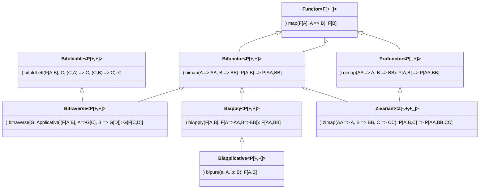
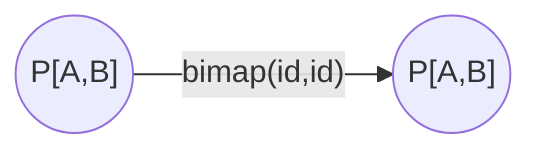
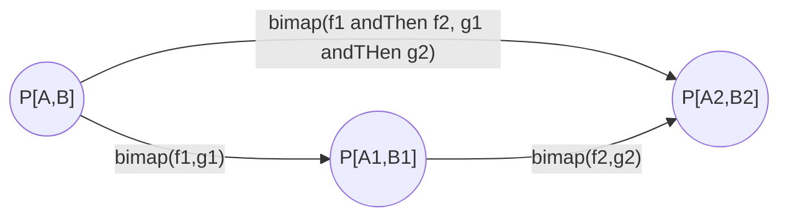
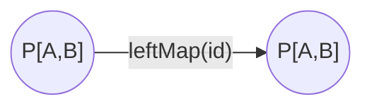
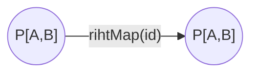
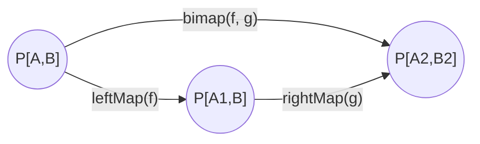

### Bifunctor

Abstracts over type constructor with 2 "holes". Represents two independent functors:
```scala
trait Bifunctor[F[_, _]] {
  def bimap[A, B, C, D](fab: F[A, B])(f: A => C, g: B => D): F[C, D]
}
```
* Bifunctor Laws
1. identity `xs.bimap(identity, identity) == xs` bimap with two identify function does nothing

2. composition `xs.bimap(f, h).bimap(g,i) == xs.bimap(x => g(f(x), x => h(i(x))`  you can bimap using f and h and then bimap using g and i or bimap once using composition

Second law is automatically fulfilled if the first law holds.

* Alternatively can be specified by providing
```scala
def leftMap[A, B, C](fab: F[A, B])(f: A => C): F[C, B]
def rightMap[A, B, D](fab: F[A, B])(g: B => D): F[A, D]
```
In that case identity law must hold for both functions:  
3. identity `xs.leftMap(identity) == xs` leftMap with identify function does nothing  

4. identity `xs.rightMap(identity) == xs` rightMap with identify function does nothing  

If leftMap and rightMap and bimap are specified then additional law must be fullfilled:  
5. `xs.bimap(f, g) == xs.leftMap(f).rightMap(g)`

* Derived methods
```scala
def leftMap[A, B, C](fab: F[A, B])(f: A => C): F[C, B]
def rightMap[A, B, D](fab: F[A, B])(g: B => D): F[A, D]
def leftFunctor[X]: Functor[F[?, X]]
def rightFunctor[X]: Functor[F[X, ?]]
def umap[A, B](faa: F[A, A])(f: A => B): F[B, B]
def widen[A, B, C >: A, D >: B](fab: F[A, B]): F[C, D]
```

* Implementations: [Cats](https://github.com/typelevel/cats/blob/master/core/src/main/scala/cats/Bifunctor.scala), [Scalaz 7](https://github.com/scalaz/scalaz/blob/series/7.3.x/core/src/main/scala/scalaz/Bifunctor.scala), [Scalaz 8](https://github.com/scalaz/scalaz/blob/series/8.0.x/base/shared/src/main/scala/scalaz/tc/bifunctor.scala), [Haskell](https://hackage.haskell.org/package/base/docs/Data-Bifunctor.html), [Purescript](https://pursuit.purescript.org/packages/purescript-bifunctors/docs/Data.Bifunctor), [Idris](https://github.com/japesinator/Idris-Bifunctors/blob/master/src/Data/Bifunctor.idr), [Agda](https://github.com/agda/agda-categories/blob/master/src/Categories/Functor/Bifunctor.agda)

* Instances [can be defined](https://github.com/lemastero/learn_scala_cats/blob/master/src/main/scala/functor/bifunctor/InstancesForForBuildInTypes.scala) for: Tuple2, Either, Validated. For Function1 not - functions are contravariant for input type.

* Resources
  * [Scalaz example](https://github.com/scalaz/scalaz/blob/series/7.3.x/example/src/main/scala/scalaz/example/BifunctorUsage.scala)
  * [Cats docs](https://typelevel.org/cats/typeclasses/bifunctor.html)
  * Funky Scala Bifunctor - Tony Morris [(blog post)](http://blog.tmorris.net/posts/funky-scala-bifunctor/index.html)
  * herding cats — Datatype-generic programming with Bifunctor [(blog post (understand Free monads first))](http://eed3si9n.com/herding-cats/datatype-generic-programming.html)
  * [Haskell libraries using Bifunctors](https://packdeps.haskellers.com/reverse/bifunctors)
  * (Haskell) The Extended Functor Family - George Wilson: [video](https://www.youtube.com/watch?v=JUVMiRRq6wU&t=303)
  * (Haskell) Parametricity for Bifunctor - Brent Yorgey [(blog post)](https://byorgey.wordpress.com/2018/03/30/parametricity-for-bifunctor/)
  * https://twitter.com/xgrommx/status/1234493383126769665

### Bifunctor Join

Turn a Bifunctor with both arguments with the same type into Functor.

```haskell
newtype Join p a = Join { runJoin :: p a a }

-- instance
-- Bifunctor p => Functor (Join p)
```

* Implementations [Haskell bifunctors/Data.Bifunctor.Join](https://hackage.haskell.org/package/bifunctors/docs/Data-Bifunctor-Join.html) [japesinator/Idris-Bifunctors Data/Bifunctor.Join](https://github.com/japesinator/Idris-Bifunctors/blob/master/src/Data/Bifunctor/Join.idr) [purescript-bifunctors/Data.Bifunctor.Join](https://pursuit.purescript.org/packages/purescript-bifunctors/docs/Data.Bifunctor.Join)

### Bifunctor Wrap

Functor over second argument of a Bifunctor

```haskell
newtype WrappedBifunctor p a b = WrapBifunctor { unwrapBifunctor :: p a b }

-- instance
-- Bifunctor p => Functor (WrappedBifunctor p a)
```

* Implementations [Haskell bifunctors/Data.Bifunctor.Wrapped](https://hackage.haskell.org/package/bifunctors/docs/Data-Bifunctor-Wrapped.html) [purescript-bifunctors/Data.Bifunctor.Wrap](https://pursuit.purescript.org/packages/purescript-bifunctors/4.0.0/docs/Data.Bifunctor.Wrap)

### Bifunctor Flip

Swap arguments of Bifunctor

```haskell
newtype Flip p a b = Flip { runFlip :: p b a }

-- instance
-- Bifunctor p => Bifunctor (Flip p)
```

* Implementations [Haskell bifunctors/Data.Bifunctor.Flip](https://hackage.haskell.org/package/bifunctors/docs/Data-Bifunctor-Flip.html) [purescript-bifunctors/Data.Bifunctor.Flip](https://pursuit.purescript.org/packages/purescript-bifunctors/4.0.0/docs/Data.Bifunctor.Flip)

### Bifunctor Joker

Functor over second argument of Bifunctor

```haskell
newtype Joker g a b = Joker { runJoker :: g b }

-- instance
-- Functor g => Bifunctor (Joker g :: * -> * -> *)
-- Functor g => Functor (Joker g a)
```

* Implementations [Haskell bifunctors/Data.Bifunctor.Joker](https://hackage.haskell.org/package/bifunctors/docs/Data-Bifunctor-Joker.html)

* Resources
  * Clowns to the Left of me, Jokers to the Right Dissecting Data Structures - Conor McBride [(paper)](http://strictlypositive.org/CJ.pdf)

### Bifunctor Clown

Functor over second argument of Bifunctor

```haskell
newtype Clown f a b = Clown { runClown :: f a }

-- instances
-- Functor (Clown f a :: * -> *)
-- Functor f => Bifunctor (Clown f :: * -> * -> *)
```

* Implementations [Haskell bifunctors/Data.Bifunctor.Clown](https://hackage.haskell.org/package/bifunctors/docs/Data-Bifunctor-Clown.html)

* Resources
  * Clowns to the Left of me, Jokers to the Right Dissecting Data Structures - Conor McBride [(paper)](http://strictlypositive.org/CJ.pdf)


### Bifunctor Product

Product of two Bifunctors

```haskell
data Product f g a b = Pair (f a b) (g a b)

-- instance
-- (Bifunctor f, Bifunctor g) => Bifunctor (Product f g)
```

* Implementations  [Haskell bifunctors/Data.Bifunctor.Product](https://hackage.haskell.org/package/bifunctors/docs/Data-Bifunctor-Product.html) [purescript-bifunctors/Data.Bifunctor.Product](https://pursuit.purescript.org/packages/purescript-bifunctors/4.0.0/docs/Data.Bifunctor.Product)

### Bifunctor Sum

Sum of two Bifunctors

```haskell
data Sum p q a b = L2 (p a b) | R2 (q a b)

-- instance
-- (Functor f, Bifunctor p) => Functor (Tannen f p a)
```

* Implementations  [Haskell bifunctors/Data.Bifunctor.Sum](https://hackage.haskell.org/package/bifunctors/docs/Data-Bifunctor-Sum.html)


### Bifunctor Tannen

Compose Functor on the outside.

```haskell
newtype Tannen f p a b = Tannen { runTannen :: f (p a b) }

-- instances
-- (Functor f, Bifunctor p) => Bifunctor (Tannen f p)
-- (Functor f, Bifunctor p) => Functor (Tannen f p a)
```

* Implementations [Haskell bifunctors/Data.Bifunctor.Tannen](https://hackage.haskell.org/package/bifunctors/docs/Data-Bifunctor-Tannen.html)

### Bifunctor Biff

Compose two Functors inside Bifunctor

```haskell
newtype Biff p f g a b = Biff { runBiff :: p (f a) (g b) }

-- instance
-- (Bifunctor p, Functor f, Functor g) => Bifunctor (Biff p f g)
```

* Implementations: [Haskell bifunctors/Data.Bifunctor.Biff](https://hackage.haskell.org/package/bifunctors/docs/Data-Bifunctor-Biff.html)

### Bitraverse

* Implementations: [Scalaz Bitraverse](https://github.com/scalaz/scalaz/blob/series/7.3.x/core/src/main/scala/scalaz/Bitraverse.scala) [Cats Bitraverse](https://github.com/typelevel/cats/blob/master/core/src/main/scala/cats/Bitraverse.scala), [Haskell](https://hackage.haskell.org/package/base/docs/Data-Bitraversable.html), [Purescript](https://pursuit.purescript.org/packages/purescript-foldable-traversable/docs/Data.Bitraversable)

### Bifoldable

* Implementations: [(Scalaz Bifoldable)](https://github.com/scalaz/scalaz/blob/series/7.3.x/core/src/main/scala/scalaz/Bifoldable.scala) [Cats Bifoldable](https://github.com/typelevel/cats/blob/master/core/src/main/scala/cats/Bifoldable.scala) [Purescript ](https://pursuit.purescript.org/packages/purescript-foldable-traversable/docs/Data.Bifoldable)

### Biapplicative

* Implementations: [Haskell](https://hackage.haskell.org/package/bifunctors/docs/Data-Biapplicative.html)
