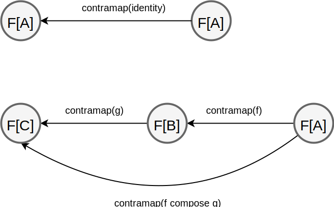

## Opposite category

Opposite category ([nLab](https://ncatlab.org/nlab/show/opposite+category)) is a category where all arrows are reversed.

```scala
case class Op[K[_,_],A,B](unOp: K[B,A])
```

or using type alias and specializing to category of Scala types and pure functions:

```scala
object Op {
  type Op[A,B] = B => A
}
```

* Implementations: [idris-ct Dual Category](https://github.com/statebox/idris-ct/blob/master/src/Dual/DualCategory.lidr)

Constructions in category C have dual constructions in category Op. Properties in given category holds also for dual construction in opposite category.

Examples of duality [nLab](https://ncatlab.org/nlab/show/duality)

| definition | dual (opposite) definition  |
|---|---|
| initial object | terminal object |
| product | coproduct |
| limits | colimits |
| monads | comonads |
| flatmap | coflatmap |
| functor | functor |
| free | cofree |
| monoid | comonoid |
| end | coend |
| initial F-algebra | terminal co-algebra |

Contravariance is different concept than duality.

### Contravariant (Contravariant Functor)

Type constructor that can be `contramap`, so map in opposite direction.

If we imagine Functor, as abstracting over some output,
then Contravariant abstract over input.

In Category Theory Contravariant Functor is a Functor from opposite category ([opposite category formalization in CubicalTT](https://github.com/mortberg/cubicaltt/blob/master/examples/opposite.ctt)).

```scala
trait Contravariant[F[_]] {
  def contramap[A, B](f: B => A): F[A] => F[B]
}
```

[Scalaz 7](https://github.com/scalaz/scalaz/blob/series/7.3.x/core/src/main/scala/scalaz/Contravariant.scala), [Scalaz 8](https://github.com/scalaz/scalaz/blob/series/8.0.x/base/shared/src/main/scala/scalaz/tc/contravariant.scala), [Cats](https://github.com/typelevel/cats/blob/master/core/src/main/scala/cats/Contravariant.scala), [Haskell](https://downloads.haskell.org/~ghc/latest/docs/html/libraries/base-4.13.0.0/Data-Functor-Contravariant.html), [Purescript](https://pursuit.purescript.org/packages/purescript-contravariant/docs/Data.Functor.Contravariant)
Proofs [UniMath](https://github.com/UniMath/UniMath/blob/master/UniMath/CategoryTheory/Presheaf.v)
Category Theory [nLab](https://ncatlab.org/nlab/show/contravariant+functor)

* Contravariant laws ([Cats](https://github.com/typelevel/cats/blob/master/laws/src/main/scala/cats/laws/ContravariantLaws.scala), [Scalaz 7](https://github.com/scalaz/scalaz/blob/series/7.3.x/core/src/main/scala/scalaz/Contravariant.scala#L59-L68), [Haskell](http://hackage.haskell.org/package/contravariant/docs/Data-Functor-Contravariant.html)):



1 contramap identity  

```scala
//         contramap(id)
// F[A]  ================> F[A]
contramap(fa)(identity[A]) == fa
```

2 contravariant composition

```scala
//        contramap f
// F[A] ==============> F[B]
val fb: F[B] = contramap(fa)(f)

//        contramap g
// F[B] ===============> F[C]
val l: F[C] = contramap(fb)(g)

//        contramap (g . f)
// F[A] =====================> F[B]
val r: F[C] = contramap(fa)(f compose g)

l == r
```

* Applications:
  * model function with fixed output type, like [Predicate - function `A => Boolean`](https://github.com/lemastero/scala_typeclassopedia/blob/master/src/main/scala/contravariant/InstancesForContravariantFunctor.scala#L61-L65) or [Show](https://github.com/scalaz/scalaz/blob/series/7.3.x/core/src/main/scala/scalaz/Show.scala#L51-L53). Edward Kmett used Contravariant functor hierarchy to [model sorting](https://github.com/ekmett/discrimination/search?q=contramap).
  * Encoder in [scodec](https://github.com/scodec/scodec/blob/series/1.11.x/shared/src/main/scala/scodec/Encoder.scala#L40-L47) has Contravariant instance: [scodec/scodec-cats](https://github.com/scodec/scodec-cats/blob/master/shared/src/main/scala/scodec/interop/cats/CatsInstances.scala#L121-L123)
  * [jberryman/simple-actors](https://github.com/jberryman/simple-actors/search?q=contramap&unscoped_q=contramap) model [Behavior of actor](https://github.com/jberryman/simple-actors/blob/master/Control/Concurrent/Actors.lhs#L336-L346)
  * [List of Haskell libraries using Contravariant functors](https://packdeps.haskellers.com/reverse/contravariant)

* Contravariant is not called Cofunctor (like Monad -> Comonad, Appy -> Coapply) because when we inverse arrows
in Functor definition, we just get Functor definition back (with A, B swapped). [More on this on SO](https://stackoverflow.com/questions/34732571/why-there-is-no-cofunctor-typeclass-in-haskell).
There is library that makes fun ot of this fact [acme-cofunctor](http://hackage.haskell.org/package/acme-cofunctor).

* Resources
  * (Haskell) 24 Days of Hackage: contravariant - Tom Ellis [(blog post)](https://ocharles.org.uk/blog/guest-posts/2013-12-21-24-days-of-hackage-contravariant.html) (all classic examples: Predicate, Op but alos Behaviors of actor, nice laws explanation)
  * (Haskell) Covariance and Contravariance - Michael Snoyman [blog post](https://www.fpcomplete.com/blog/2016/11/covariance-contravariance) (Show as contravariant, discuss Profunctors, bivariance of phantom types, good explanation of positive and negative positions)
  * (Haskell) I love profunctors. They're so easy. - Liyang HU [(blog post)](https://www.schoolofhaskell.com/school/to-infinity-and-beyond/pick-of-the-week/profunctors) (Const, Predicate, Op instances for Contravariant)
  * (Haskell) The Extended Functor Family - George Wilson [(video)](https://www.youtube.com/watch?v=JUVMiRRq6wU&t=450)
  * (Haskell) Contravariant Functors: The Other Side of the Coin - George Wilson [(video)](https://www.youtube.com/watch?v=IJ_bVVsQhvc)
  * [What is a contravariant functor? - SO](https://stackoverflow.com/questions/38034077/what-is-a-contravariant-functor)
  * [What's up with Contravariant? - r/haskell](https://www.reddit.com/r/haskell/comments/1vc0mp/whats_up_with_contravariant/)

### Divide (Contravariant Apply)

```scala
trait Divide[F[_]] extends Contravariant[F] {
  def divide[A,B,C](f: A => (B,C), fb: F[B], fc: F[C]): F[A]
}
```

* Implementations: [Scalaz](https://github.com/scalaz/scalaz/blob/series/7.3.x/core/src/main/scala/scalaz/Divide.scala), [Cats](https://github.com/typelevel/cats/blob/master/core/src/main/scala/cats/ContravariantSemigroupal.scala), [Why not in Haskell](https://github.com/ekmett/contravariant/issues/18), [Purescript](https://pursuit.purescript.org/packages/purescript-contravariant/docs/Data.Divide)

* Divide Laws ([Scalaz](https://github.com/scalaz/scalaz/blob/series/7.3.x/core/src/main/scala/scalaz/Divide.scala#L45-L52), [Haskell](http://hackage.haskell.org/package/contravariant/docs/Data-Functor-Contravariant-Divisible.html#g:4)):
let `def delta[A]: A => (A, A) = a => (a, a)`  
divide composition `divide(divide(a1, a2)(delta), a3)(delta) == divide(a1, divide(a2, a3),(delta))(delta)`

```scala
def divideComposition[A](fa1: F[A], fa2: F[A], fa3: F[A]): Boolean = {
  //                divide(delta)
  //  F[A1], F[A2] ===============> F[A12]
  val fa12: F[A] = divide(delta[A], fa1, fa2)

  //                 divide(delta)
  // F[A12], F[A3] =================> F[A123]
  val l: F[A] = divide( delta[A], fa12, fa3)


  //                divide(delta)
  //  F[A2], F[A3] ===============> F[A23]
  val fa23: F[A] = divide(delta[A], fa2, fa3)

  //                  divide(delta)
  //  F[A1], F[A23] ===============> F[A123]
  val r: F[A] = divide( delta[A], fa1, fa23 )
  
  l == r
}
```

This is simplified version. Proper version is shown in Haskell.

* Derived methods:
```scala
def divide1[A1, Z]    (a1: F[A1])           (f: Z => A1): F[Z] // contramap
def divide2[A1, A2, Z](a1: F[A1], a2: F[A2])(f: Z => (A1, A2)): F[Z]
// ...
def tuple2[A1, A2]    (a1: F[A1], a2: F[A2]):            F[(A1, A2)]
def tuple3[A1, A2, A3](a1: F[A1], a2: F[A2], a3: F[A3]): F[(A1, A2, A3)]
// ...
def deriving2[A1, A2, Z](f: Z => (A1, A2))(implicit a1: F[A1], a2: F[A2]): F[Z]
def deriving3[A1, A2, A3, Z](f: Z => (A1, A2, A3))(implicit a1: F[A1], a2: F[A2], a3: F[A3]): F[Z]
// ...
```

* Resources
  * (Haskell) Contravariant Functors: The Other Side of the Coin - George Wilson [(video)](https://www.youtube.com/watch?v=IJ_bVVsQhvc)
  * (Haskell, Category Theory) Discrimination is Wrong: Improving Productivity - Edward Kmett [(video)](https://www.youtube.com/watch?v=cB8DapKQz-I) [slides pdf](http://yowconference.com.au/slides/yowlambdajam2015/Kmett-DiscriminationIsWrong.pdf)
  
### Divisible (Contravariant Applicative)

```scala
trait Divisible[F[_]] extends Divide[F] {
  def conquer[A]: F[A]
}
```

* Implementations: [Scalaz 7](https://github.com/scalaz/scalaz/blob/series/7.3.x/core/src/main/scala/scalaz/Divisible.scala), [Cats](https://github.com/typelevel/cats/blob/master/core/src/main/scala/cats/ContravariantMonoidal.scala) [Haskell](http://hackage.haskell.org/package/contravariant/docs/Data-Functor-Contravariant-Divisible.html), [Purescript](https://pursuit.purescript.org/packages/purescript-contravariant/docs/Data.Divisible)

* Laws ([Scalaz](https://github.com/scalaz/scalaz/blob/series/7.3.x/core/src/main/scala/scalaz/Divisible.scala#L33-L39), [Haskell](http://hackage.haskell.org/package/contravariant/docs/Data-Functor-Contravariant-Divisible.html#g:4)): let `def delta[A]: A => (A, A) = a => (a, a)`
1. all Contravariant and Divide laws including composition `divide(divide(a1, a2)(delta), a3)(delta) == divide(a1, divide(a2, a3),(delta))(delta)`
(see Divide law)

2. right identity: `divide(fa, conquer)(delta) == fa`
```scala
def rightIdentity[A](fa: F[A]): Boolean = {
  //                 divide(delta)    
  // F[A], conquer ===============> F[A]
  val l: F[A] = divide(delta, fa, conquer[A])
  
  l == fa
}
```

3. left identity:  `divide(conquer, fa)(delta) == fa`
```scala
def leftIdentity[A](fa: F[A]): Boolean = {
  //                 divide(delta)    
  // conquer, F[A] ===============> F[A]
  val l: F[A] = divide(delta, conquer[A], fa)
  
  l == fa
}
```

* Instances: Predicate, Sorting, Serializable, Pritty Printing

* Resources
  * [Cats PR #2034](https://github.com/typelevel/cats/pull/2034) explaining design choices different that in Haskell, Scalaz
  * (Haskell) Contravariant Functors: The Other Side of the Coin - George Wilson [(video)](https://www.youtube.com/watch?v=IJ_bVVsQhvc)
  * (Haskell, Category Theory) Discrimination is Wrong: Improving Productivity - Edward Kmett [(video)](https://www.youtube.com/watch?v=cB8DapKQz-I) [slides pdf](http://yowconference.com.au/slides/yowlambdajam2015/Kmett-DiscriminationIsWrong.pdf)

## Contravariant Adjuctions & Representable

### Contravariant Adjunction

* Implementations: [Haskell](hackage.haskell.org/package/adjunctions/docs/Data-Functor-Contravariant-Adjunction.html), [nLab](https://ncatlab.org/nlab/show/dual+adjunction)

### Contravariant Rep

* Implementations: [Haskell](hackage.haskell.org/package/adjunctions/docs/Data-Functor-Contravariant-Rep.html)

## Contravariant Kan Extensions

### Contravariant Yoneda

* Implementation: [Haskell](https://hackage.haskell.org/package/kan-extensions/docs/Data-Functor-Contravariant-Yoneda.html)

### Contravariant Coyoneda

Similar a Coyoneda yet, with existenctial function running in opposite direction.

```scala
trait ContravariantCoyoneda[F[_], A] {
  type B
  val fb: F[B]
  val m: A => B


  def lowerCoyoneda(implicit CF: Contravariant[F]): F[A] = CF.contramap(fb)(m) // run
}

def liftCoyoneda[F[_], AA](fa: F[AA]): ContravariantCoyoneda[F, AA] = new ContravariantCoyoneda[F, AA] {
  type B = AA
  val fb: F[B] = fa
  val m: AA => B = identity[AA]
}
```

We can define Contravariant instance for Contravariant Coyoneda:

```scala
def cotraContraCoyo[F[_]] = new Contravariant[ContravariantCoyoneda[F, ?]] {
  def contramap[AA, BB](fa: ContravariantCoyoneda[F, AA])(f: BB => AA): ContravariantCoyoneda[F, BB] = new ContravariantCoyoneda[F, BB] {
    type B = fa.B
    val fb: F[B] = fa.fb
    val m: BB => B = fa.m compose f
  }
}
```

* Implementation: [Scalaz 7](https://github.com/scalaz/scalaz/blob/series/7.3.x/core/src/main/scala/scalaz/ContravariantCoyoneda.scala) [Haskll](https://hackage.haskell.org/package/kan-extensions/docs/Data-Functor-Contravariant-Coyoneda.html)

* Resources:
  * [Scalaz example](https://github.com/scalaz/scalaz/blob/series/7.3.x/example/src/main/scala/scalaz/example/ContravariantCoyonedaUsage.scala)

### Contravariant Day

* Implementation: [Haskell](https://hackage.haskell.org/package/kan-extensions/docs/Data-Functor-Contravariant-Day.html)
