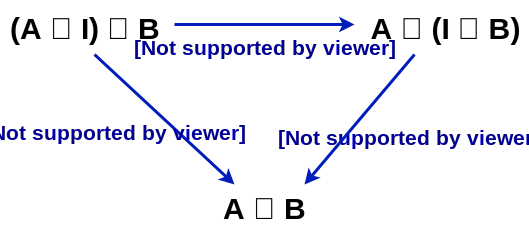
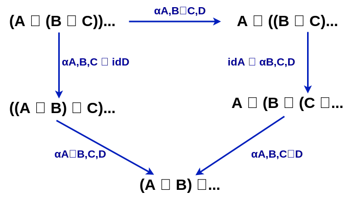

## Natural transformation (FunctionK)

Represent polymorphic function between two functors `F`, `G`

```scala
trait ~>[F[_], G[_]] {
  def apply[X](fa: F[X]): G[X]
}
```

that satisfy naturality square:

```scala
def naturalitySquare[A,B](fa: F[A], ff: ~>[F,G], g: A => B)(implicit FF: Functor[F], FG: Functor[G]): Boolean = {
  val v1: G[A] = ff(fa)
  val v2: G[B] = FG.map(v1)(g)

  val w1: F[B] = FF.map(fa)(g)
  val w2: G[B] = ff(w1)

  v2 == w2
}
```

for example:

```scala
val headOption: List ~> Option = new ~>[List,Option] {
  def apply[A](fa: List[A]): Option[A] = fa.headOption
}
```

Every polymorphic function (that do the same thing - do not change behavior for a specific type of X) have some nice properties. More in paper by [Philip Wadler - Theorems for free](http://homepages.inf.ed.ac.uk/wadler/topics/blame.html#parablame).

* Implementations: [Scalaz 7](https://github.com/scalaz/scalaz/blob/series/7.3.x/core/src/main/scala/scalaz/NaturalTransformation.scala), [Cats](https://github.com/typelevel/cats/blob/master/core/src/main/scala/cats/arrow/FunctionK.scala), [Haskell](http://hackage.haskell.org/package/natural-transformation/docs/Control-Natural.html)
* Encoding close to mathematics: [vpatryshev/Categories](https://github.com/vpatryshev/Categories/blob/master/src/main/scala/math/cat/NaturalTransformation.scala)
* Formalization in proof assistants: [statebox/idris-ct](https://github.com/statebox/idris-ct/blob/master/src/Basic/NaturalTransformation.lidr), [agda-categories](https://github.com/agda/agda-categories/blob/master/Categories/NaturalTransformation/Core.agda) [UniMath](https://github.com/UniMath/UniMath/blob/master/UniMath/CategoryTheory/Core/NaturalTransformations.v), [CubicalTT](https://github.com/mortberg/cubicaltt/blob/master/examples/univprop.ctt)
* Definition in Category Theory: [nLab](https://ncatlab.org/nlab/show/natural+transformation)

* Resources
  * Cats [docs](https://typelevel.org/cats/datatypes/functionk.html)
  * [tpolecat/doobie KleisliInterpreter](https://github.com/tpolecat/doobie/blob/master/modules/free/src/main/scala/doobie/free/kleisliinterpreter.scala) uses natural transformations
  * Parametricity: Money for Nothing and Theorems for Free - Bartosz Milewski [(blog post)](https://bartoszmilewski.com/2014/09/22/parametricity-money-for-nothing-and-theorems-for-free/)
  * Natural transformations - TheCatsters [(video playlist)](https://www.youtube.com/watch?v=FZSUwqWjHCU&list=PLA28A5C9D19465C92)


### Invariant Day

* Implementation: [Haskell](https://hackage.haskell.org/package/kan-extensions/docs/Data-Functor-Invariant-Day.html)

### Functor Functor (FFunctor)

Functor that works on natural transformations rather than on regular types

```scala
trait FFunctor[FF[_]] {
  def ffmap[F[_],G[_]](nat: NaturalTransf[F,G]): FF[F] => FF[G]
}
```

* Laws:
  * identity: `ffmap id == id`
  * composition: `ffmap (eta . phi) = ffmap eta . ffmap phi`

* Resources
  * (Haskell) Functor Functors - Benjamin [(blog post)](https://www.benjamin.pizza/posts/2017-12-15-functor-functors.html)

### Monad morphisms

* Resources
  * (Haskell) [monad morphisms](http://hackage.haskell.org/package/mmorph/docs/Control-Monad-Morph.html)
  * (Haskell) [MFunctor](http://hackage.haskell.org/package/mmorph/docs/Control-Monad-Morph.html#t:MFunctor) [used to be in pipes](https://hackage.haskell.org/package/pipes-3.1.0/docs/Control-MFunctor.html)
  * (Haskell) Q: What is not an MFunctor? [reddit](https://www.reddit.com/r/haskell/comments/2c87m8/q_what_is_not_an_mfunctor/)
  * (Haskell) [MMonad](http://hackage.haskell.org/package/mmorph-1.1.2/docs/Control-Monad-Morph.html#t:MMonad)
  * (Haskell) [Github issue with code with MCoyoneda](https://github.com/Gabriel439/Haskell-MMorph-Library/issues/33)
  * (Haskell) [Tutorial - Gabriel Gonzalez](http://hackage.haskell.org/package/mmorp-1.1.2/docs/Control-Monad-Morph.html#g:3)
  * (Haskell) mmorph-1.0.0: Monad morphisms - Gabriel Gonzalez [blog post](http://www.haskellforall.com/2013/03/mmorph-100-monad-morphisms.html)

### higher kinded category theory
  * [hask](https://github.com/ekmett/hask)
  * [cokin](http://hackage.haskell.org/package/conkin/docs/Conkin.html)
  * [rank2classes](http://hackage.haskell.org/package/rank2classes)

### Monoidal Categories, Monoid Object

In Category Theory a Monoidal Category is a Category with a Bifuctor and morphisms

```scala
trait MonoidalCategory[M[_, _], I] {
  val tensor: Bifunctor[M]
  val mcId: I

  def rho[A]    (mai: M[A,I]): A
  def rho_inv[A](a:   A):      M[A, I]

  def lambda[A]      (mia: M[I,A]): A
  def lambda_inv[A,B](a: A):        M[I, A]

  def alpha[A,B,C](    mabc: M[M[A,B], C]): M[A, M[B,C]]
  def alpha_inv[A,B,C](mabc: M[A, M[B,C]]): M[M[A,B], C]
}
```

that satisfy triangular equations:



and pentagon equations:



```scala
trait MonoidalCategoryLaws[M[_, _], I] extends MonoidalCategory[M,I] {

  def triangleEquations[A, B](fa: M[M[A, I], B]): Boolean = {
    //               ro[A] * id[B]
    // (A * I) * C ----------------> A * B
    val v1: M[A, B] = mcBif.bimap(rho[A], identity[B])(fa)

    //              alpha[A,I,B]                  id[A] * lambda[B]
    // (A * I) * C -------------->  A * (I * C) --------------------> A * B
    val w1: M[A, M[I, B]] = alpha[A,I,B](fa)
    val w2: M[A, B] = mcBif.bimap[A,A, M[I,B],B](identity[A],lambda[B])(w1)

    v1 == w2
  }

  def pentagonEquations[A,B,C,D](fa: M[M[M[A,B],C],D]): Boolean = {
    //                    alpha[A,B,C] * 1D                      alpha[A,B*C,D]
    // ((A * B) * C) * D -------------------> (A * (B * C)) * D ------------------> A * ((B * C) * D)
    //                    1A * alpha[B,C,D]
    // A * ((B * C) * D) ------------------> A * (B * (C * D))
    val v1: M[M[A, M[B, C]], D] = mcBif.bimap(alpha[A,B,C],identity[D])(fa)
    val v2: M[A, M[M[B,C], D]] = alpha[A,M[B,C],D](v1)
    val v3: M[A, M[B, M[C,D]]] = mcBif.bimap(identity[A],alpha[B,C,D])(v2)

    //                     alpha[A*B,C,D]                       alpha[A,B,C*D]
    // ((A * B) * C) * D -----------------> (A * B) * (C * D) -----------------> A * (B * (C * D))
    val w1: M[M[A,B], M[C,D]] = alpha[M[A,B],C,D](fa)
    val w2: M[A,M[B,M[C,D]]] = alpha[A,B,M[C,D]](w1)

    v3 == w2
  }
}
```

* Implementations: [Haskell](https://hackage.haskell.org/package/categories/docs/Control-Category-Monoidal.html#t:Monoidal), [Agda](https://github.com/agda/agda-categories/blob/master/Categories/Category/Monoidal.agda), [UniMath](https://github.com/UniMath/UniMath/blob/master/UniMath/CategoryTheory/Monoidal/MonoidalCategories.v), [nlab](https://ncatlab.org/nlab/show/monoidal+category)

We can create monoidal category where product (Tuple) is a bifunctor or an coproduct (Either).

Monoidal Categories are useful if we consider category of endofunctors. If we develop concept of Monoid Object then it is possible to define
* Monads as Monoid Object in Monoidal Category of Endofunctors with Product as Bifunctor
* Applicative as Monoid Object in Monoidal Category of Endofunctors with Day convolution as Bifunctor

In category of Profunctors with Profunctor Product as Bifunctor the Monoid Object is Arrow.

* Resources
  * lemastero/MonoidalCategories.scala [(Gist)](https://gist.github.com/lemastero/cb50818fc40361ffb309701cffa651c9)
  * (Haskell, Category Theory) Discrimination is Wrong: Improving Productivity - Edward Kmett [(video)](https://www.youtube.com/watch?v=cB8DapKQz-I&feature=youtu.be&t=373) [slides pdf](http://yowconference.com.au/slides/yowlambdajam2015/Kmett-DiscriminationIsWrong.pdf)
  * (Haskell, Category  Theory) Notions of Computation as Monoids (extended version) - Exequiel Rivas, Mauro Jaskelioff [(paper)](http://www.fceia.unr.edu.ar/~mauro/pubs/Notions_of_Computation_as_Monoids_ext.pdf)
  * (Haskell) Monoidal Category [data-category/Data.Category.Monoidal](https://hackage.haskell.org/package/data-category/docs/Data-Category-Monoidal.html), [categories/Control.Category.Monoidal](https://hackage.haskell.org/package/categories/docs/Control-Category-Monoidal.html)
  * (Haskell) [categories Cartesian Monoidal Category](https://hackage.haskell.org/package/categories/docs/Control-Category-Cartesian.html#t:Cartesian)
  * (Haskell) [categories CoCartesian Monoidal Category](https://hackage.haskell.org/package/categories/docs/Control-Category-Cartesian.html#t:CoCartesian)
 
### Braided Monoidal Category

* Implementations: [Haskell](https://hackage.haskell.org/package/categories/docs/Control-Category-Braided.html#t:Braided), [Agda](https://github.com/agda/agda-categories/blob/master/Categories/Category/Monoidal/Braided.agda)

### Symmetric Monoidal Category

* Implementations [Haskell](https://hackage.haskell.org/package/categories/docs/Control-Category-Braided.html#t:Symmetric), [Agda](https://github.com/agda/agda-categories/blob/master/Categories/Category/Monoidal/Symmetric.agda)

### Cartesian Closed Category

* Implementations [Haskell](https://hackage.haskell.org/package/category-extras-0.53.0/docs/Control-Category-Cartesian-Closed.html), [Agda](https://github.com/agda/agda-categories/blob/master/Categories/Category/CartesianClosed.agda)

* Resources
  * [TomasMikula/LambdaCart](https://github.com/TomasMikula/LambdaCart) (CCC is used to define EDSL in Scala)
  * [Compiling to categories - Conal Elliott](http://conal.net/papers/compiling-to-categories/) (Encoding of many CT abstractions, applications for automatic derivation of functions, describing hardware, Fast Fourier Transformation)
  * (Haskell) [Cartesian Closed Category in data-category](https://hackage.haskell.org/package/data-category/docs/Data-Category-CartesianClosed.html)

### Day Convolution

Monads are monoids in a monoidal category of endofunctors.
Applicative functors are also monoids in a monoidal category of endofunctors but as a tensor is used Day convolution.

There is nice intuition for Day convolution as generalization of one of Applicative Functor methods. 

* Haskell

```haskell
data Day f g a where
  Day :: forall x y. (x -> y -> a) -> f x -> g y -> Day f g a
```
* Scala

```scala
trait DayConvolution[F[_], G[_], A] {
  type X
  type Y
  val fx: F[X]
  val gy: G[Y]
  def xya: (X, Y) => A
}
```

* Implementation: [Scalaz 7](https://github.com/scalaz/scalaz/blob/series/7.3.x/core/src/main/scala/scalaz/Day.scala), [Haskell](http://hackage.haskell.org/package/kan-extensions/docs/Data-Functor-Day.html), [Purescritp](https://pursuit.purescript.org/packages/purescript-day/10.0.0/docs/Data.Functor.Day)

* There is various ways to create Day Convolution:
```scala
def day[F[_], G[_], A, B](fab: F[A => B], ga: G[A]): Day[F, G, B]
def intro1[F[_], A](fa: F[A]): Day[Id, F, A]
def intro2[F[_], A](fa: F[A]): Day[F, Id, A]
```

* Day convolution can be transformed by mapping over last argument, applying natural transformation to one of type constructors, or swapping them
```scala
def map[B](f: A => B): Day[F, G, B]
def trans1[H[_]](nat: NaturalTransf[F, H]): Day[H, G, A]
def trans2[H[_]](nat: NaturalTransf[G, H]): Day[F, H, A]
def swapped: Day[G, F, A] = new Day[G, F, A]
```

* There is various ways to collapse Day convolution into value in type constructor:
```scala
def elim1[F[_], A](d: Day[Id, F, A])(implicit FunF: Functor[F]): F[A]
def elim2[F[_], A](d: Day[F, Id, A])(implicit FunF: Functor[F]): F[A]
def dap[F[_], A](d: Day[F, F, A])(implicit AF: Applicative[F]): F[A]
```

* We can define Functor instance without any conditions on type constructors (so it forms Functor for free like Coyoneda):

```scala
def functorDay[F[_], G[_]]: Functor[DayConvolution[F, G, ?]] = new Functor[DayConvolution[F, G, ?]] {
  def map[C, D](d: DayConvolution[F, G, C])(f: C => D): DayConvolution[F, G, D] =
    new DayConvolution[F, G, D] {
      type X = d.X
      type Y = d.Y
      val fx: F[X] = d.fx
      val gy: G[Y] = d.gy

      def xya: X => Y => D = x => y => f(d.xya(x)(y))
    }
}
```

* If both type constructor are Applicative then whoe Day Convolution is applicative.
Similarly it is Comonad if both type constructors are Comonads.

* Resources
  * (Haskell) Notions of Computation as Monoids by Exequiel Rivas, Mauro Jaskelioff [(paper)](https://arxiv.org/abs/1406.4823)
  * (Haskell) Reddit comment by echatav [(comment)](https://www.reddit.com/r/haskell/comments/4wvae2/functorial_blog_comonads_and_day_convolution/d6bem5i/)
  * (Haskell) Comonads and Day Convolution - Phil Freeman [(blog post)](http://blog.functorial.com/posts/2016-08-08-Comonad-And-Day-Convolution.html)
  * (Purescript) extensible coeffect system built out of comonads and Day convolution [paf31/purescript-smash](https://github.com/paf31/purescript-smash/blob/master/src/Data/Smash.purs)
  * (Purescript) [paf31/purescript-react-explore](https://github.com/paf31/purescript-react-explore/blob/master/src/React/Explore/List.purs)
  * (Haskell) usage examples with Free CoFree [jwiegley/notes Day](https://github.com/jwiegley/notes/blob/0d8720a38221fdface5e766a66423c1b14e89484/haskell/Day.hs)
  * (Theory) [The convolution of comonads is a comonad](https://mathoverflow.net/questions/346529/the-convolution-of-comonads-is-a-comonad)
