### Profunctor

Profunctor abstract over
- type constructor with two holes `P[_,_]`
- operation `def dimap(preA: NewA => A, postB: B => NewB): P[A, B] => P[NewA, NewB]` 
that given `P[A,B]` and two functions 
- apply first `preA` before first type of `P` (ast as contravariant functor)
- apply second `postB` after second type of `P` (act as functor)

Alternatively we can define Profunctor not using dimap but using two separate functions:
 * def lmap(f: AA => A): P[A,C] => P[AA,C] = dimap(f,identity[C])
 * def rmap(f: B => BB): P[A,B] => P[A,BB] = dimap(identity[A], f)

Profunctors in Haskell were explored by sifpe at blog A Neighborhood of Infinity in post [Profunctors in Haskell](http://blog.sigfpe.com/2011/07/profunctors-in-haskell.html)
Implemented in Haskell: [ekmett/profunctors](https://github.com/ekmett/profunctors)

```scala
trait Profunctor[F[_, _]] {
  def dimap[A, B, C, D](fab: F[A, B])(f: C => A)(g: B => D): F[C, D]
}
```

* Implementations: [Scalaz 7](https://github.com/scalaz/scalaz/blob/series/7.3.x/core/src/main/scala/scalaz/Profunctor.scala), [Scalaz 8](https://github.com/scalaz/scalaz/blob/series/8.0.x/base/shared/src/main/scala/scalaz/tc/profunctor.scala), [Cats](https://github.com/typelevel/cats/blob/master/core/src/main/scala/cats/arrow/Profunctor.scala), [Haskell](hackage.haskell.org/package/profunctors/docs/Data-Profunctor.html), [Purescript](https://github.com/purescript/purescript-profunctor/blob/master/src/Data/Profunctor.purs), [Java](https://github.com/Mojang/DataFixerUpper/blob/master/src/main/java/com/mojang/datafixers/optics/profunctors/Profunctor.java)
* Verified implementations: [Agda](https://github.com/agda/agda-categories/blob/master/Categories/Functor/Profunctor.agda),[UniMath](https://github.com/UniMath/UniMath/blob/master/UniMath/CategoryTheory/Profunctors/Core.v), [idris-ct Profunctors](https://github.com/statebox/idris-ct/blob/master/src/Profunctors/Profunctor.lidr)
* Definition in Category Theory: [nLab](https://ncatlab.org/nlab/show/profunctor)

* Alternatively we can define functor using:
```scala
def lmap[A, B, C](fab: F[A, B])(f: C => A): F[C, B]
def rmap[A, B, C](fab: F[A, B])(f: B => C): F[A, C]
```

* Most popular is instance for Function with 1 argument:

```scala
trait Profunctor[Function1] {
  def lmap[A,B,C](f: A => B): (B => C) => (A => C) = f andThen
  def rmap[A,B,C](f: B => C): (A => B) => (A => C) = f compose
}
```

Becasue Profunctors can be used as base to define Arrows therefore there are instances for Arrow like constructions like `Kleisli`

* In Category Theory:
When we have Category `C` and `D` and `D'` the opposite category to D,
then a Profunctor `P` is a Functor  `D' x C -> Set` We write `D -> C`
In category of types and functions we use only one category, so Profunctor P is `C' x C => C`
  
* Laws [Scalaz 7](https://github.com/scalaz/scalaz/blob/series/7.3.x/core/src/main/scala/scalaz/Profunctor.scala#L39-L45) [Cats](https://github.com/typelevel/cats/blob/master/laws/src/main/scala/cats/laws/ProfunctorLaws.scala):
- if we define Profunctor using dimap:
  * `dimap id id == id`
```scala
def dimapIdentity[A, B](p: P[A, B]): Boolean = {
  //          dimap(id, id)
  // P[A,B] ================> P[A,B]
  dimap(identity[A], identity[B])(p) == p
}
```
  * `dimap (f . g) (h . i) == dimap g h . dimap f i`
```scala
def dimapComposition[A, B, C, D, E, F](pad: P[A,D], fcb: C => B, fba: B => A, fde: D => E, fef: E => F): Boolean = {
  //          dimap B=>A D=>E
  // P[A,D] ===================> F[B,E]
  val pbe: P[B, E] = dimap(fba, fde)(pad)
  //          dimap C=>B E=>F
  // P[B,E] ====================> P[C,F]
  val l: P[C,F] = dimap(fcb, fef)(pbe)

  val fca: C => A = fba compose fcb
  val fdf: D => F = fef compose fde
  //         dimap C=>A D=> F
  // P[A,D] ===================> P[C,F]
  val r: P[C,F] = dimap(fca, fdf)(pad)
  
  l == r
}
```
Second law we get for free by parametricity.

- if specify lmap or rmap
  * `lmap id == id`
  * `rmap id == id`
  * `lmap (f . g) == lmap g . lmap f`
  * `rmap (f . g) == rmap f . rmap g`
  
Last two laws we get for free by parametricity.

- if specify both (in addition to law for dimap and laws for lmap:
  * `dimap f g == lmap f . rmap g`

* Resources
   * (Haskell) Fun with Profunctors - Phil Freeman [video](https://www.youtube.com/watch?v=OJtGECfksds)
   * I love profunctors. They're so easy - Liyang HU [(post)](https://www.schoolofhaskell.com/school/to-infinity-and-beyond/pick-of-the-week/profunctors)
   * [Haskell libraries using Profunctors](https://packdeps.haskellers.com/reverse/profunctors)
   * [Tom Ellis: 24 Days of Hackage: profunctors](https://ocharles.org.uk/guest-posts/2013-12-22-24-days-of-hackage-profunctors.html)
   * Explorations in Variance - Michael Pilquist [(video)](https://www.youtube.com/watch?v=VZWLRepyNvo)
   * Monadic profunctors for bidirectional programming [(post)](https://blog.poisson.chat/posts/2017-01-01-monadic-profunctors.html), [(blog Lysxia)](https://blog.poisson.chat/), repo [Lysxia/profunctor-monad](https://github.com/Lysxia/profunctor-monad)
   * Analog of free monads for Profunctors [(post SO)](https://stackoverflow.com/questions/39241262/analog-of-free-monads-for-profunctors)
   * Category Theory III 6.1, Profunctors - Bartosz Milewski [(video)](https://www.youtube.com/watch?v=XJgfrF3O6iE)
   * [How to abstract over a “back and forth” transformation? - SO](https://stackoverflow.com/questions/15222013/how-to-abstract-over-a-back-and-forth-transformation/15235409#15235409)

### Star 

Lift Functor into Profunctor "forward"

```scala
case class Star[F[_],D,C](runStar: D => F[C])
```

If `F` is a Functor then `Star[F, ?, ?]` is a Profunctor:

```scala
def profunctor[F[_]](implicit FF: Functor[F]): Profunctor[Star[F, ?,?]] = new Profunctor[Star[F, ?, ?]] {
  def dimap[X, Y, Z, W](ab: X => Y, cd: Z => W): Star[F, Y, Z] => Star[F, X, W] = bfc =>
    Star[F,X, W]{ x =>
      val f: Y => F[Z] = bfc.runStar
      val fz: F[Z] = f(ab(x))
      FF.map(fz)(cd)
    }
}
```

### CoStar

Lift Functor into Profunctor "backwards"

```scala
case class Costar[F[_],D,C](runCostar: F[D] => C)
```

If `F` is a Functor then `Costar[F, ?, ?]` is a Profunctor

```scala
def profunctor[F[_]](FF: Functor[F]): Profunctor[Costar[F, ?, ?]] = new Profunctor[Costar[F, ?, ?]] {
  def dimap[A, B, C, D](ab: A => B, cd: C => D): Costar[F, B, C] => Costar[F, A, D] = fbc =>
    Costar{ fa =>
      val v: F[B] = FF.map(fa)(ab)
      val c: C = fbc.runCostar(v)
      cd(c)
    }
}
```

### Strong Profunctor

Profunctor with additional method `first` that lift profunctor so it can run on first element of tuple.

For Profunctor of functions from A to B this operation just apply function to first element of tuple.

```scala
trait StrongProfunctor[P[_, _]] extends Profunctor[P] {
  def first[X,Y,Z](pab: P[X, Y]): P[(X, Z), (Y, Z)]
}
```

* Laws [Haskell](https://hackage.haskell.org/package/profunctors/docs/Data-Profunctor-Strong.html) [Cats](https://github.com/typelevel/cats/blob/master/laws/src/main/scala/cats/laws/StrongLaws.scala)
  1) `first == dimap(swap, swap) andThen second`
  2) `lmap(_.1) == rmap(_.1) andThen first`
  3) `lmap(second f) andThen first == rmap(second f) andThen first`
  4) `first . first ≡ dimap assoc unassoc . first`
  5) `second ≡ dimap swap swap . first`
  6) `lmap snd ≡ rmap snd . second`
  7) `lmap (first f) . second ≡ rmap (first f) . second`
  8) `second . second ≡ dimap unassoc assoc . second`
    
where
```haskell
assoc ((a,b),c) = (a,(b,c))
unassoc (a,(b,c)) = ((a,b),c)
```
  
In [Notions of Computation as Monoids by Exequiel Rivas and Mauro Jaskelioff](https://www.fceia.unr.edu.ar/~mauro/pubs/Notions_of_Computation_as_Monoids_ext.pdf) in 7.1 there are following laws:
1) `dimap identity pi (first a) = dimap pi id a`
2) `first (first a) = dimap alphaInv alpha (first a)`
3) `dimap (id × f) id (first a) = dimap id (id × f) (first a)`
    
* Derived methods:
```scala
def second[X,Y,Z](pab: P[X, Y]): P[(Z, X), (Z, Y)]
def uncurryStrong[P[_,_],A,B,C](pa: P[A, B => C])(S: Strong[P]): P[(A,B),C]
```
In [Purescript implementation of Strong](https://pursuit.purescript.org/packages/purescript-profunctor/docs/Data.Profunctor.Strong) there are some more helper methods that use Category constraint for P.

* Most common instance is Function with one argument:

```scala
val Function1Strong = new Strong[Function1] with Function1Profunctor {
  def first[X, Y, Z](f: Function1[X, Y]): Function1[(X,Z), (Y, Z)] = { case (x,z) => (f(x), z) }
}
```

it is possible to define instance for Kleisli arrow

* Implementations: [Cats](https://github.com/typelevel/cats/blob/master/core/src/main/scala/cats/arrow/Strong.scala) [Scalaz 7](https://github.com/scalaz/scalaz/blob/series/7.3.x/core/src/main/scala/scalaz/Strong.scala) [Scalaz 8](https://github.com/scalaz/scalaz/blob/series/8.0.x/base/shared/src/main/scala/scalaz/tc/strong.scala) [Haskell](http://hackage.haskell.org/package/profunctors/docs/Data-Profunctor-Strong.html) [Purescript](https://github.com/purescript/purescript-profunctor/blob/master/src/Data/Profunctor/Strong.purs)

* Resources:
   * usage of Strong in [paf31/purescript-sdom](https://github.com/paf31/purescript-sdom/blob/master/src/SDOM.purs#L197-L205)

### Tambara

```scala
trait Tambara[P[_,_],A,B]{
  def runTambara[C]: P[(A,C),(B,C)]
}
```

Tambara is a Profunctor:

```scala
trait Profunctor[Tambara[P, ?, ?]] {
  def PP: Profunctor[P]

  def dimap[X, Y, Z, W](f: X => Y, g: Z => W): Tambara[P, Y, Z] => Tambara[P, X, W] = (tp : Tambara[P, Y, Z]) => new Tambara[P, X, W]{
   
    def runTambara[C]: P[(X, C), (W, C)] = {
      val fp: P[(Y,C),(Z,C)] => P[(X, C), (W, C)] = PP.dimap(
        Function1Strong.first[X, Y, C](f),
        Function1Strong.first[Z, W, C](g)
      )
      val p: P[(Y,C),(Z,C)] = tp.runTambara[C]
      fp(p)
    }
  }
}
```

It is also FunctorProfunctor:

```scala
def promap[P[_, _], Q[_, _]](f: DinaturalTransformation[P, Q])(implicit PP: Profunctor[P]): DinaturalTransformation[Lambda[(A,B) => Tambara[P, A, B]], Lambda[(A,B) => Tambara[Q, A, B]]] = {
  new DinaturalTransformation[Lambda[(A,B) => Tambara[P, A, B]], Lambda[(A,B) => Tambara[Q, A, B]]] {
    def dinat[X, Y](ppp: Tambara[P, X, Y]): Tambara[Q, X, Y] = new Tambara[Q, X, Y] {
      def runTambara[C]: Q[(X, C), (Y, C)] = {
        val p: P[(X,C), (Y,C)] = ppp.runTambara
        f.dinat[(X,C), (Y,C)](ppp.runTambara)
      }
    }
  }
}
```

# Profunctor Costrong

```scala
trait Costrong[F[_,_]] extends Profunctor[F] {
  def unfirst[A,B,D](fa: F[(A,D), (B, D)]): F[A,B]
  def unsecond[A,B,D](fa: F[(D,A),(D,B)]): F[A,B]
}
```

### Choice Profunctor

Profunctor with additional method left that wrap both types inside Either.

```scala
trait ProChoice[P[_, _]] extends Profunctor[P] {
  def left[A,B,C](pab: P[A, B]):  P[Either[A, C], Either[B, C]]
}
```

* derived method
```scala
def right[A,B,C](pab: P[A, B]): P[Either[C, A], Either[C, B]]
```

* Implementations: [Scalaz 7](https://github.com/scalaz/scalaz/blob/series/7.3.x/core/src/main/scala/scalaz/Profunctor.scala) [Scalaz 8](https://github.com/scalaz/scalaz/blob/series/8.0.x/base/shared/src/main/scala/scalaz/tc/choice.scala) [Haskell](http://hackage.haskell.org/package/profunctors/docs/Data-Profunctor-Choice.html) [Purescript](https://github.com/purescript/purescript-profunctor/blob/master/src/Data/Profunctor/Choice.purs)

### Extranatural Transformation

```scala
trait ExtranaturalTransformation[P[_,_],Q[_,_]]{
  def exnat[A,B](p: P[A,B]): Q[A,B]
}
```
 
* Resources
   * [Haskell profunctors/ Data.Profunctor.Types :->](https://hackage.haskell.org/package/profunctors-5.3/docs/Data-Profunctor-Types.html#t::-45--62-)


### Profunctor Functor

Functor (endofunctor) between two Profunctors.

It is different than regualar Functor:
Functor lifts regular function to function working on type constructor: def map[A, B](f: A => B): F[A] => F[B]
Profunctor lifts two regular functions to work on type constructor with two holed.

And ProfunctorFunctor lifts dinatural transformation of two Profunctors P[_,_] => Q[_,_]
 
operates on type constructor with one hole (F[A] => F[B])
and ProfunctorFunctor and ProfunctorFunctor map P[A,B] => Q[A,B]

 in Scala 2.12 we cannot express type constructor that have hole with shape
that is not sepcified)

```scala
trait ProfunctorFunctor[T[_]] {
  def promap[P[_,_], Q[_,_]](dt: DinaturalTransformation[P,Q])(implicit PP: Profunctor[P]): DinaturalTransformation[Lambda[(A,B) => T[P[A,B]]], Lambda[(A,B) => T[Q[A,B]]]]
}
```

### Profunctor Monad

```scala
trait ProfunctorMonad[T[_]] extends ProfunctorFunctor[T] {
  def proreturn[P[_,_]](implicit P: Profunctor[P]): DinaturalTransformation[P, Lambda[(A,B) => T[P[A,B]]]]
  def projoin[P[_,_]](implicit P: Profunctor[P]): DinaturalTransformation[Lambda[(A,B) => T[T[P[A,B]]]], Lambda[(A,B) => T[P[A,B]]]]
}
```

* Laws:
  * `promap f . proreturn == proreturn . f`
  * `projoin . proreturn == id`
  * `projoin . promap proreturn == id`
  * `projoin . projoin == projoin . promap projoin`

### Profunctor Comonad

```scala
trait ProfunctorComonad[T[_]] extends ProfunctorFunctor[T] {
  def proextract[P[_,_]](implicit P: Profunctor[P]): DinaturalTransformation[Lambda[(A,B) => T[P[A,B]]], P]
  def produplicate[P[_,_]](implicit P: Profunctor[P]): DinaturalTransformation[Lambda[(A,B) => T[P[A,B]]], Lambda[(A,B) => T[T[P[A,B]]]]]
}
```

* Laws
  * `proextract . promap f == f . proextract`
  * `proextract . produplicate == id`
  * `promap proextract . produplicate == id`
  * `produplicate . produplicate == promap produplicate . produplicate`

### Profunctor Yoneda

```scala
trait ProfunctorYoneda[P[_,_],A,B] {
  def runYoneda[X,Y](f: X => A, g: B => Y): P[X,Y]
}
```

is a Profunctor for free, because we can define:
```scala
def dimap[AA, BB](l: AA => A, r: B => BB): ProfunctorYoneda[P, AA, BB] = new ProfunctorYoneda[P, AA, BB] {
  def runYoneda[X, Y](l2: X => AA, r2: BB => Y): P[X, Y] = {
    val f1: X => A = l compose l2
    val f2: B => Y = r2 compose r
    self.runYoneda(f1, f2)
  }
}
```

### Profunctor CoYoneda

```scala
trait ProfunctorCoyoneda[P[_,_],A,B] {
  type X
  type Y
  def f1: A => X
  def f2: Y => B
  def pxy: P[X,Y]
}
```

helper constructor:

```scala
def apply[XX,YY,P[_,_],A,B](ax: A => XX, yb: YY => B, p: P[XX,YY]): ProfunctorCoyoneda[P,A,B] = new ProfunctorCoyoneda[P,A,B] {
  type X = XX
  type Y = YY
  def f1: A => X = ax
  def f2: Y => B = yb
  def pxy: P[X,Y] = p
}
```

ProfunctorCoyoneda is a Profunctor for free:

```scala
def dimap[C, W](l: C => A, r: B => W): ProfunctorCoyoneda[P, C, W] =
  ProfunctorCoyoneda[X, Y, P, C, W](f1 compose l, r compose f2, pxy)
```

### Profunctor Ran

* Implementations: [Haskell](https://hackage.haskell.org/package/profunctors/docs/Data-Profunctor-Ran.html)

### Profunctor Codensity

* Implementations: [Haskell](http://hackage.haskell.org/package/profunctors/docs/Data-Profunctor-Ran.html#t:Codensity)

### Profunctor Adjunction

* Implementations: [Haskell](http://hackage.haskell.org/package/profunctors/docs/Data-Profunctor-Adjunction.html)

### Profunctor Rep

* TODO Corepresentable, Corep, Prep, Coprep

* Implementations: [Haskell](http://hackage.haskell.org/package/profunctors/docs/Data-Profunctor-Rep.html)

### Procompose

In general Profunctors should have straightforward way to compose them as we have the same category in definition.
But to be faithfull with Category Theory definition, Profunctor Composition is defined using exitential types:

```scala
trait Procompose[P[_,_],Q[_,_],D,C] {
  type X
  val p: P[X,C]
  val q: Q[D,X]
}
```

### ProductProfunctor

A generalization of Profunctor by adding Applicative superpowers to output.
Documentation of [tomjaguarpaw/product-profunctors on Hackage](http://hackage.haskell.org/package/product-profunctors/docs/Data-Profunctor-Product.html) is excelent.

```haskell
class Profunctor p => ProductProfunctor p where
  purePP :: b -> p a b
  (****) :: p a (b -> c) -> p a b -> p a c
  empty  :: p () ()
  (***!) :: p a b -> p a' b' -> p (a, a') (b, b')

(***$) :: ProductProfunctor p => (b -> c) -> p a b -> p a c
```

* utility methods
from `p0` to `p62`
```haskell
p3 :: forall p a0 a1 a2 b0 b1 b2. ProductProfunctor p => (p a0 b0, p a1 b1, p a2 b2) -> p (a0, a1, a2) (b0, b1, b2)
```

from to `pT1` to `pT62` 
```haskell
pT3 :: forall p a0 a1 a2 b0 b1 b2. ProductProfunctor p => T3 (p a0 b0) (p a1 b1) (p a2 b2) -> p (T3 a0 a1 a2) (T3 b0 b1 b2)
```

* Implementation: [tomjaguarpaw/product-profunctors](http://hackage.haskell.org/package/product-profunctors/docs/Data-Profunctor-Product.html)

### SumProfunctor

```haskell
class Profunctor p => SumProfunctor p where
  (+++!) :: p a b -> p a' b' -> p (Either a a') (Either b b')

list :: (ProductProfunctor p, SumProfunctor p) => p a b -> p [a] [b]
```

* Implementation: [tomjaguarpaw/product-profunctors](http://hackage.haskell.org/package/product-profunctors/docs/Data-Profunctor-Product.html#t:SumProfunctor)

### ProfunctorEnd

```haskell
class Profunctor p => ProfunctorEnd p where
  end :: p a a

instance ProfunctorEnd (->) where
  end = id
```

* (Haskell) [sjoerdvisscher/product-profunctors](https://github.com/sjoerdvisscher/product-profunctors/blob/master/Data/Profunctor/Product.hs#L171-L197)

## Arrows



### Category

Abstraction for operations that can be composed and that provide no-op (id)

```scala
trait Category[F[_, _]] {
  def id[A]: F[A, A]
  def compose[A, B, C](f: F[B, C], g: F[A, B]): F[A, C]
}
```
that satisfy certain conditions.

* Implementations:  
  Compose/Semicategory [Cats](https://github.com/typelevel/cats/blob/master/core/src/main/scala/cats/arrow/Compose.scala), [Scalaz 8](https://github.com/scalaz/scalaz/blob/series/8.0.x/base/shared/src/main/scala/scalaz/tc/semicategory.scala)  
  Category: [Cats](https://github.com/typelevel/cats/blob/master/core/src/main/scala/cats/arrow/Category.scala), [Scalaz 8](https://github.com/scalaz/scalaz/blob/series/8.0.x/base/shared/src/main/scala/scalaz/tc/category.scala), [Haskell](https://hackage.haskell.org/package/base/docs/Control-Category.html), [nlab](https://ncatlab.org/nlab/show/category)
* Encoding close to mathematics: [vpatryshev/Categories](https://github.com/vpatryshev/Categories/blob/master/src/main/scala/math/cat/Category.scala)
* Formalization in proof assistants: [statebox/idris-ct](https://github.com/statebox/idris-ct/blob/master/src/Basic/Category.lidr), [agda-categories](https://github.com/agda/agda-categories/blob/master/Categories/Category/Core.agda), [cubicaltt](https://github.com/mortberg/cubicaltt/blob/master/examples/category.ctt)

* Category laws [Cats Category laws](https://github.com/typelevel/cats/blob/master/laws/src/main/scala/cats/laws/CategoryLaws.scala), [Cats Compose laws](https://github.com/typelevel/cats/blob/master/laws/src/main/scala/cats/laws/ComposeLaws.scala):

  * associativity `f.compose(g.compose(h)) == f.compose(g).compose(h)`  

```scala
def compositivityLaw[A,B,C,D](g: M[B,C], f: M[A,B], h:M[C,D]): Boolean = {
  val gf: M[A, C] = compose(g)(f)
  val v2: M[A, D] = compose(h)(gf)

  val hg: M[B, D] = compose(h)(g)
  val w2: M[A, D] = compose(hg)(f)

  v2 == w2
}
```
    
  * identity `f.compose(id) == id.compose(f) == f`  

```scala
def leftIdentityLaw[A,B](fa: M[A,B]): Boolean = {
  compose(id[B])(fa) == fa
}

def rightIdentityLaw[A,B](fa: M[A,B]): Boolean = {
  compose(fa)(id[A]) == fa
}
```

* Resources
  * (Category Theory) Category Theory 1.2: What is a category? - Bartosz Milewski [(video)](https://www.youtube.com/watch?v=i9CU4CuHADQ)
  * Hask is not a category - Andrej Bauer [(blog)](http://math.andrej.com/2016/08/06/hask-is-not-a-category/)

#### Category of types and functions

Types in given programming language like Scala or Haskell with one argument pure functions form a category - called `Scala` or `Hask` respectively.
(Because in Haskell functions are automatically curried - there is no requirements for 1 argument.)

```scala
trait Function1Cat extends Category[Function1] {
  def id[A]: A => A = identity[A]
  def compose[A, B, C](f: B => C)(g: A => B): A => C = g andThen f
}
```

#### Functor category

Functor category is a category where objects are functors and morphisms are natural transformations. Provided definition of category
does not allow to express this. We could encode this in following way:

```scala
object CategoryKInstances {
  val functorCategory: CategoryK[~>] = new CategoryK[~>] {
    def id[F[_]]: F~>F = new IdNat[F]
    def compose[A[_], B[_], C[_]](f: B ~> C)(g: A ~> B): A ~> C = VerticalCompositionNat(g,f)
  }
}

trait CategoryK[Morphism[ _[_], _[_] ]] {
  def id[A[_]]: Morphism[A,A]
  def compose[A[_],B[_],C[_]](f: Morphism[B,C])(g: Morphism[A,B]): Morphism[A,C]
}

trait ~>[F[_], G[_]] {
  def apply[A](fa: F[A]): G[A]
}

case class VerticalCompositionNat[F[_],G[_],H[_]](f: F~>G, g: G~>H) extends ~>[F,H] {
  def apply[A](fa: F[A]): H[A] = g(f(fa))
}

case class IdNat[F[_]]() extends ~>[F,F] {
  def apply[A](fa: F[A]): F[A] = fa
}
```

Implementation in [statebox/idris-ct](https://github.com/statebox/idris-ct/blob/master/src/Cats/FunctorsAsCategory.lidr)


### Arrow

* Resources
  * Scalaz [src](https://github.com/scalaz/scalaz/blob/series/7.3.x/core/src/main/scala/scalaz/Arrow.scala) [examples](https://github.com/scalaz/scalaz/blob/series/7.3.x/example/src/main/scala/scalaz/example/ArrowUsage.scala)
  * Cats [src](https://github.com/typelevel/cats/blob/master/core/src/main/scala/cats/arrow/Arrow.scala), [laws](https://github.com/typelevel/cats/blob/master/laws/src/main/scala/cats/laws/ArrowLaws.scala)
  * [traneio/arrows](https://github.com/traneio/arrows)
  * [Understanding arrows - Haskell wiki](https://en.wikibooks.org/wiki/Haskell/Understanding_arrows)
  * [When does one consider using Arrows? - reddit](https://www.reddit.com/r/haskell/comments/4fkkzo/when_does_one_consider_using_arrows/)
  * (Haskell) [base/Control-Arrow](http://hackage.haskell.org/package/base/docs/Control-Arrow.html)
  * (Haskell) The arrow calculus - Sam Lindley, Philip Wadler, and Jeremy Yalloop [(paper)](http://homepages.inf.ed.ac.uk/wadler/papers/arrows-jfp/arrows-jfp.pdf)
  * (Haskell) Idioms are oblivious, arrows are meticulous, monads are promiscuous - Sam Lindley, Philip Wadler [(paper)](http://homepages.inf.ed.ac.uk/wadler/papers/arrows-and-idioms/arrows-and-idioms.pdf)
  * [Tom Ellis: 24 Days of GHC Extensions: Arrows](https://ocharles.org.uk/guest-posts/2014-12-21-arrows.html)
  * (Category Theory) Bartosz Milewski - Arrows are strong profunctors [(video)](https://www.youtube.com/watch?v=hrNfkP8iKAs)
  * (Category Theory) What is a Categorical Model of Arrows? - Robert Atkey [(paper)](https://bentnib.org/arrows.pdf)
  * Learning Scalaz - Arrow - eed3si9n: [(blog post)](http://eed3si9n.com/learning-scalaz/Arrow.html)
  * (Haskell) FixxBuzz using arrows [(blog post)](http://logicaltypes.blogspot.com/2014/02/arrow-is-spelt-fizz-buzz.html)
  * (Haskell) Arrow's place in the Applicative/Monad hierarchy - Gergő Érdi [(blog post)](https://gergo.erdi.hu/blog/2014-07-12-arrow's_place_in_the_applicative_monad_hierarchy/)
  * Do it with (free?) arrows! – Julien Richard Foy [(video)](https://www.youtube.com/watch?v=PWBTOhMemxQ)
  * Functional programming with arrows [(video)](https://www.youtube.com/watch?v=ZfAgvAIoUEY)
  * (Haskell) 'Arrow' is spelt 'fizz-buzz' - @geophf [blog post](http://logicaltypes.blogspot.com/2014/02/arrow-is-spelt-fizz-buzz.html)

### CommutativeArrow

* Resources
  * Cats [src](https://github.com/typelevel/cats/blob/master/core/src/main/scala/cats/arrow/CommutativeArrow.scala), [laws](https://github.com/typelevel/cats/blob/master/laws/src/main/scala/cats/laws/CommutativeArrowLaws.scala)

### Arrow Choice

* Resources
  * Cats [src](https://github.com/typelevel/cats/blob/master/core/src/main/scala/cats/arrow/ArrowChoice.scala)
  * [channingwalton/typeclassopedia ArrowChoice](https://github.com/channingwalton/typeclassopedia/blob/master/src/main/scala/org/typeclassopedia/ArrowChoice.scala)
  * (Haskell) [Typeclassopedia ArrowChoice](https://wiki.haskell.org/Typeclassopedia#ArrowChoice)

### Arrow Apply, Arrow Monad

* Resources
  * [channingwalton/typeclassopedia ArrowApply](https://github.com/channingwalton/typeclassopedia/blob/master/src/main/scala/org/typeclassopedia/ArrowApply.scala)
  * (Haskell) [Typeclassopedia ArrowApply](https://wiki.haskell.org/Typeclassopedia#ArrowApply)
  * (Haskell) [base/Control-Arrow ArrowApply](https://hackage.haskell.org/package/base/docs/Control-Arrow.html#t:ArrowApply)
  * (Haskell) [base/Control-Arrow ArrowMonad](https://hackage.haskell.org/package/base/docs/Control-Arrow.html#t:ArrowMonad)

### Arrow Loop

* Resources
  * (Haskell) [base/Control-Arrow ArrowLoop](https://hackage.haskell.org/package/base/docs/Control-Arrow.html#t:ArrowLoop)
  * (Haskell) [Typeclassopedia ArrowLoop](https://wiki.haskell.org/Typeclassopedia#ArrowLoop)

### Arrow Zero

* Resources
  * [channingwalton/typeclassopedia ArrowZero](https://github.com/channingwalton/typeclassopedia/blob/master/src/main/scala/org/typeclassopedia/ArrowZero.scala)
  * (Haskell) [base/Control-Arrow ArrowZero](https://hackage.haskell.org/package/base/docs/Control-Arrow.html#t:ArrowZero)


### Kleisli

```scala
case class Kleisli[F[_],A,B](run: A => F[B])
```

* Implementations:  [Scalaz 7](https://github.com/scalaz/scalaz/blob/series/7.3.x/core/src/main/scala/scalaz/Kleisli.scala), [Cats](https://github.com/typelevel/cats/blob/master/core/src/main/scala/cats/data/Kleisli.scala), [UniMath](https://github.com/UniMath/UniMath/blob/master/UniMath/CategoryTheory/Monads/KleisliCategory.v)

* Resources
  * (C++) Category Theory 3.2: Kleisli category - Bartosz Milewski [(video)](https://www.youtube.com/watch?v=i9CU4CuHADQ)
  * (Category Theory) Category Theory 4.1: Terminal and initial objects - Bartosz Milewski [(first 10 min of video)](https://www.youtube.com/watch?v=zer1aFgj4aU)
  * Cats [docs](http://typelevel.org/cats/datatypes/kleisli.html)
  * scalaz [(docs)](https://github.com/scalaz/scalaz/blob/series/7.3.x/example/src/main/scala/scalaz/example/KleisliUsage.scala)
  * (Java) Thoughts on Kleisli Arrows in Java (WIP) - geophf [blog post](http://logicaltypes.blogspot.com/2013/06/thoughts-on-kleisli-arrows-in-java-wip.html)

### Cokleisli

```scala
case class CoKleisli[F[_],A,B](run: F[A] => B)
```

* Cats
  * Cats [src](https://github.com/typelevel/cats/blob/master/core/src/main/scala/cats/data/Cokleisli.scala)

### BiArrow

* Resources:
  * There and back again: arrows for invertible programming - Artem Alimarine , Sjaak Smetsers , Arjen Weelden , Marko Eekelen , Rinus Plasmeijer [(paper)](http://citeseerx.ist.psu.edu/viewdoc/summary?doi=10.1.1.153.9383)
  * (Haskell) [BiArrow](http://hackage.haskell.org/package/invertible/docs/Control-Invertible-BiArrow.html)

### BiKleisli

* Resources:
  * [Haskell category-extras](http://hackage.haskell.org/package/category-extras-0.53.3/docs/Control-Arrow-BiKleisli.html)
  * [everpeace/scala-bikleisli](https://github.com/everpeace/scala-bikleisli)
  * BiKleisli Arrow in Scala using Scalaz - everpeace [blog post](http://everpeace.github.io/scala-bikleisli/)


### Dinatural Transformation

Dinatural Transformation is a function that change one Profunctor P into another one Q without modifying the content.
It is equivalent to Natural Transformation between two Functors (but for Profunctors).

```scala
trait DinaturalTransformation[P[_,_],Q[_,_]]{
  def dinat[A](p: P[A,A]): Q[A,A]
}
```

* Laws:
  * `rmap f . dinat . lmap f == lmap f . dinat . rmap f`

* Resources
   * [Scalaz src](https://github.com/scalaz/scalaz/blob/series/7.3.x/core/src/main/scala/scalaz/NaturalTransformation.scala#L87-L89)
   * [nlab/Extranatural Transformation](https://ncatlab.org/nlab/show/extranatural+transformation)
   * [Agda](https://github.com/agda/agda-categories/blob/master/Categories/NaturalTransformation/Dinatural.agda)

### Ends & Coends

Ends can be seen as infinite product.
End corresponds to forall so polymorphic function:

```scala
// P is Profunctor

trait End[P[_,_]] {
  def run[A]: P[A,A]
}
```

Coend can be seen as infinite coproduct (sum).
Coends corresponds to exists

```Haskell
data Coend p = forall x. Coend p x x
```

* Resources
  * This is the (co)end, my only (co)friend - Fosco Loregian [(paper)](https://arxiv.org/tb/1501.02503)
  * (Haskell) [Dinatural Transformations and Coends - A Neighborhood of Infinity - Dan Piponi](http://blog.sigfpe.com/2009/03/dinatural-transformations-and-coends.html)
  * Category Theory III 6.2, Ends - Bartosz Milewski [(video)](https://www.youtube.com/watch?v=TAPxt26YyEI)
  * Category Theory III 7.1, Natural transformations as ends - Bartosz Milewski [(video)](https://www.youtube.com/watch?v=DseY4qIGZV4)
  * Category Theory III 7.2, Coends - Bartosz Milewski [(video)](https://www.youtube.com/watch?v=jQUebw8uac0)
  * Ends - TheCatsters [(video playlist)](https://www.youtube.com/watch?v=mxI9ba6Rexc&list=PLg-WC4aaB3JuUXyuc337P8UYQSQVTjyP6)
