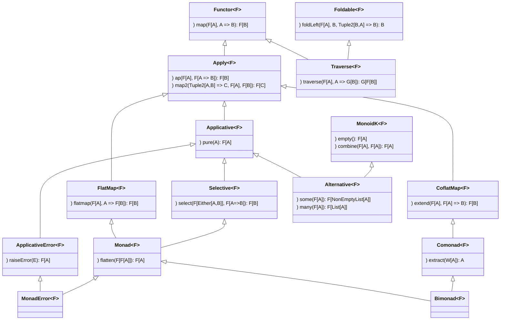

# Scala typeclassopedia

[Abstract Algebra](./AbstractAlgebra.MD)

[Category Theory](#category-theory)

* Base abstractions
  * [Functor](#functor-covariant-functor)
  * [Apply](#apply)
  * [Applicative](#applicative-applicative-functor)
  * [Monad](#monad)
  * [Contravariant](./Contravariant.MD#contravariant-contravariant-functor)
  * [Comonad](./Comonads.MD#comonad)
  * [Foldable](#foldable)
  * [Bifunctor](./Bifunctors.MD#bifunctor)
  * [Arrow](./Profunctors.MD#arrow)
  * [Coyoneda](./KanExtensions.MD#coyoneda)

* Covariant Functors
  * [Functor](#functor-covariant-functor)
  * [Apply](#apply)
  * [Applicative](#applicative-applicative-functor)
  * [Selective](#selective-selective-applicative-functors)

* [Monad](#monad)
  * [Reader](#reader)
  * [Writer](#writer)
  * [State](#state)
  * [RWS Monad](#rws-monad)
  * [Update Monad](#update-monad)
  * [Logic Monad, Prompt Monad, Failure Monad](#logic-monad-prompt-monad-failure-monad)
  * [Type-Indexed Monads](#type-indexed-monads)
  * [ContT (Continuation Monad)](#contt-continuation-monad)
  * [Reverse State Monad](#reverse-state-monad)
  * [Tardis (Bidirectional State Monad)](#tardis-bidirectional-state-monad)
  * [Chronicle Monad](#chronicle-monad)
  * [Bimonad](#bimonad)
  * [Dijkstra monad](#dijkstra-monad)
  * [Hoare Monad](#hoare-monad)

* [IO related monads](#io-related-monads)
  * [IO](#io-monad)
  * [Bifunctor IO (BIO)](#bifunctor-io-bio)
  * [RIO Monad (Reader + IO)](#rio-monad-reader--io)
  * [TRIO (RIO Monad + Bifunctor IO)](#trio-rio-monad--bifunctor-io)

* [Commutative](#commutative)
  * [CommutativeArrow](./Profunctors.MD#commutativearrow)

* Contravariant functors
  * [Contravariant](./Contravariant.MD#contravariant-contravariant-functor)
  * [Divide (Contravariant Apply)](./Contravariant.MD#divide-contravariant-apply)
  * [Divisible (Contravariant Applicative)](./Contravariant.MD#divisible-contravariant-applicative)

* Contravariant Adjuctions & Representable
  * [Contravariant Adjunction](./Contravariant.MD#contravariant-adjunction)
  * [Contravariant Rep](./Contravariant.MD#contravariant-rep)

* [Contravariant Kan Extensions](./Contravariant.MD#contravariant-kan-extensions)
  * [Contravariant Yoneda](./Contravariant.MD#contravariant-yoneda)
  * [Contravariant Coyoneda](./Contravariant.MD#contravariant-coyoneda)
  * [Contravariant Day](./Contravariant.MD#contravariant-day)
  * [Invariant Day](./Contravariant.MD#invariant-day)

* Invariant Functors
  * [Invariant (Invariant Functor, Exponential Functor)](#invariant-invariant-functor-exponential-functor)
  * [Invariant Day](./HigherKinded.MD#invariant-day)

* [Natural transformation (FunctionK)](./HigherKinded.MD#natural-transformation-functionk)

* Bifunctors
  * [Bifunctor](./Bifunctors.MD#bifunctor)
  * [Bifunctor Join](./Bifunctors.MD#bifunctor-join)
  * [Bifunctor Wrap](./Bifunctors.MD#bifunctor-wrap)
  * [Bifunctor Flip](./Bifunctors.MD#bifunctor-flip)
  * [Bifunctor Joker](./Bifunctors.MD#bifunctor-joker)
  * [Bifunctor Clown](./Bifunctors.MD#bifunctor-clown)
  * [Bifunctor Product](./Bifunctors.MD#bifunctor-product)
  * [Bifunctor Sum](./Bifunctors.MD#bifunctor-sum)
  * [Bifunctor Tannen](./Bifunctors.MD#bifunctor-tannen)
  * [Bifunctor Biff](./Bifunctors.MD#bifunctor-biff)
  * [Bitraverse](./Bifunctors.MD#bitraverse)
  * [Bifoldable](./Bifunctors.MD#bifoldable)

* Comonads
  * [Comonad](./Comonads.MD#comonad)
    * [Coreader (Env comonad, Product comonad)](./Comonads.MD#coreader-env-comonad-product-comonad)
    * [Cowriter](./Comonads.MD#cowriter)
    * [Cofree](./Free.MD#cofree)
    * [Cokleisli](./Comonads.MD#cokleisli)
  * [Bimonad](./Comonads.MD#bimonad)

* Traversing Folding Filtering
  * [Monoid](./AbstractAlgebra.MD#monoid)
  * [Foldable](#foldable)
  * [Traverse](#traverse)
  * [Bitraverse](#bitraverse)
  * [Bifoldable](#bifoldable)
  * [FunctorFilter](#functorfilter)
  * [TraverseFilter](#traversefilter)
  * [Distributive](#distributive)
  * [Cofree Traverse](./Free.MD#cofree-traverse)

* Monads not compose - solutions
  * [Monad Transformers](#monad-transformers-optiont-eithert-readert)
  * [Free Monads](./Free.MD#free-monads)
  * Tagless Final
  * [Extensible effects](#extensible-effects)

* [Free constructions](./Free.MD#free-constructions)
  * [Free Applicative](./Free.MD#free-applicative)
  * [Free Monads](./Free.MD#free-monads)
  * [Cofree](./Free.MD#cofree)
  * [Free Alternative](./Free.MD#free-alternative)
  * [Free Arrow](./Free.MD#free-arrow)
  * [Free Monad transformers](./Free.MD#free-monad-transformers)
  * [Cofree Traverse](./Free.MD#cofree-traverse)
 
* [Representable & Adjunctions](./Adjunction.MD#representable--adjunctions)
  * [Representable](./Adjunction.MD#representable)
  * [Corepresentable](./Adjunction.MD#corepresentable)
  * [Adjunction](./Adjunction.MD#adjunction)
  * [Adjoint Triples](./Adjunction.MD#adjoint-triples)

* [(Co)Yoneda & (Co)Density & Kan Extensions](./KanExtensions.MD#coyoneda--codensity--kan-extensions)
  * [Yoneda](./KanExtensions.MD#yoneda)
  * [Coyoneda](./KanExtensions.MD#coyoneda)
  * [Right Kan extension](./KanExtensions.MD#right-kan-extension)
  * [Left Kan Extension](./KanExtensions.MD#left-kan-extension)
  * [Density Comonad](./KanExtensions.MD#density-comonad)
  * [Codensity](./KanExtensions.MD#codensity)
  * [Day Convolution](./KanExtensions.MD#day-convolution)

* Profunctors
  * [Profunctor](./Profunctors.MD#profunctor)
  * [Star](./Profunctors.MD#star)
  * [CoStar](./Profunctors.MD#costar)
  * [Strong Profunctor](./Profunctors.MD#strong-profunctor)
  * [Tambara](./Profunctors.MD#tambara)
  * [Choice Profunctor](./Profunctors.MD#choice-profunctor)
  * [Extranatural Transformation](./Profunctors.MD#extranatural-transformation)
  * [Profunctor Functor](./Profunctors.MD#profunctor-functor)
  * [Profunctor Monad](./Profunctors.MD#profunctor-monad)
  * [Profunctor Comonad](./Profunctors.MD#profunctor-comonad)
  * [Procompose](./Profunctors.MD#procompose)
  * [ProductProfunctor](./Profunctors.MD#roductprofunctor)
  * [SumProfunctor](./Profunctors.MD#sumprofunctor)

* Profunctor Adjuctions & Representable
  * [Profunctor Adjunction](./Profunctors.MD#profunctor-adjunction)
  * [Profunctor Rep](./Profunctors.MD#profunctor-rep)

* Profunctor Kan Extensions
  * [Profunctor Yoneda](./Profunctors.MD#profunctor-yoneda)
  * [Profunctor CoYoneda](./Profunctors.MD#profunctor-coyoneda)
  * [Profunctor Ran](./Profunctors.MD#profunctor-ran)
  * [Profunctor Codensity](./Profunctors.MD#profunctor-codensity)

* [Arrows](./Profunctors.MD#arrows)
  * [Category](./Profunctors.MD#category)
  * [Arrow](./Profunctors.MD#arrow)
  * [CommutativeArrow](./Profunctors.MD#commutativearrow)
  * [Arrow Choice](./Profunctors.MD#arrow-choice)
  * [Arrow Apply, Arrow Monad](./Profunctors.MD#arrow-apply-arrow-monad)
  * [Arrow Loop](./Profunctors.MD#arrow-loop)
  * [Arrow Zero](./Profunctors.MD#arrow-zero)
  * [Free Arrow](./Free.MD#free-arrow)
  * [Kleisli](./Profunctors.MD#kleisli)
  * [Cokleisli](./Profunctors.MD#cokleisli)
  * [BiArrow](./Profunctors.MD#biarrow)
  * [BiKleisli](./Profunctors.MD#bikleisli)

* [Cayley representations](#cayley-representations)
  * [Difference Lists](#difference-lists)
  * [Codensity](./KanExtensions.MD#codensity)
  * [Double Cayley Representation](#double-cayley-representation)

* [ADT (Algebra of types)](./Limits.MD#adt-algebra-of-types)
  * [Unit](./Limits.MD#unit)
  * [Void](./Limits.MD#void)
  * [Product](./Limits.MD#product)
  * [Sum (Coproduct)](./Limits.MD#sum-coproduct)
  * [These](./Limits.MD#These)

* Higher kinded & exotic abstractions
  * [Monoidal Category, Monoid Object](./HigherKinded.MD#monoidal-categories-monoid-object)
  * [Cartesian Closed Category](./HigherKinded.MD#cartesian-closed-category)
  * [Day Convolution](./HigherKinded.MD#day-convolution)
  * [Functor Functor (FFunctor)](./HigherKinded.MD#functor-functor-ffunctor)
  * [Monad morphisms](./HigherKinded.MD#monad-morphisms)
  * [higher kinded category theory](./HigherKinded.MD#higher-kinded-category-theory)
  * [SemigroupK (Plus)](#semigroupk-plus)
  * [MonoidK (PlusEmpty)](#monoidk-plusempty)
  * [Dinatural Transformation](./Profunctors.MD#dinatural-transformation)
  * [Ends & Coends](./Profunctors.MD#ends--coends)
  * [Align](#align)
  * [Task](#andrey-mokhov-task)
  * [Transducers](#transducers)
  * [Relative monads](#relative-monads)
  * [Disintegrate](#disintegrate)

* Limits
  * [Cone](./Limits.MD#cone)
  * [Cocone](./Limits.MD#cocone)
  * [Diagonal Functor](./Limits.MD#diagonal-functor)
  * [Limit](./Limits.MD#limit)
  * [Colimit](./Limits.MD#colimit)
  * [Ends & Coends](./Profunctors#ends--coends)

* Topoi
  * [Topos](./Topos.MD#topos)

* [Other Encodings of Category Theory](./OtherEncodingsOfCT.MD)
  * [data-category by Sjoerd Visscher](./OtherEncodingsOfCT.MD#encoding-of-category-theory-by-sjoerd-visscher)
  * [Formalizations of Category Theory in proof assistants (Coq)](./OtherEncodingsOfCT.MD#formalizations-of-category-theory-in-proof-assistants)

* [Recursion schemas](RecursionSchemas.MD)
  * [Unfoldable](#unfoldable)

* [Optics](./Optics.MD)

* [Resource About Category Theory](#resource-about-category-theory)
  * [Mathematical resources about Category Theory](ComputationalTrinitarianism.MD)

* [Functor Oriented Programming](#functor-oriented-programming)

* [Functional data structures](./FunctionalDataStructures.MD)

## Category Theory

## Resource About Category Theory

* Resources covering topics about FP and category theory in great details:
  * [Functional Programming in Scala - Paul Chiusano and Rúnar Bjarnason](https://www.manning.com/books/functional-programming-in-scala) Best book about FP in Scala. I have bought it for myself and higly recommend it. Worth reading, doing exercises and re-reading.
  * Functional Structures in Scala - Michael Pilquist [(video playlist)](https://www.youtube.com/watch?v=Dsd4pc99FSY&list=PLFrwDVdSrYE6dy14XCmUtRAJuhCxuzJp0): workshop on [implementating FP constructions](https://github.com/mpilquist/Structures) with usage examples and great insights about Scala and FP.
  * Applied functional type theory - Sergei Winitzki [(video playlist)](https://www.youtube.com/watch?v=0Ld79Lnzx_o&list=PLcoadSpY7rHXJWbUkjQ3P9MXBbXxLP8kV)
  * Series of blog posts by Eugene Yokota (@eed3si9n): [herding cats](http://eed3si9n.com/herding-cats/) and [learning Scalaz](http://eed3si9n.com/learning-scalaz/) Easy to understand examples, clear explanations, many insights from Haskell papers and literature.
  * [Examples in scalaz repository](https://github.com/scalaz/scalaz/tree/series/7.3.x/example/src/main/scala/scalaz/example) Learning Scalaz is probably the best documentation for Scalaz.
  * [Documentation for Cats](https://typelevel.org/cats/) (runnable online version for older Cats version on [ScalaExercises](https://www.scala-exercises.org/cats))
  * [channingwalton/typeclassopedia](https://github.com/channingwalton/typeclassopedia) implementation of Haskell Typeclassopedia by Channing Walton, [(blog post)](http://channingwalton.github.io/typeclassopedia/)
  * Notes on Category Theory in Scala 3 (Dotty) - Juan Pablo Romero Méndez [(blog post)](https://typista.org/categories-in-dotty/#1-categories)
  * Scala Type-class Hierarchy - Tony Morris [(blog post)](http://blog.tmorris.net/posts/scala-type-class-hierarchy/index.html) (traits for all cathegory theory constructions with exotic ones like `ComonadHoist`)
  * [Summary of types in Cats documentation](https://typelevel.org/cats/nomenclature.html)
  * (Haskell) [Typeclassopedia](https://wiki.haskell.org/Typeclassopedia)
  * (Kotlin) [Patterns from Category Theory in Kotlin](https://arrow-kt.io/docs/)
