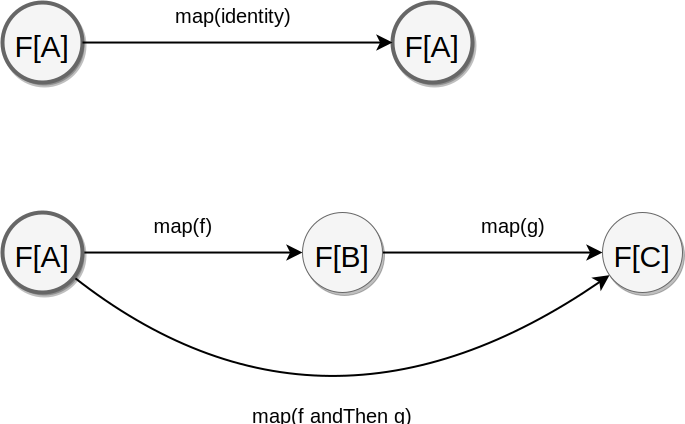

[](https://travis-ci.org/lemastero/scala_typeclassopedia)

# Scala typeclassopedia

[Abstract Algebra](./AbstractAlgebra.MD)

[Category Theory](#category-theory)

* Covariant Functors
  * [Functor](#functor-covariant-functor)
  * [Apply](#apply)
  * [Applicative](#applicative-applicative-functor)
  * [Selective](#selective-selective-applicative-functors)

* [Monad](#monad)
  * [Reader](#reader)
  * [Writer](#writer)
  * [State](#state)
  * [RWS Monad](#rws-monad)
  * [Update Monad](#update-monad)
  * [Logic Monad, Prompt Monad, Failure Monad](#logic-monad-prompt-monad-failure-monad)
  * [Type-Indexed Monads](#type-indexed-monads)
  * [ContT (Continuation Monad)](#contt-continuation-monad)
  * [Reverse State Monad](#reverse-state-monad)
  * [Tardis (Bidirectional State Monad)](#tardis-bidirectional-state-monad)
  * [Chronicle Monad](#chronicle-monad)
  * [Bimonad](#bimonad)
  * [Dijkstra monad](#dijkstra-monad)
  * [Hoare Monad](#hoare-monad)

* [IO related monads](#io-related-monads)
  * [IO](#io-monad)
  * [Bifunctor IO (BIO)](#bifunctor-io-bio)
  * [RIO Monad (Reader + IO)](#rio-monad-reader--io)
  * [TRIO (RIO Monad + Bifunctor IO)](#trio-rio-monad--bifunctor-io)

* [Commutative](#commutative)
  * [CommutativeArrow](./Profunctors.MD#commutativearrow)

* Contravariant functors
  * [Contravariant](./Contravariant.MD#contravariant-contravariant-functor)
  * [Divide (Contravariant Apply)](./Contravariant.MD#divide-contravariant-apply)
  * [Divisible (Contravariant Applicative)](./Contravariant.MD#divisible-contravariant-applicative)

* Contravariant Adjuctions & Representable
  * [Contravariant Adjunction](./Contravariant.MD#contravariant-adjunction)
  * [Contravariant Rep](./Contravariant.MD#contravariant-rep)

* [Contravariant Kan Extensions](./Contravariant.MD#contravariant-kan-extensions)
  * [Contravariant Yoneda](./Contravariant.MD#contravariant-yoneda)
  * [Contravariant Coyoneda](./Contravariant.MD#contravariant-coyoneda)
  * [Contravariant Day](./Contravariant.MD#contravariant-day)
  * [Invariant Day](./Contravariant.MD#invariant-day)

* Invariant Functors
  * [Invariant (Invariant Functor, Exponential Functor)](#invariant-invariant-functor-exponential-functor)
  * [Invariant Day](./HigherKinded.MD#invariant-day)

* [Natural transformation (FunctionK)](./HigherKinded.MD#natural-transformation-functionk)

* Bifunctors
  * [Bifunctor](./Bifunctors.MD#bifunctor)
  * [Bifunctor Join](./Bifunctors.MD#bifunctor-join)
  * [Bifunctor Wrap](./Bifunctors.MD#bifunctor-wrap)
  * [Bifunctor Flip](./Bifunctors.MD#bifunctor-flip)
  * [Bifunctor Joker](./Bifunctors.MD#bifunctor-joker)
  * [Bifunctor Clown](./Bifunctors.MD#bifunctor-clown)
  * [Bifunctor Product](./Bifunctors.MD#bifunctor-product)
  * [Bifunctor Sum](./Bifunctors.MD#bifunctor-sum)
  * [Bifunctor Tannen](./Bifunctors.MD#bifunctor-tannen)
  * [Bifunctor Biff](./Bifunctors.MD#bifunctor-biff)
  * [Bitraverse](./Bifunctors.MD#bitraverse)
  * [Bifoldable](./Bifunctors.MD#bifoldable)

* Comonads
  * [Comonad](./Comonads.MD#comonad)
    * [Coreader (Env comonad, Product comonad)](./Comonads.MD#coreader-env-comonad-product-comonad)
    * [Cowriter](./Comonads.MD#cowriter)
    * [Cofree](./Comonads.MD#cofree)
    * [Cokleisli](./Comonads.MD#cokleisli)
  * [Bimonad](./Comonads.MD#bimonad)

* Traversing Folding Filtering
  * [Monoid](./AbstractAlgebra.MD#monoid)
  * [Foldable](#foldable)
  * [Traverse](#traverse)
  * [Bitraverse](#bitraverse)
  * [Bifoldable](#bifoldable)
  * [FunctorFilter](#functorfilter)
  * [TraverseFilter](#traversefilter)
  * [Distributive](#distributive)
  * [Cofree Traverse](./Free.MD#cofree-traverse)

* Monads not compose - solutions
  * [Monad Transformers](#monad-transformers-optiont-eithert-readert)
  * [Free Monads](./Free.MD#free-monads)
  * Tagless Final
  * [Extensible effects](#extensible-effects)

* [Free constructions](./Free.MD#free-constructions)
  * [Free Applicative](./Free.MD#free-applicative)
  * [Free Monads](./Free.MD#free-monads)
  * [Cofree](./Free.MD#cofree)
  * [Free Alternative](./Free.MD#free-alternative)
  * [Free Arrow](./Free.MD#free-arrow)
  * [Free Monad transformers](./Free.MD#free-monad-transformers)
  * [Cofree Traverse](./Free.MD#cofree-traverse)
 
* [Representable & Adjunctions](./Adjunction.MD#representable--adjunctions)
  * [Representable](./Adjunction.MD#representable)
  * [Corepresentable](./Adjunction.MD#corepresentable)
  * [Adjunction](./Adjunction.MD#adjunction)
  * [Adjoint Triples](./Adjunction.MD#adjoint-triples)

* [(Co)Yoneda & (Co)Density & Kan Extensions](./KanExtensions.MD#coyoneda--codensity--kan-extensions)
  * [Yoneda](./KanExtensions.MD#yoneda)
  * [Coyoneda](./KanExtensions.MD#coyoneda)
  * [Right Kan extension](./KanExtensions.MD#right-kan-extension)
  * [Left Kan Extension](./KanExtensions.MD#left-kan-extension)
  * [Density Comonad](./KanExtensions.MD#density-comonad)
  * [Codensity](./KanExtensions.MD#codensity)
  * [Day Convolution](./KanExtensions.MD#day-convolution)

* Profunctors
  * [Profunctor](./Profunctors.MD#profunctor)
  * [Star](./Profunctors.MD#star)
  * [CoStar](./Profunctors.MD#costar)
  * [Strong Profunctor](./Profunctors.MD#strong-profunctor)
  * [Tambara](./Profunctors.MD#tambara)
  * [Choice Profunctor](./Profunctors.MD#choice-profunctor)
  * [Extranatural Transformation](./Profunctors.MD#extranatural-transformation)
  * [Profunctor Functor](./Profunctors.MD#profunctor-functor)
  * [Profunctor Monad](./Profunctors.MD#profunctor-monad)
  * [Profunctor Comonad](./Profunctors.MD#profunctor-comonad)
  * [Procompose](./Profunctors.MD#procompose)
  * [ProductProfunctor](./Profunctors.MD#roductprofunctor)
  * [SumProfunctor](./Profunctors.MD#sumprofunctor)

* Profunctor Adjuctions & Representable
  * [Profunctor Adjunction](./Profunctors.MD#profunctor-adjunction)
  * [Profunctor Rep](./Profunctors.MD#profunctor-rep)

* Profunctor Kan Extensions
  * [Profunctor Yoneda](./Profunctors.MD#profunctor-yoneda)
  * [Profunctor CoYoneda](./Profunctors.MD#profunctor-coyoneda)
  * [Profunctor Ran](./Profunctors.MD#profunctor-ran)
  * [Profunctor Codensity](./Profunctors.MD#profunctor-codensity)

* [Arrows](./Profunctors.MD#arrows)
  * [Category](./Profunctors.MD#category)
  * [Arrow](./Profunctors.MD#arrow)
  * [CommutativeArrow](./Profunctors.MD#commutativearrow)
  * [Arrow Choice](./Profunctors.MD#arrow-choice)
  * [Arrow Apply, Arrow Monad](./Profunctors.MD#arrow-apply-arrow-monad)
  * [Arrow Loop](./Profunctors.MD#arrow-loop)
  * [Arrow Zero](./Profunctors.MD#arrow-zero)
  * [Free Arrow](./Free.MD#free-arrow)
  * [Kleisli](./Profunctors.MD#kleisli)
  * [Cokleisli](./Profunctors.MD#cokleisli)
  * [BiArrow](./Profunctors.MD#biarrow)
  * [BiKleisli](./Profunctors.MD#bikleisli)

* [Cayley representations](#cayley-representations)
  * [Difference Lists](#difference-lists)
  * [Codensity](./KanExtensions.MD#codensity)
  * [Double Cayley Representation](#double-cayley-representation)

* [ADT (Algebra of types)](./Limits.MD#adt-algebra-of-types)
  * [Unit](./Limits.MD#unit)
  * [Void](./Limits.MD#void)
  * [Product](./Limits.MD#product)
  * [Sum (Coproduct)](./Limits.MD#sum-coproduct)
  * [These](./Limits.MD#These)

* Higher kinded & exotic abstractions
  * [Monoidal Category, Monoid Object](./HigherKinded.MD#monoidal-categories-monoid-object)
  * [Cartesian Closed Category](./HigherKinded.MD#cartesian-closed-category)
  * [Day Convolution](./HigherKinded.MD#day-convolution)
  * [Functor Functor (FFunctor)](./HigherKinded.MD#functor-functor-ffunctor)
  * [Monad morphisms](./HigherKinded.MD#monad-morphisms)
  * [higher kinded category theory](./HigherKinded.MD#higher-kinded-category-theory)
  * [SemigroupK (Plus)](#semigroupk-plus)
  * [MonoidK (PlusEmpty)](#monoidk-plusempty)
  * [Dinatural Transformation](./Profunctors.MD#dinatural-transformation)
  * [Ends & Coends](./Profunctors.MD#ends--coends)
  * [Align](#align)
  * [Task](#andrey-mokhov-task)
  * [Transducers](#transducers)
  * [Relative monads](#relative-monads)
  * [Disintegrate](#disintegrate)

* Limits
  * [Cone](./Limits.MD#cone)
  * [Cocone](./Limits.MD#cocone)
  * [Diagonal Functor](./Limits.MD#diagonal-functor)
  * [Limit](./Limits.MD#limit)
  * [Colimit](./Limits.MD#colimit)
  * [Ends & Coends](./Profunctors#ends--coends)

* Topoi
  * [Topos](./Topos.MD#topos)

* [Other Encodings of Category Theory](./OtherEncodingsOfCT.MD)
  * [data-category by Sjoerd Visscher](./OtherEncodingsOfCT.MD#encoding-of-category-theory-by-sjoerd-visscher)
  * [Formalizations of Category Theory in proof assistants (Coq)](./OtherEncodingsOfCT.MD#formalizations-of-category-theory-in-proof-assistants)

* [Recursion schemas](RecursionSchemas.MD)
  * [Unfoldable](#unfoldable)

* [Optics](./Optics.MD)

* [Resource About Category Theory](#resource-about-category-theory)
  * [Mathematical resources about Category Theory](ComputationalTrinitarianism.MD)

* [Functor Oriented Programming](#functor-oriented-programming)

* [Functional data structures](./FunctionalDataStructures.MD)

## Category Theory



### Functor (Covariant Functor)

Type constructor `F[_]` that requires single type with function `map` - ability to transform its content, without changing the structure.

You can think of Functor using following intuitions:
- containers (Id, List, Vector, Tree, Option) can apply given function to every element in the collection
- computational context - `map` applies function to a value inside this effect, without changing the effect
    - Id - no effects
    - Const - always return the same value (ignore changes)
    - Option - may not have value,
    - List/Vector - may have multiple values,
    - Either/ValidatedNel/Try - may contain value or error(s) 
    - Reader - require some context to be computed
    - Writer - while computing value, generate some description
    - State, IO - computing changes a state
    - Monix Task/Future/Twitter Future/Scalaz Task - needs time to be computed
    - Map - is indexed with other type (see Controversies about Map)

```scala
trait Functor[F[_]] {
  def map[A,B](a: F[A])(f: A => B): F[B]
}
```

* Functor Implementations: [Scalaz 7](https://github.com/scalaz/scalaz/blob/series/7.3.x/core/src/main/scala/scalaz/Functor.scala), [Scalaz 8](https://github.com/scalaz/scalaz/blob/series/8.0.x/base/shared/src/main/scala/scalaz/tc/functor.scala), [Cats](https://github.com/typelevel/cats/blob/master/core/src/main/scala/cats/Functor.scala), [Idris](https://github.com/idris-lang/Idris-dev/blob/master/libs/prelude/Prelude/Functor.idr) [Purescript](https://github.com/purescript/purescript-prelude/blob/master/src/Data/Functor.purs) [Haskell base](http://hackage.haskell.org/package/base/docs/Data-Functor.html), [Haskell data-category](http://hackage.haskell.org/package/data-category/docs/Data-Category-Functor.html#g:2), [nLab](https://ncatlab.org/nlab/show/functor), [Java Mojang/DataFixerUpper](https://github.com/Mojang/DataFixerUpper/blob/master/src/main/java/com/mojang/datafixers/kinds/Functor.java)
* Encoding close to mathematics: [vpatryshev/Categories](https://github.com/vpatryshev/Categories/blob/master/src/main/scala/math/cat/Functor.scala)
* Formalization in proof assistants: [statebox/idris-ct](https://github.com/statebox/idris-ct/blob/master/src/Basic/Functor.lidr), [UniMath](https://github.com/UniMath/UniMath/blob/master/UniMath/CategoryTheory/Core/Functors.v), [HoTT Book](https://github.com/HoTT/HoTT/blob/master/theories/Categories/Functor/Core.v), [cubicaltt](https://github.com/mortberg/cubicaltt/blob/master/examples/category.ctt)

* Functor Laws ([Cats](https://github.com/typelevel/cats/blob/master/laws/src/main/scala/cats/laws/FunctorLaws.scala), [Scalaz 7](https://github.com/scalaz/scalaz/blob/series/7.3.x/core/src/main/scala/scalaz/Functor.scala#L98-L107) [Haskell](http://hackage.haskell.org/package/base/docs/Data-Functor.html#t:Functor)):
  1. identify: `xs.map(identity) == xs`
  2. composition: `xs.map(f).map(g) == xs.map(x => g(f(x))`



If Functor satisfies first law, then it also satisfies second: [(Haskell) The second Functor law is redundant - David Luposchainsky](https://github.com/quchen/articles/blob/master/second_functor_law.md)
if we don't include `bottom values` - [(Haskell) contrexample using undefined](https://stackoverflow.com/questions/8305949/haskell-functor-implied-law/8323243#8323243).

* In Category Theory, functor is a mapping of:
   * objects (`F[_]` maps types e.g. `Int` to `List[Int]`) and
   * morphisms (if `f` is mapping between `A` and `B` then we can think of `map(f)` as mapping between `F[A]` and `F[B]`) that
   * preserves composition and identity - this is ensured by the Functor Laws

But in general, functor maps two arbitrary categories. Functor, that maps the same category to itself, is called `endo functor`.
So strictly speaking, Functor in programming is `Endofunctor` in Category theory.

* Derived methods of Functor:

```scala
def lift[A, B](f: A => B): F[A] => F[B] // lift regular function to function inside container
def fproduct[A, B](fa: F[A])(f: A => B): F[(A, B)] // zip elements with result after applying f
def as[A, B](fa: F[A], b: B): F[B] // replace every element with b
def void[A](fa: F[A]): F[Unit] // clear preserving structure
def tupleLeft[A, B](fa: F[A], b: B): F[(B, A)]
def tupleRight[A, B](fa: F[A], b: B): F[(A, B)]
def widen[A, B >: A](fa: F[A]): F[B]
```

* Functors can compose: Cats [ComposedFunctor](https://github.com/typelevel/cats/blob/master/core/src/main/scala/cats/Composed.scala#L20-L26) [compose](https://github.com/typelevel/cats/blob/master/core/src/main/scala/cats/Functor.scala#L147-L151), [Scalaz 7](https://github.com/scalaz/scalaz/blob/series/7.3.x/core/src/main/scala/scalaz/Functor.scala#L61-L66)

* An examples for [instances for built in types](https://github.com/lemastero/learn_scala_cats/blob/master/src/main/scala/functor/InstancesForBuiltInTypes.scala),
[function1](https://www.youtube.com/watch?v=Dsd4pc99FSY&t=1075),
and [custom Tree type](https://github.com/lemastero/learn_scala_cats/blob/master/src/main/scala/functor/TreeFunctor.scala).
An examples for [usage of map, derived methods, compose](https://github.com/lemastero/learn_scala_cats/blob/master/src/test/scala/functor/FunctorExamplesSpec.scala).

Functor definition does not require any conditions on type constructor `F` or any other operations (unlike Applicative, Monad).
Therefore pretty much everything is a Functor. Notable exceptions are:
  1. function input arguments (they are in `negative position`) or any input like type - see [Contravariant](./Contravariant.MD#contravariant-contravariant-functor) We can define Functor only for return type - because type is in `positive position`.
  2. abstractions where type can be both input and output, see [Invariant](#invariant-invariant-functor-exponential-functor) and blog post [Rotten Bananas by Edward Kmett](http://comonad.com/reader/2008/rotten-bananas/)
  3. abstractions that behave like a Functor but not there are some controversies:

* Controversies:
  1. Set: [Twitter discussion](https://twitter.com/MikeMKH/status/1073950622301503488) with explanation done by Mark Seemann [Set is not a functor](http://blog.ploeh.dk/2018/12/03/set-is-not-a-functor/). [Comments in alleycats](https://github.com/typelevel/cats/blob/master/alleycats-core/src/main/scala/alleycats/std/set.scala). [PR in Scalaz explaining why Set is not a Functor but is a Foldable](https://github.com/scalaz/scalaz/pull/276)
  2. Map: [Cats Issue #1831](https://github.com/typelevel/cats/issues/1831)
  3. Try: [Comments in alleycats](https://github.com/typelevel/cats/blob/master/alleycats-core/src/main/scala/alleycats/std/try.scala)

* Many abstractions have enough structure, so we can define `map` that obeys the laws. Such as `Monad` defined using `pure` and `flatMap`.
Another notable example is `Coyoneda` that wraps any type constructor and allows to use `map` on it. Functor instance is neccessary only when we want to extract the end result.
See [Free constructions](./Free.MD#free-constructions) for `Free functors`. 

* Resources:
  * herding cats - Functor - @eed3si9n [(blog post)](http://eed3si9n.com/herding-cats/Functor.html)
  * FSiS 1, Type Constructors, Functors, and Kind Projector - Michael Pilquist [(video)](https://www.youtube.com/watch?v=Dsd4pc99FSY)
  * [Cats docs](https://typelevel.org/cats/typeclasses/functor.html)
  * [Scalaz example](https://github.com/scalaz/scalaz/blob/series/7.3.x/example/src/main/scala/scalaz/example/FunctorUsage.scala)
  * (Haskell) The Extended Functor Family - George Wilson [(video)](https://www.youtube.com/watch?v=JUVMiRRq6wU)
  * Functional Patterns in C++, 1. Functors - Bartosz Milewski [(video)](https://www.youtube.com/watch?v=ph7qt0pkPkc)
  * Understanding Data.Functor.Constant constructor and applicative laws
 - [(SO)](https://stackoverflow.com/questions/21169943/understanding-data-functor-constant-constructor-and-applicative-laws)

### Apply

Apply is a Functor with superpower to apply function already inside container to container of arguments.

```scala
trait Apply[F[_]] extends Functor[F] {
  def ap[A, B](ff: F[A => B])(fa: F[A]): F[B]
}
```

* Apply Implementations: [Cats](https://github.com/typelevel/cats/blob/master/core/src/main/scala/cats/Apply.scala) [Scalaz 7](https://github.com/scalaz/scalaz/blob/series/7.3.x/core/src/main/scala/scalaz/Apply.scala) [Scalaz 8](https://github.com/scalaz/scalaz/blob/series/8.0.x/base/shared/src/main/scala/scalaz/tc/apply.scala) [Java Mojang/DataFixerUpper](https://github.com/Mojang/DataFixerUpper/blob/master/src/main/java/com/mojang/datafixers/functions/Apply.java)

* Apply Laws ([Cats](https://github.com/typelevel/cats/blob/master/laws/src/main/scala/cats/laws/ApplyLaws.scala), [Scalaz 7](https://github.com/scalaz/scalaz/blob/series/7.3.x/core/src/main/scala/scalaz/Apply.scala#L203-L208)):
  1. functor laws
  2. `ap` composition

```scala
def apComposition[A, B, C](fa: F[A], fab: F[A => B], fbc: F[B => C]): Boolean = {

  //        ap F[A => B]              ap F[B => C]
  // F[A] ==================> F[B] =================> F[C]
  val fb: F[B] = ap(fab)(fa)
  val left: F[C] = ap(fbc)(fb)

  val expand: (B => C) => ((A => B) => (A => C)) =
    (bc: B => C) =>
      (ab: A => B) =>
        bc compose ab

  //               map( A=>B => B=>C => A=>C )
  // F[B => C] ======================================> F[A=>B => A=>C]
  val fabac: F[(A => B) => (A => C)] = map(fbc)(expand)

  //              ap F[A=>B => A=>C]
  // F[A => B] ==============================> F[A => C]
  val fac: F[A => C] = ap(fabac)(fab)

  //           ap F[A=>C]
  // F[A] =========================> F[C]
  val right: F[C] = ap(fac)(fa)

  left == right
}
```

* Derived methods (there are version defined from `xyz2` until `xyz22`)

```scala
def apply2[A, B, Z]   (fa: F[A], fb: F[B])          (ff: F[(A,B) => Z]): F[Z]
def apply3[A, B, C, Z](fa: F[A], fb: F[B], fc: F[C])(ff: F[(A,B,C) => Z]): F[Z]
// ...

def map2[A , B, Z]  (fa: F[A], fb: F[B])          (f: (A, B) => Z):    F[Z]
def map3[A, B, C, Z](fa: F[A], fb: F[B], fc: F[C])(f: (A, B, C) => Z): F[Z]
// ...

def tuple2[A, B]   (fa: F[A], fb: F[B]):           F[(A, B)]
def tuple3[A, B, C](fa: F[A], fb: F[B], fc: F[C]): F[(A, B, C)]
// ...

def product[A,B](fa: F[A], fb: F[B]): F[(A, B)]
def flip[A, B](ff: F[A => B]): F[A] => F[B]
```

* Apply was extracted from Applicative definition and usually is defined as a weaker version of Applicative that cannot put value inside effect F.
So, instances for Apply are the same as for Applicative.

* Apply can compose: [Cats compose](https://github.com/typelevel/cats/blob/master/core/src/main/scala/cats/Apply.scala#L210-L214) [ComposedApply](https://github.com/typelevel/cats/blob/master/core/src/main/scala/cats/Composed.scala#L28-L37), [Scalaz 7](https://github.com/scalaz/scalaz/blob/series/7.3.x/core/src/main/scala/scalaz/Apply.scala#L52-L57))

* Resources:
  * herding cats - Apply - @eed3si9n [(blog post)](http://eed3si9n.com/herding-cats/Apply.html)
  * [Cats docs](https://typelevel.org/cats/typeclasses/applicative.html#apply---a-weakened-applicative)
  * [Scalaz example](https://github.com/scalaz/scalaz/blob/series/7.3.x/example/src/main/scala/scalaz/example/ApplyUsage.scala)
  * John DeGoes explains why `ap` is useful from Haskell perspective, but in Scala better would be to use `product` (named `zip`) [(reddit)](https://www.reddit.com/r/scala/comments/afor0h/scalaz_8_timeline/eeac71m/) 

### Applicative (Applicative Functor)

Applicative Functor is a Functor that can:
- apply function already inside container to container of arguments (so it is Apply)
- put value into container (lift into effect)

```scala
trait Applicative[F[_]] extends Apply[F] {
  def pure[A](value: A): F[A] // point
}
```

* Applicative Implementations: [Cats](https://github.com/typelevel/cats/blob/master/core/src/main/scala/cats/Applicative.scala) [Scalaz 7](https://github.com/scalaz/scalaz/blob/series/7.3.x/core/src/main/scala/scalaz/Applicative.scala) [Scalaz 8](https://github.com/scalaz/scalaz/blob/series/8.0.x/base/shared/src/main/scala/scalaz/tc/applicative.scala) [Haskell](https://hackage.haskell.org/package/base/docs/Control-Applicative.html) [Idris](https://github.com/idris-lang/Idris-dev/blob/master/libs/prelude/Prelude/Applicative.idr) [Java](https://github.com/Mojang/DataFixerUpper/blob/master/src/main/java/com/mojang/datafixers/kinds/Applicative.java)

* Applicative Laws ([Cats](https://github.com/typelevel/cats/blob/master/laws/src/main/scala/cats/laws/ApplicativeLaws.scala), [Scalaz 7](https://github.com/scalaz/scalaz/blob/series/7.3.x/core/src/main/scala/scalaz/Applicative.scala#L118-L134)):

1 identify: `xs.ap(pure(identity)) == xs` apply identify function lifted inside effect does nothing

```scala
def apIdentityLaw[A](fa: F[A]): Boolean = {
  val l1: F[A => A] = pure(identity[A])
  val l2: F[A] = ap(l1)(fa)

  //         ap F[identity]
  //  F[A] ==================> F[A]
  l2 == fa
}
```

2 homomorphism: `pure(a).ap(pure(f)) == pure(f(a))` lifting value a and applying lifted function f is the same as apply function to this value and then lift result

```scala
def homomorphismLaw[A, B](ab: A => B, a: A): Boolean = {
  val fab: F[A => B] = pure(ab)
  val fa: F[A] = pure(a)

  //         F[A => B]
  // F[A] =============> F[B]
  val l: F[B] = ap(fab)(fa)

  val r: F[B] = pure(ab(a))

  l == r
}
```

3 interchange: `pure(a).ap(ff) == ff.ap(pure(f => f(a)))` where `ff: F[A => B]`

```scala
def interchangeLaw[A, B](fab: F[A => B], a: A): Boolean = {
  //       ap F[A => B]
  // F[A] ==============> F[B]
  val l: F[B] = ap(fab)(pure(a))

  val fabb: F[(A => B) => B] = pure((f: A => B) => f(a))

  //              ap F[(A => B) => B]
  // F[A => B] ========================> F[B]
  val r: F[B] = ap(fabb)(fab)

  l == r
}
```

4 map: `fa.map(f) == fa.ap(pure(f))`

```scala
def mapLikeDerivedLaw[A, B](f: A => B, fa: F[A]): Boolean = {
  val l: F[B] = map(fa)(f)
  val r: F[B] = ap(pure(f))(fa)
  l == r
}
```

* Derived methods - see Apply

* Applicatives can be composed (Cats [compose](https://github.com/typelevel/cats/blob/master/core/src/main/scala/cats/Applicative.scala#L86-L90) [ComposedApplicative](https://github.com/typelevel/cats/blob/master/core/src/main/scala/cats/Composed.scala#L39-L45), [Scalaz 7](https://github.com/scalaz/scalaz/blob/series/7.3.x/core/src/main/scala/scalaz/Applicative.scala#L93-L98))

* Minimal set of methods to implement Applicative (other methods can be derived from them):
  * map2, pure
  * apply, pure

* Resources:
  * (Haskell) [Typeclassopedia - Applicative](https://wiki.haskell.org/Typeclassopedia#Applicative)
  * (Haskell) Applicative Functors - Łukasz Marchewka [(video)](https://www.youtube.com/watch?v=7y4Vf0klsUw)
  * FSiS 2 - Applicative type class - Michael Pilquist [(video)](https://www.youtube.com/watch?v=tD_EyIKqqCk)
  * FSiS 3 - Monad type class - Michael Pilquist [(video)](https://www.youtube.com/watch?v=VWCtLhH815M)
  * Cats: [docs](https://typelevel.org/cats/typeclasses/applicative.html) 
  * (Haskell) Applicative programming with effects - Conor McBride, Ross Paterson [(shorter)](http://strictlypositive.org/IdiomLite.pdf) [longer](http://strictlypositive.org/Idiom.pdf)
  * (Haskell) The Essence of the Iterator Pattern - Jeremy Gibbons, Bruno C. d. S. Oliveira: [(paper)](https://www.cs.ox.ac.uk/jeremy.gibbons/publications/iterator.pdf)
  * The Essence of the Iterator Pattern - Eric Torreborre [(blog post)](http://etorreborre.blogspot.com/2011/06/essence-of-iterator-pattern.html)
  * herding cats - Applicative: [(blog post)](http://eed3si9n.com/herding-cats/Applicative.html)
  * Static analysis with Applicatives - Gergő Érdi [(blog post)](https://gergo.erdi.hu/blog/2012-12-01-static_analysis_with_applicatives/)
  * Lifting - Tony Morris [(blog post)](http://blog.tmorris.net/posts/lifting/index.html)
  * (Haskell) Abstracting with Applicatives - Gershom Bazerman [(blog post)](http://comonad.com/reader/2012/abstracting-with-applicatives/)
  * (Haskell) Algebras of Applicatives - Gershom Bazerman [(blog post)](http://comonad.com/reader/2013/algebras-of-applicatives/)
  * Functional Patterns in C++, 2. Currying, Applicative - Bartosz Milewski [(video)](https://www.youtube.com/watch?v=Hx9jojeBj6w)

### Selective (Selective applicative functors)

"Extend the Applicative type class with a single method
that makes it possible to be selective about effects."

"handle is a selective function application:
you apply a handler function of type A => B when given a value of type Left(a),
but can skip the handler (along with its effects) in the case of Right(b)."

Andrey Mokhov

```scala
trait Selective[F[_]] extends Applicative[F] {
  def handle[A, B](fab: F[Either[A, B]], ff: F[A => B]): F[B]
  def select[A, B, C](fab: F[Either[A, B]], fac: F[A => C], fbc: F[B => C]): F[C]
}
```

* Implementations: [Haskell](http://hackage.haskell.org/package/selective/docs/Control-Selective.html) [cb372/cats-selective](https://github.com/cb372/cats-selective/blob/master/core/src/main/scala/cats/Selective.scala)

* Resources:
  * Selective functor in sbt - @eed3si9n [(blog post)](http://eed3si9n.com/selective-functor-in-sbt)
  * (Haskell) Selective applicative functors - Andrey Mokhov [(blog post)](https://blogs.ncl.ac.uk/andreymokhov/selective/), [(video)](https://www.youtube.com/watch?v=7vruj4gj38Q)
  * (Haskell) Selective Applicative Functors Declare Your Effects Statically, Select Which to Execute Dynamically - Andrey Mokhov, Georgy Lukyanov, Simon Marlow, Jeremie Dimino [(paper)](https://www.staff.ncl.ac.uk/andrey.mokhov/selective-functors.pdf)
  * (OCaml) [snowleopard/selective-ocaml](https://github.com/snowleopard/selective-ocaml)
  * (Coq) [tuura/selective-theory-coq](https://github.com/tuura/selective-theory-coq)
  * (Haskell) Haskell Cafe: Applicative functors with branch/choice? [(mail archive)](https://mail.haskell.org/pipermail/haskell-cafe/2012-July/102518.html)
  * [copumpkin/SelectiveSigma.hs](https://gist.github.com/copumpkin/d5bdbc7afda54ff04049b6bdbcffb67e#file-selectivesigma-hs-L38-L39)

### Monad

We add to Apply ability `flatMap` that can join two computations
and use the output from previous computations to decide what computations to run next.

```scala
trait Monad[F[_]] extends Apply[F] {
  def pure[A](value: A): F[A]
  def flatMap[A, B](fa: F[A])(f: A => F[B]): F[B]
}
```

* Monad Laws ([Cats](https://github.com/scalaz/scalaz/blob/series/7.3.x/core/src/main/scala/scalaz/Monad.scala#L76-L85), [Scalaz 7](https://github.com/scalaz/scalaz/blob/series/7.3.x/core/src/main/scala/scalaz/Monad.scala#L76-L85), [Haskell Wiki](https://wiki.haskell.org/Monad_laws)):
  1. flatmap associativity: `fa.flatMap(f).flatMap(g) == fa.flatMap(a => f(a).flatMap(b => g(b))`
  2. left identity: `pure(a).flatMap(f) == f(a)`
  3. right identity: `fa.flatMap(a => pure(a)) == fa`

```scala
def flatMapAssociativity[A,B,C](fa: M[A], f: A => M[B], g: B => M[C]): Boolean = {
  //         flatMap(f)
  //  M[A] =============> M[B]
  val l1: M[B] = flatMap(fa)(f)
  //         flatMap(g)
  //  M[B] =============> M[C]
  val l2: M[C] = flatMap(l1)(g)

  val r1: A => M[C] = a => flatMap(f(a))(b => g(b))
  //         flatMap(f flatMap g)
  //  M[A] ======================> M[C]
  val r2: M[C] = flatMap(fa)(r1)
  l2 == r2
}

def leftIdentity[A,B,C](a: A, f: A => M[B], g: B => M[C]): Boolean = {
  //    pure
  // A =======> M[A]
  val l1: M[A] = pure(a)
  //        flatMap
  // M[A] ==========> M[B]
  val l2: M[B] = flatMap(l1)(f)

  // A =======> M[B]
  val r: M[B] = f(a)
  l2 == r
}

def rightIdentity[A,B,C](a: A, fa: M[A], g: B => M[C]): Boolean = {
  //        flatMap
  // M[A] ==========> M[A]
  val l: M[A] = flatMap(fa)(pure)
  
  val r: M[A] = fa
  l == r
}
```


* Minimal set of methods to implement Monad (others can be derived using them):
  * pure, flatMap
  * pure, flatten, map
  * pure, flatten, apply
  * pure, flatten, map2

* Derived methods:
```scala
def flatten[A](ffa: F[F[A]]): F[A]
def sequence[G[_], A](as: G[F[A]])(implicit G: Traverse[G]): F[G[A]]
def traverse[A, G[_], B](value: G[A])(f: A => F[B])(implicit G: Traverse[G]): F[G[B]]
def replicateA[A](n: Int, fa: F[A]): F[List[A]]
def unit: F[Unit] // put under effect ()
def factor[A, B](ma: F[A], mb: F[B]): F[(A, B)]
```

* Monads do not compose [Tony Morris blog post](http://blog.tmorris.net/posts/monads-do-not-compose/index.html).
You can use Monad Transformer that know what monad is inside (OptionT, EitherT, ListT) or Free Monads or Eff Monad.

* Monads can't be filtered. You can use Moand Filter for that.

* Example (translated from John Huges mind blowing workshop: Monads and all that) [instance for custom Tree](https://github.com/lemastero/learn_scala_cats/blob/master/src/main/scala/monad/TreeMonad.scala) 
and [usage of flatMap to implement functions zip and number](https://github.com/lemastero/learn_scala_cats/blob/master/src/main/scala/helper_implementations/Tree.scala) 
(using [State Int](https://github.com/lemastero/learn_scala_cats/blob/master/src/main/scala/monad/IntState.scala)).

* Implementations:  
  FlatMap/Bind: [Cats](https://github.com/typelevel/cats/blob/master/core/src/main/scala/cats/CoflatMap.scala), [Scalaz 7](https://github.com/scalaz/scalaz/blob/series/7.3.x/core/src/main/scala/scalaz/Bind.scala), [Scalaz 8](https://github.com/scalaz/scalaz/blob/series/8.0.x/base/shared/src/main/scala/scalaz/tc/bind.scala)  
  Monad: [Cats](https://github.com/typelevel/cats/blob/master/core/src/main/scala/cats/Monad.scala), [Scalaz 7](https://github.com/scalaz/scalaz/blob/series/7.3.x/core/src/main/scala/scalaz/Monad.scala), [Scalaz 8](https://github.com/scalaz/scalaz/blob/series/8.0.x/base/shared/src/main/scala/scalaz/tc/monad.scala), [Idris](https://github.com/idris-lang/Idris-dev/blob/master/libs/prelude/Prelude/Monad.idr), [Purescript](https://pursuit.purescript.org/packages/purescript-prelude/docs/Control.Monad), [Agda](https://github.com/agda/agda-categories/blob/master/Categories/Monad.agda), [UniMath](https://github.com/UniMath/UniMath/blob/master/UniMath/CategoryTheory/Monads/Monads.v), [nLab](https://ncatlab.org/nlab/show/monad)

* Resources
  * FSiS 3 - Monad type class - Michael Pilquist [(vido 14:44)](https://www.youtube.com/watch?v=VWCtLhH815M&t=884)
  * herding cats - Monad [blog post](http://eed3si9n.com/herding-cats/Monad.html)
  * [Cats docs](https://typelevel.org/cats/typeclasses/monad.html)
  * (Haskell) Monads for functional programming - Philip Wadler [(paper)](http://homepages.inf.ed.ac.uk/wadler/papers/marktoberdorf/baastad.pdf)
  * (Haskell) Monads are Trees with Grafting - A Neighborhood of Infinity - Dan Piponi [(paper)](https://github.com/dpiponi/grafting3/blob/master/monads.pdf)
  * More on Monoids and Monads - [(blog post)](https://apocalisp.wordpress.com/2010/07/21/more-on-monoids-and-monads/)
  * [wiki.haskell - Blow your mind - Monad magic](https://wiki.haskell.org/Blow_your_mind#Monad_magic)
  * https://www.quora.com/What-are-some-crazy-things-one-can-do-with-monads-in-Haskell
  * (Category Theory) Monads - TheCatsters [(video playlist)](https://www.youtube.com/watch?v=9fohXBj2UEI&list=PL0E91279846EC843E)
  * (Type Theory) The Partiality Monad Achim Jung Fest An Intersection of Neighbourhoods - Thorsten Altenkirch [(slides)](http://www.cs.nott.ac.uk/~psztxa/talks/achimfest.pdf) (partial evaluation modeled using Monads)
  * Tail Call Elimination in Scala Monads [(blog post)](https://apocalisp.wordpress.com/2011/10/26/tail-call-elimination-in-scala-monads/)
  * MonadMask vs MonadBracket - Michael Snoyman [blog post](https://www.fpcomplete.com/blog/2017/02/monadmask-vs-monadbracket)
  * Functional Patterns in C++, 3. Async API, Monoid, Monad - Bartosz Milewski [video](https://www.youtube.com/watch?v=ozN6XxsAF84)
  * (Haskell) Trivial Monad solutions - @geophf [(blog post 1)](http://logicaltypes.blogspot.com/2008/05/trivial-monad-solutions.html) [(blog post 2)](http://logicaltypes.blogspot.com/2008/05/trivial-monad-solutions-cont.html)
  * Monads in Java - @geophf [(blog post)](http://logicaltypes.blogspot.com/2011/09/monads-in-java.html)

### Reader

Wrapper around function from given type.
Input type can be seen as some configuration required to produce result.  

```scala
case class Reader[-In, +R](run: In => R) {
  def map[R2](f: R => R2): Reader[In, R2] =
    Reader(run andThen f)

  def flatMap[R2, In2 <: In](f: R => Reader[In2, R2]): Reader[In2, R2] =
    Reader(x => f(run(x)).run(x))
}
```

* Reader can be used to implement dependency injection.
* Monad instance can be defined for Reaer.

* Resources
  * The Reader Monad for Dependency Injection - Json Arhart [(video)](https://www.youtube.com/watch?v=xPlsVVaMoB0)
  * FSiS 9 - Reader, ReaderT, Id  - Michael Pilquist [(video)](https://www.youtube.com/watch?v=H3CCvXx4GvI)
  * https://gist.github.com/Mortimerp9/5384467

### Writer

* Resources
  * Monadic Logging and You - Martin Snyder [(video)](https://www.youtube.com/watch?v=t-YX55ZF4g0)
  * The Writer Monad using Scala (example) - Tony Morris: [blog post](http://blog.tmorris.net/posts/the-writer-monad-using-scala-example/index.html)

### State

Abstraction over stateful computation.

```scala
case class State[S,A](runState: S => (A,S))
```

is a monad:

```scala
def stateMonad[S]: Monad[State[S, ?]] = new Monad[State[S, ?]] {

  def pure[A](a: A): State[S, A] = State(s => (a, s))

  def flatMap[A, B](ma: State[S, A])(f: A => State[S, B]): State[S, B] = State[S, B](
    s => {
      val (a: A, s2: S) = ma.runState(s)
      f(a).runState(s2)
    }
  )
}
```

* Resources
  * Towards an Effect System in Scala, Part 1: ST Monad [(blog post)](https://apocalisp.wordpress.com/2011/03/20/towards-an-effect-system-in-scala-part-1/)
  * Scalaz State Monad - Michael Pilquist [(video)](https://www.youtube.com/watch?v=Jg3Uv_YWJqI)
  * Memoisation with State using Scala - Tony Morris [(blog post)](http://blog.tmorris.net/posts/memoisation-with-state-using-scala/index.html)
  * Monads to Machine Code - Stephen Diehl [(blog post)](http://www.stephendiehl.com/posts/monads_machine_code.html) explore JIT compilation and LLVM using IO Monad and State Monad
  * Immutability, Docker, and Haskell's ST type - Michael Snoyman (https://www.fpcomplete.com/blog/2017/02/immutability-docker-haskells-st-type)

### RWS Monad

* Resources
  * (Haskell) Life after monads - robinp [(blog post)](https://www.schoolofhaskell.com/user/robinp/life-after-monads)
  * (Haskell) Tying the knot, redux - Dan Rosen [(blog post)](http://mergeconflict.com/tying-the-knot-redux/) [(reddit)](https://www.reddit.com/r/haskell/comments/w0haf/tying_the_knot_using_the_rws_monad/)
  * (Haskell) [mtl/Control.Monad.RWS](http://hackage.haskell.org/package/mtl/docs/Control-Monad-RWS.html)

### Update Monad

* Resources
  * (Haskell) Update Monads: Variation On State Monads - Chris Penner [(blog post)](https://chrispenner.ca/posts/update-monad)

### Logic Monad, Prompt Monad, Failure Monad
* [Adventures in Three Monads - Edward Z. Yang](http://web.mit.edu/~ezyang/Public/threemonads.pdf)
* [LogicT - backtracking monad transformer with fair operations and pruning](http://okmij.org/ftp/Computation/monads.html#LogicT)

### Type-Indexed Monads

 * indexed RWS monad [iravid/irwst IRWS](https://github.com/iravid/irwst/blob/rws/irwst/src/main/scala/com/iravid/irwst/IRWS.scala)
 * [Monad Factory: Type-Indexed Monads, Mark Snyder, Perry Alexander](https://www.researchgate.net/publication/221335580_Monad_Factory_Type-Indexed_Monads)
 * [Indexed Monads - Kwang's Haskell Blog](https://kseo.github.io/posts/2017-01-12-indexed-monads.html)
 * [garyb/purescript-indexed-monad](https://github.com/garyb/purescript-indexed-monad)

### ContT (Continuation Monad)

* Applications:
  * [Is there a real-world applicability for the continuation monad outside of academic use?](https://stackoverflow.com/questions/41202721/is-there-a-real-world-applicability-for-the-continuation-monad-outside-of-academ)
  * [snoyberg/conduit](https://github.com/snoyberg/conduit/blob/master/resourcet/Control/Monad/Trans/Resource/Internal.hs#L104-L105)
  * byorgey/MonadRandom [Strict](https://github.com/byorgey/MonadRandom/blob/master/Control/Monad/Trans/Random/Strict.hs#L197-L198), [Lazy](https://github.com/byorgey/MonadRandom/blob/master/Control/Monad/Trans/Random/Lazy.hs#L196-L197)
  * [mrkkrp/megaparsec](https://github.com/mrkkrp/megaparsec/blob/master/Text/Megaparsec/Internal.hs#L237-L241)
  * [gitpan/Perl6-Pugs](https://github.com/gitpan/Perl6-Pugs/blob/master/src/Pugs/AST/Eval.hs#L27)
  * [snapframework/heist](https://github.com/snapframework/heist/blob/master/src/Heist/Internal/Types/HeistState.hs#L543-L544)
  * [simonmar/monad-par](https://github.com/simonmar/monad-par/blob/master/monad-par/Control/Monad/Par/Scheds/Direct.hs)
  * [mvoidex/hsdev](https://github.com/mvoidex/hsdev/blob/master/src/System/Win32/FileMapping/Memory.hs)
  * [paolino/reactivegas Server](https://github.com/paolino/reactivegas/blob/master/Lib/Server/Server.hs#L54), [Passo (1)](https://github.com/paolino/reactivegas/blob/master/Lib/Passo.hs#L67) [(2)](https://github.com/paolino/reactivegas/blob/master/Lib/Passo.hs#L100), [Interazione](https://github.com/paolino/reactivegas/blob/master/Lib/Interazione.hs#L31)
  * [motemen/jusk](https://github.com/motemen/jusk/blob/master/src/Main.hs#L27)
  * [aleino/thesis](https://bitbucket.org/aleino/thesis/src/2a6657136dc2525f8c2afcbf0e1fceb98b94892c/poga/Graphics/GraphicalGame.hs?at=master&fileviewer=file-view-default)
  * [orbitz/web_typed](https://github.com/orbitz/web_typed/blob/master/libs/pa_monad/cc.ml)
  * [exFalso/Sim](https://github.com/exFalso/Sim/blob/master/SimNode.hs#L189)
  * [chris-taylor/Haskeme](https://github.com/chris-taylor/Haskeme/blob/master/src/Language/Types.hs#L64)
  * [vpetro/heopl](https://bitbucket.org/vpetro/heopl/src/d717615d311e8d7d45594e1e6b1b20a5680a521d/continuation-examples.hs?at=default&fileviewer=file-view-default)
  * [Rabbit: A Compiler for Scheme/Chapter 8 D. Conversion to Continuation-Passing Style](https://en.wikisource.org/wiki/Rabbit:_A_Compiler_for_Scheme/Chapter_8)

* Resources
  * Cats [src](https://github.com/typelevel/cats/blob/master/core/src/main/scala/cats/data/ContT.scala)
  * gist by xuwei-k (https://gist.github.com/xuwei-k/19c9bb8c3afd08175762957880c57500)
  * Continuation monad in Scala - Tony Morris [(blog post)](http://blog.tmorris.net/posts/continuation-monad-in-scala/index.html)
  * (Haskell) School of Haskell - The Mother of all Monads - Dan Piponi [(blog post)](https://www.schoolofhaskell.com/school/to-infinity-and-beyond/pick-of-the-week/the-mother-of-all-monads)
  * (Haskell) Haskell for all - The Continuation Monad - Gabriel Gonzalez [(blog post)](http://www.haskellforall.com/2012/12/the-continuation-monad.html)

### Reverse State Monad

* Resources
  * https://stackoverflow.com/questions/43712476/real-life-and-useful-examples-of-reverse-state-monad
  * The Curious Time-Traveling Reverse State Monad [(blog post)](https://tech-blog.capital-match.com/posts/5-the-reverse-state-monad.html)
  * https://kseo.github.io/posts/2017-01-21-writer-monad.html
  * https://pavkin.ru/reverse-state-monad-in-scala-is-it-possible/

### Tardis (Bidirectional State Monad)

* Resources
  * https://www.pusher.com/sessions/meetup/london-functional-programmers/interview-pro-tip-travel-through-time
  * https://rosettacode.org/wiki/Water_collected_between_towers
  * http://landcareweb.com/questions/33409/haskellde-ni-xiang-xing-cong-tardisdao-revstate
  * http://hackage.haskell.org/package/tardis/docs/Control-Monad-Tardis.html
  * https://kcsongor.github.io/time-travel-in-haskell-for-dummies/
  * https://www.reddit.com/r/haskell/comments/199po0/can_the_tardis_monad_be_used_in_an_efficient_way/
  * https://repl.it/@Ouroboros2/Haskell-Tardis-1
  * http://blog.sigfpe.com/2006/08/you-could-have-invented-monads-and.html

### Dijkstra monad

```scala
trait Dijkstra[S,A] {
  def wp[Omega](f: (S,A) => Omega): S => Omega
}
```

is a Monad:

```scala
implicit def dijakstraMonad[S]: Monad[Dijkstra[S, ?]] = new Monad[Dijkstra[S, ?]] {
  def pure[A](a: A): Dijkstra[S,A] = new Dijkstra[S,A] {
    def wp[Omega](f: (S, A) => Omega): S => Omega =
      s => f(s,a)
  }

  def flatMap[A,B](ma: Dijkstra[S,A])(f: A => Dijkstra[S,B]): Dijkstra[S,B] =
    new Dijkstra[S,B] {
      def wp[Omega](g: (S, B) => Omega): S => Omega =
        ma.wp{ case (s,a) => f(a).wp(g)(s) }
    }
}
```

can be created from State:

```scala
def fromState[S,A](h: State[S,A]): Dijkstra[S,A] =
  new Dijkstra[S,A] {
    def wp[Omega](f: (S, A) => Omega): S => Omega =
      s => {
        val (a,s2) = h.runState(s)
        f(s2,a)
      }
  }
```

and converted to State:

```scala
def fromDijkstra[S,A](k: Dijkstra[S,A]): State[S,A] = State(
  s => k.wp{ case(s2,a) => (a,s2) }(s)
)
```

* Resources
  * (Haskell) Dijkstra monads - James Cheney [(blgo post)](http://why-lambda.blogspot.com/2014/09/dijkstra-monads.html)
  * Dijkstra Monads in Monadic Computation - Bart Jacobs [(paper)](http://www.cs.ru.nl/B.Jacobs/PAPERS/Dijkstra-monad.pdf)
  * Dijkstra Monads for Free - Danel Ahman et. al. [(paper)](https://www.fstar-lang.org/papers/dm4free/)
  * Verifying Higher order Programs with the Dijkstra Monad - Nikhil Swamy, Juan Chen, Ben Livshits [(paper)](https://www.microsoft.com/en-us/research/publication/verifying-higher-order-programs-with-the-dijkstra-monad/)

### Hoare Monad

* Resources
  * (Coq) The Hoare State Monad - Wouter Swierstra [(paper)](http://www.staff.science.uu.nl/~swier004/publications/2009-tphols.pdf)

## IO related monads

### IO Monad

* Resources
  * The Making of an IO - Daniel Spiewak [(video)](https://www.youtube.com/watch?v=g_jP47HFpWA)
  * Towards an Effect System in Scala, Part 2: IO Monad - (https://apocalisp.wordpress.com/2011/12/19/towards-an-effect-system-in-scala-part-2-io-monad/)
  * An IO monad for cats - Daniel Spiewak [(blog post)](https://typelevel.org/blog/2017/05/02/io-monad-for-cats.html)
  * [typelevel/cats-effect](https://github.com/typelevel/cats-effect)
  * [Tutorial Monix Task 2.x](https://monix.io/docs/2x/eval/task.html)
  * There Can Be Only One...IO Monad - John A De Goes [(blog post)](http://degoes.net/articles/only-one-io)

### Bifunctor IO (BIO)

IO that abstract over input, output and potential error. Below implementation based on simplified ZIO from John A De Goes tweet:

```scala
case class BIO[R, E, A](run: R => Either[E, A]) {
  def map[B](f: A => B): BIO[R, E, B] =
    BIO(r => run(r).map(f))

  def flatMap[R1 <: R, E1 >: E, B](f: A => BIO[R1, E1, B]): BIO[R1, E1, B] =
    BIO(r => run(r).flatMap(a => f(a).run(r)))
}
```

Classic IO is a Profunctor, for Bifunctor IO one can define also instance of Bifunctor

```scala
def zioFunctor[R,E]: Functor[BIO[R,E,*]] = new Functor[BIO[R,E,*]] {
  def map[A, B](fa: BIO[R, E, A])(f: A => B): BIO[R, E, B] = fa.map(f)
}

trait BIOMonad[R,E] extends Monad[BIO[R,E,*]] {
  def pure[A](a: A): BIO[R, E, A] = BIO(_ => Right(a))
  def flatMap[A, B](fa: BIO[R, E, A])(f: A => BIO[R, E, B]): BIO[R, E, B] = fa.flatMap(f)
}

def bioMonad[R,E]: Monad[BIO[R,E,*]] = new BIOMonad[R,E] {}

def bioContravariant[E,A]: Contravariant[BIO[*, E, A]] = new Contravariant[BIO[*,E,A]] {
  def contramap[R, RR](fa: BIO[R, E, A])(f: RR => R): BIO[RR, E, A] =
    BIO{ rr => fa.run(f(rr)) }
}

def bioProfunctor[E]: Profunctor[BIO[*,E,*]] = new Profunctor[BIO[*, E, *]] {
  def dimap[RR, R, A, AA](f: RR => R, g: A => AA): BIO[R, E, A] => BIO[RR, E, AA] = fa =>
    BIO{ rr => fa.map(g).run(f(rr)) }
}

def bioBifunctor[R]: Bifunctor[BIO[R, *, *]] = new Bifunctor[BIO[R,*,*]] {
  def bimap[E, EE, A, AA](f: E => EE, g: A => AA): BIO[R, E, A] => BIO[R, EE, AA] = fa =>
    BIO{ rr =>
      fa.run(rr) match {
        case Right(a) => Right(g(a))
        case Left(b) => Left(f(b))
      }
    }
}
```

* Resources
  * [John A De Goes tweet with simplified ZIO implementation](https://twitter.com/jdegoes/status/1196536274909323271)
  * Bifunctor IO: A Step Away from Dynamically-Typed Error Handling - John A De Goes [(blog post)](http://degoes.net/articles/bifunctor-io), [reddit](https://www.reddit.com/r/scala/comments/8ifwkl/bifunctor_io_a_step_away_from_dynamicallytyped/)
  * On Bifunctor IO and Java's Checked Exceptions - @alexelcu [(blog post)](https://alexn.org/blog/2018/05/06/bifunctor-io.html), [twitter](https://twitter.com/alexelcu/status/993154465518837760)
  * [LukaJCB/cats-bio](https://github.com/LukaJCB/cats-bio), [PR to move into cats-effect](https://github.com/typelevel/cats-effect/issues/189)
  * (Idris) [base/Control/IOExcept](https://github.com/idris-lang/Idris-dev/blob/master/libs/base/Control/IOExcept.idr)
  * Using ZIO with Tagless-Final - John A De Goes [(blog post)](http://degoes.net/articles/polymorphic-bifunctors)
  * scalaz/scalaz-zio IO [docs](https://scalaz.github.io/scalaz-zio/datatypes/io.html) [src](https://github.com/scalaz/scalaz-zio/blob/master/core/shared/src/main/scala/scalaz/zio/IO.scala)
  * (Haskell) Combining errors with Bifunctor - Daniel Díaz Carrete (https://medium.com/@danidiaz/combining-errors-with-bifunctor-e7a40970fda9)


## RIO Monad (Reader + IO)

* Resources
  * The RIO Monad - Michael Snoyman [(blog post)](https://www.fpcomplete.com/blog/2017/07/the-rio-monad), [snoyberg/rio](https://github.com/snoyberg/rio), [reddit](https://www.reddit.com/r/haskell/comments/6p6p4b/the_rio_monad/)
  * [http4s-tracer motivation](https://http4s-tracer.profunktor.dev/motivations.html)


### TRIO (RIO Monad + Bifunctor IO)

* Resources
  * [snoyberg/trio](https://github.com/snoyberg/trio)


### Invariant (Invariant Functor, Exponential Functor)

Functor that can create covariant functor (by passing identity as g) or contravariant functor (by passing identity to f).
It represent situation when given type constructor
contains type on both positive and negative position (like function A => A).

```scala
trait Invariant[F[_]] {
  def imap[A, B](fa: F[A])(f: A => B)(g: B => A): F[B]
}
```

* Implementations [Scalaz 7](https://github.com/scalaz/scalaz/blob/series/7.3.x/core/src/main/scala/scalaz/InvariantFunctor.scala) [Scalaz 8](https://github.com/scalaz/scalaz/blob/series/8.0.x/base/shared/src/main/scala/scalaz/tc/invariantfunctor.scala) [Cats](https://github.com/typelevel/cats/blob/master/core/src/main/scala/cats/Invariant.scala) [Haskell](https://hackage.haskell.org/package/category-extras/docs/Control-Functor-Exponential.html) 

* Resources
  * Explorations in Variance - Michael Pilquist [(video)](https://www.youtube.com/watch?v=VZWLRepyNvo)
  * Cats [docs](https://typelevel.org/cats/typeclasses/invariant.html)
  * Exponential on Functor level [tweeter Oleg Grenrus](https://twitter.com/phadej/status/1085342927591784451)
  * (Haskell) Rotten Bananas - Edward Kmett [(blog post)](http://comonad.com/reader/2008/rotten-bananas/) (There is nice example, beware: a lot of recursion schemas)
  * Category Theory 8.1: Function objects, exponentials [(video)](https://www.youtube.com/watch?v=REqRzMI26Nw)

### Distributive

Traverse are composable Distributive it require only Functor (and Traverse require Applicative)

```scala
trait Distributive[F[_]] extends Functor[F] {
  def collect[G[_]:Functor,A,B](fa: G[A])(f: A => F[B]): F[G[B]]
  def distribute[G[_]:Functor,A](fa: G[F[A]]): F[G[A]]
}
```

* Implementations: [Scalaz](https://github.com/scalaz/scalaz/blob/scalaz-seven/core/src/main/scala/scalaz/Distributive.scala) [Cats](https://github.com/typelevel/cats/blob/master/core/src/main/scala/cats/Distributive.scala) [Haskell distributive/Data.Distributive](http://hackage.haskell.org/package/distributive/docs/Data-Distributive.html) [Purescript purescript-distributive/Data.Distributive](https://pursuit.purescript.org/packages/purescript-distributive/docs/Data.Distributive)

* Resources
   * Scalaz issue about difference between Haskell/Purescript vs Scala impl [issue](https://github.com/scalaz/scalaz/issues/2034)
   * The essence of dataflow programming - 	Tarmo Uustalu, 	Varmo Vene [paper short][http://cs.ioc.ee/~tarmo/papers/aplas05.pdf] [long](http://cs.ioc.ee/~tarmo/papers/cefp05.pdf) [slides](http://www.cs.ox.ac.uk/ralf.hinze/WG2.8/22/slides/varmo.pdf)) (parsing using Monads, Distributive, Comonads) 
   * (Haskell) Moore for Less - Edward Kmett [(blog post)](https://www.schoolofhaskell.com/user/edwardk/moore/for-less)
   * (Haskell) Zippers Using Representable And Cofree - Chris Penner (https://chrispenner.ca/posts/representable-cofree-zippers)
   * (Haskell) A law for Distributive? [(reddit)](https://www.reddit.com/r/haskell/comments/4cmjeg/a_law_for_distributive/)
   * (Haskell) How to write a Representable instance using only Distributive properties? [(SO)](https://stackoverflow.com/questions/49497241/how-to-write-a-representable-instance-using-only-distributive-properties)
   * (Haskell) usage of Distributive in [old hanshoglund/music-suite](https://github.com/hanshoglund/music-suite/blob/648354f701ba6806e259a4b79b59bb5699249eea/sketch/old/TT.hs#L1742-L1743)
   * [Is there a concept of something like co-applicative functors sitting between comonads and functors?](https://cstheory.stackexchange.com/questions/16241/is-there-a-concept-of-something-like-co-applicative-functors-sitting-between-com)




### Foldable

Given definition of foldLeft (eager, left to right0) and foldRight (lazi, right to left) provide additional way to fold Monoid.
```scala
trait Foldable[F[_]]  {
  def foldLeft[A, B](fa: F[A], b: B)(f: (B, A) => B): B
  def foldRight[A, B](fa: F[A], z: => B)(f: (A, => B) => B): B
}
```
* Laws: no. You can define condition that foldLeft and foldRight must be consistent.
* Derived methods (are different for scalaz and Cats):
```scala
def foldMap[A, B](fa: F[A])(f: A => B)(implicit B: Monoid[B]): B
def foldM    [G[_], A, B](fa: F[A], z: B)(f: (B, A) => G[B])(implicit G: Monad[G]): G[B] // foldRightM
def foldLeftM[G[_], A, B](fa: F[A], z: B)(f: (B, A) => G[B])(implicit G: Monad[G]): G[B]
def find[A](fa: F[A])(f: A => Boolean): Option[A] // findLeft findRight
def forall[A](fa: F[A])(p: A => Boolean): Boolean // all
def exists[A](fa: F[A])(p: A => Boolean): Boolean // any
def isEmpty[A](fa: F[A]): Boolean // empty
def get[A](fa: F[A])(idx: Long): Option[A] // index
def size[A](fa: F[A]): Long // length
def toList[A](fa: F[A]): List[A]
def intercalate[A](fa: F[A], a: A)(implicit A: Monoid[A]): A
def existsM[G[_], A](fa: F[A])(p: A => G[Boolean])(implicit G: Monad[G]): G[Boolean] // anyM
def forallM[G[_], A](fa: F[A])(p: A => G[Boolean])(implicit G: Monad[G]): G[Boolean] // allM

// Cats specific
def filter_[A](fa: F[A])(p: A => Boolean): List[A]
def takeWhile_[A](fa: F[A])(p: A => Boolean): List[A]
def dropWhile_[A](fa: F[A])(p: A => Boolean): List[A]
def nonEmpty[A](fa: F[A]): Boolean
def foldMapM[G[_], A, B](fa: F[A])(f: A => G[B])(implicit G: Monad[G], B: Monoid[B]): G[B]
def traverse_[G[_], A, B](fa: F[A])(f: A => G[B])(implicit G: Applicative[G]): G[Unit]
def sequence_[G[_]: Applicative, A](fga: F[G[A]]): G[Unit]
def foldK[G[_], A](fga: F[G[A]])(implicit G: MonoidK[G]): G[A]

// scalaz specific
def filterLength[A](fa: F[A])(f: A => Boolean): Int
def maximum[A: Order](fa: F[A]): Option[A]
def maximumOf[A, B: Order](fa: F[A])(f: A => B): Option[B]
def minimum[A: Order](fa: F[A]): Option[A]
def minimumOf[A, B: Order](fa: F[A])(f: A => B): Option[B]
def splitWith[A](fa: F[A])(p: A => Boolean): List[NonEmptyList[A]]
def splitBy[A, B: Equal](fa: F[A])(f: A => B): IList[(B, NonEmptyList[A])]
def selectSplit[A](fa: F[A])(p: A => Boolean): List[NonEmptyList[A]]
def distinct[A](fa: F[A])(implicit A: Order[A]): IList[A]
```
* Can be composed

* Implementations: [Cats](https://github.com/typelevel/cats/blob/master/core/src/main/scala/cats/Foldable.scala) [Scalaz 7](https://github.com/scalaz/scalaz/blob/series/7.3.x/core/src/main/scala/scalaz/Foldable.scala) [Scalaz 8](https://github.com/scalaz/scalaz/blob/series/8.0.x/base/shared/src/main/scala/scalaz/tc/foldable.scala) [Idris](https://github.com/idris-lang/Idris-dev/blob/master/libs/prelude/Prelude/Foldable.idr) [Java DataFixerUpper](https://github.com/Mojang/DataFixerUpper/blob/master/src/main/java/com/mojang/datafixers/functions/Fold.java) [Java vavr](https://github.com/vavr-io/vavr/blob/master/vavr/src/main/java/io/vavr/collection/Foldable.java)

* Resources:
   * FSiS 4 - Semigroup, Monoid, and Foldable type classes - Michael Pilquist [video 55:38](https://www.youtube.com/watch?v=ueo_E2BxMnA&t=3337)
   * [Cats docs](https://typelevel.org/cats/typeclasses/foldable.html)
   * [Scalaz example](https://github.com/scalaz/scalaz/blob/series/7.3.x/example/src/main/scala/scalaz/example/FoldableUsage.scala)
   * [scalaz Foldable1 src](https://github.com/scalaz/scalaz/blob/series/7.3.x/core/src/main/scala/scalaz/Foldable1.scala) [example](https://github.com/scalaz/scalaz/blob/series/7.3.x/example/src/main/scala/scalaz/example/Foldable1Usage.scala)
   * [Purescript purescript-foldable-traversable/Data.FoldableWithIndex](https://pursuit.purescript.org/packages/purescript-foldable-traversable/docs/Data.FoldableWithIndex)
   * [Purescript purescript-foldable-traversable/Data.Semigroup.Foldable](https://pursuit.purescript.org/packages/purescript-foldable-traversable/docs/Data.Semigroup.Foldable)
   * A tutorial on the universality and expressiveness of fold - Graham Hutton [(paper)](http://www.cs.nott.ac.uk/~pszgmh/fold.pdf)
   * (Haskell) Conquering Folds - Edward Kmett [blog post](https://www.schoolofhaskell.com/user/edwardk/conquering-folds)
   * (Haskell) Monoidal Sorting - Chris Penner [(blog post)](https://chrispenner.ca/posts/monoid-sort) (`Monoids` and `foldMap` used for sorting)
   * Beautiful folds are practical, too - Gabriel Gonzalez [(video)](https://www.youtube.com/watch?v=6a5Ti0r8Q2s) [slides repo](https://github.com/Gabriel439/slides/blob/master/munihac/foldmap.md) [Hacker News](https://news.ycombinator.com/item?id=16478744)
   * Beautiful folds in Scala - Adam Warski [(blog post)](https://softwaremill.com/beautiful-folds-in-scala/)

### Traverse

Functor with method traverse and folding functions from Foldable.
```scala
trait Traverse[F[_]] extends Functor[F] with Foldable[F] {
  def traverse[G[_]: Applicative, A, B](fa: F[A])(f: A => G[B]): G[F[B]]
}
```
* Laws:
 [Cats Traverse laws](https://github.com/typelevel/cats/blob/master/laws/src/main/scala/cats/laws/TraverseLaws.scala)
 (Haskell) [Typeclassopedia](https://wiki.haskell.org/Typeclassopedia#Laws_7)
* Derived methods
```scala
def sequence[G[_]:Applicative,A](fga: F[G[A]]): G[F[A]]
def zipWithIndex[A](fa: F[A]): F[(A, Int)] // indexed
// ... other helper functions are different for scalaz and cats
```

* Implementations: [Cats](https://github.com/typelevel/cats/blob/master/core/src/main/scala/cats/Traverse.scala) [Scalaz 7](https://github.com/scalaz/scalaz/blob/series/7.3.x/core/src/main/scala/scalaz/Traverse.scala) [Scalaz 8](https://github.com/scalaz/scalaz/blob/series/8.0.x/base/shared/src/main/scala/scalaz/tc/traversable.scala) [Idris](https://github.com/idris-lang/Idris-dev/blob/master/libs/prelude/Prelude/Traversable.idr) [Purescript](https://pursuit.purescript.org/packages/purescript-foldable-traversable/docs/Data.Traversable) [Java DataFixerUpper](https://github.com/Mojang/DataFixerUpper/blob/master/src/main/java/com/mojang/datafixers/kinds/Traversable.java) [Java vavr-io](https://github.com/vavr-io/vavr/blob/master/vavr/src/main/java/io/vavr/collection/Traversable.java)

* Resources
   * [Scalaz example](https://github.com/scalaz/scalaz/blob/series/7.3.x/example/src/main/scala/scalaz/example/TraverseUsage.scala) 
   * [Cats docs](https://typelevel.org/cats/typeclasses/traverse.html) 
   * [PR for Cats](https://github.com/typelevel/cats/pull/2424)
   * [scalaz Traverse1](https://github.com/scalaz/scalaz/blob/series/7.3.x/core/src/main/scala/scalaz/Traverse1.scala)
   * [purescript-foldable-traversable/Data.TraversableWithIndex](https://pursuit.purescript.org/packages/purescript-foldable-traversable/docs/Data.TraversableWithIndex)
   * FSiS 5 - Parametricity and the Traverse type class - Michael Pilquist [(video)](https://www.youtube.com/watch?v=D0Fnzr15BAU) 
   * The Essence of the Iterator Pattern - Jeremy Gibbons, Bruno C. d. S. Oliveira: [(paper)](https://www.cs.ox.ac.uk/jeremy.gibbons/publications/iterator.pdf)
   * An Investigation of the Laws of Traversals - Mauro Jaskelioff, Ondrej Rypacek [(paper)](https://www.fceia.unr.edu.ar/~mauro/pubs/TraverseLaws.pdf)
   
### SemigroupK (Plus)

Semigroup that abstracts over type constructor F. For any proper type A can produce Semigroup for F[A]. 

```scala
trait SemigroupK[F[_]] {
  def combineK[A](x: F[A], y: F[A]): F[A]  // plus
  def algebra[A]: Semigroup[F[A]] //  semigroup
}
```

* SemigroupK can compose

* Resources:
  * Scalaz [(src)](https://github.com/scalaz/scalaz/blob/series/7.3.x/core/src/main/scala/scalaz/Plus.scala)
  * Cats [docs](https://typelevel.org/cats/typeclasses/semigroupk.html) [src](https://github.com/typelevel/cats/blob/master/core/src/main/scala/cats/SemigroupK.scala)
  * FSiS 6 - SemigroupK, MonoidK, MonadFilter, MonadCombine - Michael Pilquist [(video)](https://www.youtube.com/watch?v=f26aSrkFKa4)
  
### MonoidK (PlusEmpty)

Monoid that abstract over type constructor ```F```. For any proper type ```A``` can produce Monoid for ```F[A]```. 

```scala
trait MonoidK[F[_]] extends SemigroupK[F] {
  def empty[A]: F[A]
  override def algebra[A]: Monoid[F[A]] // monoid
}
```

* MonoidK can compose

* Resources:
  * Scalaz [(src)](https://github.com/scalaz/scalaz/blob/series/7.3.x/core/src/main/scala/scalaz/PlusEmpty.scala)
  * Cats [docs](https://typelevel.org/cats/typeclasses/monoidk.html) [src](https://github.com/typelevel/cats/blob/master/core/src/main/scala/cats/MonoidK.scala)
  * FSiS 6 - SemigroupK, MonoidK, MonadFilter, MonadCombine - Michael Pilquist [(video 21:15)](https://www.youtube.com/watch?v=f26aSrkFKa4&t=1275)

### FunctorFilter

* Implementations [Cats](https://github.com/typelevel/cats/blob/master/core/src/main/scala/cats/FunctorFilter.scala)

* Resources
  * Finding all permutations of list: [(blog post haskell)](https://byorgey.wordpress.com/2007/06/26/deducing-code-from-types-filterm/) [(translation to Scala using Cats)](https://github.com/lemastero/learn_scala_cats/blob/master/src/test/scala/mtl/TraverseEmptyListPermutationsSpec.scala)

### TraverseFilter

* Implementations
  * [Cats TraverseFilter](https://github.com/typelevel/cats/blob/master/core/src/main/scala/cats/TraverseFilter.scala) [Haskell witherable/Data.Witherable](https://hackage.haskell.org/package/witherable/docs/Data-Witherable.html)
 
## Monads not compose - solutions
 
* Resources
  * [Documentation.Layers.Overview](https://hackage.haskell.org/package/layers-0.1/docs/Documentation-Layers-Overview.html) (nice overwiev of alternative approaches in Haskell)

### Monad Transformers (OptionT EitherT ReaderT)

"Monad transformers just aren’t practical in Scala."
John A De Goes

* Resources
  * No More Transformers: High-Performance Effects in Scalaz 8 - John A De Goes [(blog post)](http://degoes.net/articles/effects-without-transformers)
  * (Haskell) [Typeclassopedia Monad transformers](https://wiki.haskell.org/Typeclassopedia#Monad_transformers)
  * FSiS 7 - OptionT transformer - Michael Pilquist [(video)](https://www.youtube.com/watch?v=ZNUTMabdgzo)
  * FSiS 8 - EitherT transformer - Michael Pilquist [(video)](https://www.youtube.com/watch?v=z7rCBQ_vTRg)
  * (Haskell) The ReaderT Design Pattern - Michael Snoyman [(blog post)](https://www.fpcomplete.com/blog/2017/06/readert-design-pattern)
  * (Haskell) Announcing: monad-unlift - Michael Snoyman [(blog post)](https://www.fpcomplete.com/blog/2015/04/announcing-monad-unlift)
  * (Haskell) Scanner-parsers II: State Monad Transformers - geophf [(blog post)](http://logicaltypes.blogspot.com/2008/08/scanner-parsers-ii-state-monad.html)

### Extensible effects

* Resources
  * Eff monad for cats atnos-org/eff [github](https://github.com/atnos-org/eff)
  * b-studios/scala-effekt [github](https://github.com/b-studios/scala-effekt)
  * extensible-effects [hackage](https://hackage.haskell.org/package/extensible-effects)
  * [Extensible Effects: an alternative to Monad Transformers - Oleg Kiselyov](http://okmij.org/ftp/Haskell/extensible/)
  * [Idris Effect](https://www.idris-lang.org/documentation/effects/)
  * [bibliography of work related to the theory and practice of computational effects](https://github.com/yallop/effects-bibliography)

### Comma categories, Slice category

* Verified implementations: [idris-ct Comma Category](https://github.com/statebox/idris-ct/blob/master/src/Comma/CommaCategory.lidr),
 [idris-ct Over Category](https://github.com/statebox/idris-ct/blob/master/src/Comma/OverCategory.lidr), [idris-ct Under Category](https://github.com/statebox/idris-ct/blob/master/src/Comma/UnderCategory.lidr)

* Resources
  * (Theory) Pointwise Kan Extensions - Bartosz Milewski [(blog post)](https://bartoszmilewski.com/2018/01/23/pointwise-kan-extensions/)
  * (Theory) Slice and comma categories 1 - TheCatsters [(video)](https://www.youtube.com/watch?v=f4jpvwwnq_s)
  * (Theory) Slice and comma categories 2 - TheCatsters [(video)](https://www.youtube.com/watch?v=W6sG5uraex0)
  * (Theory) Overcategories aka Comma Categories - MathProofsable [(video)](https://www.youtube.com/watch?v=WHwRghUl2Zo)
  * (Theory) Abstract and Concrete Categories The Joy of Cats - Jiri Adamek, Horst Herrlich, George E. Strecker [(book)](http://katmat.math.uni-bremen.de/acc/acc.pdf)
  * (Theory) Functorial Semantics of Algebraic Theories and Some Algebraic Problems in the context of Functorial Semantics of Algebraic Theories - F. William Lawvere - TAC Reprints [(book)](http://www.tac.mta.ca/tac/reprints/articles/5/tr5.pdf)
  * (Theory) Computational Category Theory - D.E. Rydeheard, R.M. Burstall [(book)](http://www.cs.man.ac.uk/~david/categories/book/book.pdf)
  * (Theory) [comma category - nLab](https://ncatlab.org/nlab/show/comma+category#functors_and_comma_categories)
  
### Align

  * [PR for Cats](https://github.com/typelevel/cats/pull/1755)
  * (Haskell) [these/Data.Align](https://hackage.haskell.org/package/these/docs/Data-Align.html)


### Chronicle Monad

Implementations: [Cats MTL](https://github.com/typelevel/cats-mtl/blob/master/core/src/main/scala/cats/mtl/MonadChronicle.scala) [Haskell](https://hackage.haskell.org/package/these/docs/Control-Monad-Chronicle.html)  

Resources:
  * [Cats MTL docs](https://typelevel.org/cats-mtl/mtl-classes/monadchronicle.html)
  * (Haskell) These, Align, and Crosswalk - Tim Humphries [(blog post)](https://teh.id.au/posts/2017/03/29/these-align-crosswalk/index.html) [(reddit)](https://www.reddit.com/r/haskell/comments/634owv/these_align_and_crosswalk/)

### Unfoldable

Implementations:  
  * Unfoldable1: [Scalaz 8](https://github.com/scalaz/scalaz/blob/series/8.0.x/base/shared/src/main/scala/scalaz/tc/unfoldable1.scala) [Purescript](https://pursuit.purescript.org/packages/purescript-unfoldable/docs/Data.Unfoldable1)  
  * Unfoldable: [Scalaz 8](https://github.com/scalaz/scalaz/blob/series/8.0.x/base/shared/src/main/scala/scalaz/tc/unfoldable.scala) [Purescript](https://pursuit.purescript.org/packages/purescript-unfoldable/docs/Data.Unfoldable) [Haskell](http://hackage.haskell.org/package/unfoldable/docs/Data-Unfoldable.html)  
  * Biunfoldable: [Haskell](http://hackage.haskell.org/package/unfoldable/docs/Data-Biunfoldable.html)

Resources:
  * [PR for Cats](https://github.com/typelevel/cats/pull/1132)

### Andrey Mokhov Task

"computes the value of a key k, in a side-effect-free way, using a callback of type k → f v to find the values of its dependencies"

```Haskell
type Task c k v = forall f. c f => (k -> f v) -> k -> Maybe (f v)
```

Resources:
  * The Task abstraction - Andrey Mokhov [(blog post)](https://blogs.ncl.ac.uk/andreymokhov/the-task-abstraction/)
  * [usage in snowleopard/build](https://github.com/snowleopard/build/search?q=Task&unscoped_q=Task)

### Transducers

Clojure transducers expressed using types.

```Haskell
type Reducer a r = r -> a -> r
type Transducer a b = forall r . Reducer a r -> Reducer b r
```

Resources:
  * (Haskell) Understanding Clojure transducers through types - Franklin Chen [(blog post)](https://conscientiousprogrammer.com/blog/2014/08/07/understanding-cloure-transducers-through-types/)
  * (Haskell) Transducers are monoid homomorphisms - Oleksandr Manzyuk [(blog post)](https://oleksandrmanzyuk.wordpress.com/2014/08/09/transducers-are-monoid-homomorphisms/)
  * (Haskell) Transducers, Mappers and Reducers - giuliohome [(blog post)](https://giuliohome.wordpress.com/2017/05/22/transducers-mappers-and-reducers/)

## Relative monads

Monads thats wokrs on different categories.

* Implementations: [UniMath](https://github.com/UniMath/UniMath/blob/master/UniMath/CategoryTheory/Monads/RelativeMonads.v), [Agda](https://github.com/jmchapman/Relative-Monads) [nlab](https://ncatlab.org/nlab/show/relative+monad)

Resources:
  * (Type Theory) Monads Need Not Be Endofunctors - Thorsten Altenkirch, James Chapman, Tarmo Uustalu [(paper)](http://www.cs.nott.ac.uk/~psztxa/talks/scotcats-slides.pdf), [(code)](https://jmchapman.github.io/relmon.html)

## Disintegrate

Resources:
  * [Twitter @sigfpe](https://twitter.com/sigfpe/status/1195783717655986176)
  * [Attempt at implementation in Scala](./src/main/scala/disintegrate/Disintegrate.scala)

## Commutative

For many standard abstractions we can add restriction to be commutative.

Implementations:
  Commutative Semigroup [ekmett/abelian](https://github.com/ekmett/abelian/blob/master/src/Data/Semigroup/Commutative.hs)  
  Commutative Monoid [ekmett/abelian](https://github.com/ekmett/abelian/blob/master/src/Data/Semigroup/Commutative.hs#L50-L51)  
  Commutative Apply [Cats src](https://github.com/typelevel/cats/blob/master/core/src/main/scala/cats/CommutativeApply.scala) [Cats laws](https://github.com/typelevel/cats/blob/master/laws/src/main/scala/cats/laws/CommutativeApplyLaws.scala)   
  Commutative Applicative [Cats src](https://github.com/typelevel/cats/blob/master/core/src/main/scala/cats/CommutativeApplicative.scala) [Cats laws](https://github.com/typelevel/cats/blob/master/laws/src/main/scala/cats/laws/CommutativeApplicativeLaws.scala) [ekmett/abelian](https://github.com/ekmett/abelian/blob/master/src/Control/Commutative.hs#L41)   
  Commutative FlatMap [Cats src](https://github.com/typelevel/cats/blob/master/core/src/main/scala/cats/CommutativeFlatMap.scala) [Cats laws](https://github.com/typelevel/cats/blob/master/laws/src/main/scala/cats/laws/CommutativeFlatMapLaws.scala)   
  Commutative Monad [Cats src](https://github.com/typelevel/cats/blob/master/core/src/main/scala/cats/CommutativeMonad.scala) [Cats laws](https://github.com/typelevel/cats/blob/master/laws/src/main/scala/cats/laws/CommutativeMonadLaws.scala)   
  Commutative Free Monads [ekmett/abelian](https://github.com/ekmett/abelian/blob/master/src/Control/Commutative/Monad/Free.hs)   
  Commutative Monad Transformers [ekmett/abelian](https://github.com/ekmett/abelian/blob/master/src/Control/Commutative/Monad/Trans.hs)   
  Commutative Comonads [ekmett/abelian](https://github.com/ekmett/abelian/blob/master/src/Control/Commutative.hs#L107-L109)

Resources:
  * (Haskell) Haskell Live-Coding, Session 1, Commutativity - Edward Kmett [(video)](https://www.youtube.com/watch?v=Nv5tf8pvgrY)
  * Are there any interesting commutative monads in Haskell? [SO](https://stackoverflow.com/questions/24356166/are-there-any-interesting-commutative-monads-in-haskell)
  * The Commutativity monad [(blog post)](http://gelisam.blogspot.com/2013/07/the-commutative-monad.html) [reddit](https://www.reddit.com/r/haskell/comments/1jegxb/the_commutative_monad/)

## Resource About Category Theory

* Resources covering topics about FP and category theory in great details:
  * [Functional Programming in Scala - Paul Chiusano and Rúnar Bjarnason](https://www.manning.com/books/functional-programming-in-scala) Best book about FP in Scala. I have bought it for myself and higly recommend it. Worth reading, doing exercises and re-reading.
  * Functional Structures in Scala - Michael Pilquist [(video playlist)](https://www.youtube.com/watch?v=Dsd4pc99FSY&list=PLFrwDVdSrYE6dy14XCmUtRAJuhCxuzJp0): workshop on [implementating FP constructions](https://github.com/mpilquist/Structures) with usage examples and great insights about Scala and FP.
  * Applied functional type theory - Sergei Winitzki [(video playlist)](https://www.youtube.com/watch?v=0Ld79Lnzx_o&list=PLcoadSpY7rHXJWbUkjQ3P9MXBbXxLP8kV)
  * Series of blog posts by Eugene Yokota (@eed3si9n): [herding cats](http://eed3si9n.com/herding-cats/) and [learning Scalaz](http://eed3si9n.com/learning-scalaz/) Easy to understand examples, clear explanations, many insights from Haskell papers and literature.
  * [Examples in scalaz repository](https://github.com/scalaz/scalaz/tree/series/7.3.x/example/src/main/scala/scalaz/example) Learning Scalaz is probably the best documentation for Scalaz.
  * [Documentation for Cats](https://typelevel.org/cats/) (runnable online version for older Cats version on [ScalaExercises](https://www.scala-exercises.org/cats))
  * [channingwalton/typeclassopedia](https://github.com/channingwalton/typeclassopedia) implementation of Haskell Typeclassopedia by Channing Walton, [(blog post)](http://channingwalton.github.io/typeclassopedia/)
  * Notes on Category Theory in Scala 3 (Dotty) - Juan Pablo Romero Méndez [(blog post)](https://typista.org/categories-in-dotty/#1-categories)
  * Scala Type-class Hierarchy - Tony Morris [(blog post)](http://blog.tmorris.net/posts/scala-type-class-hierarchy/index.html) (traits for all cathegory theory constructions with exotic ones like `ComonadHoist`)
  * [Summary of types in Cats documentation](https://typelevel.org/cats/nomenclature.html)
  * (Haskell) [Typeclassopedia](https://wiki.haskell.org/Typeclassopedia)
  * (Kotlin) [Patterns from Category Theory in Kotlin](https://arrow-kt.io/docs/)


## Functor Oriented Programming

Resources:
  * Functor-Oriented Programming - Russell O’Connor [blog post](http://r6.ca/blog/20171010T001746Z.html) [hacker news](https://news.ycombinator.com/item?id=15440108) [reddit](https://www.reddit.com/r/haskell/comments/75fo8k/functor_oriented_programming/)

## Abstractions for abstractions

  * (Haskell) Functor-Of - Vladimir Ciobanu [(blog post)](https://cvlad.info/functor-of/) 
