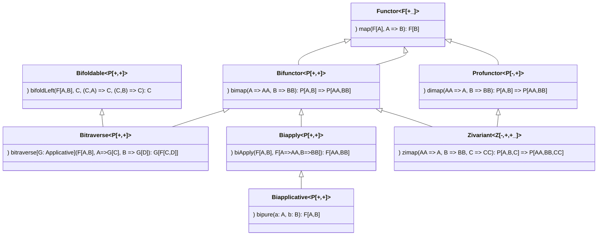
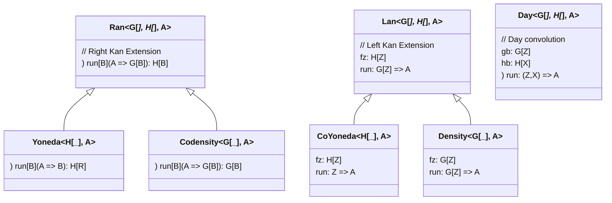
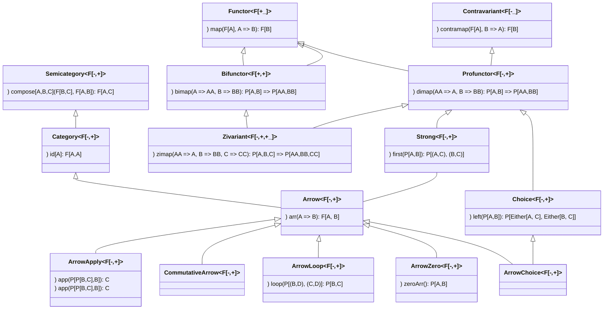

# Scala typeclassopedia

* Base abstractions: [Functor](./BasicAbstractions.MD#functor-covariant-functor), [Apply](./BasicAbstractions.MD#apply), [Applicative](./BasicAbstractions.MD#applicative-applicative-functor), [Monad](./BasicAbstractions.MD#monad), [Contravariant](./Contravariant.MD#contravariant-contravariant-functor), [Comonad](./Comonads.MD#comonad), [Foldable](./BasicAbstractions.MD#foldable), [Bifunctor](./Bifunctors.MD#bifunctor), [Arrow](./Profunctors.MD#arrow), [Coyoneda](./KanExtensions.MD#coyoneda)

* Covariant Functors: [Functor](./BasicAbstractions.MD#functor-covariant-functor), [Apply](./BasicAbstractions.MD#apply), [Applicative](./BasicAbstractions.MD#applicative-applicative-functor), [Selective](./BasicAbstractions.MD#selective-selective-applicative-functors)

* [Monads](./BasicAbstractions.MD#monad): [Reader](./BasicAbstractions.MD#reader), [Writer](./BasicAbstractions.MD#writer), [State](./BasicAbstractions.MD#state), [RWS Monad](./BasicAbstractions.MD#rws-monad), [Update Monad](./BasicAbstractions.MD#update-monad), [Logic Monad, Prompt Monad, Failure Monad](./BasicAbstractions.MD#logic-monad-prompt-monad-failure-monad), [ContT (Continuation Monad)](./BasicAbstractions.MD#contt-continuation-monad), [Reverse State Monad](./BasicAbstractions.MD#reverse-state-monad), [Tardis (Bidirectional State Monad)](./BasicAbstractions.MD#tardis-bidirectional-state-monad), [Chronicle Monad](./BasicAbstractions.MD#chronicle-monad), [Bimonad](./BasicAbstractions.MD#bimonad), [Dijkstra monad](./BasicAbstractions.MD#dijkstra-monad), [Hoare Monad](./BasicAbstractions.MD#hoare-monad)

* Monads generalizations: [Indexed Monads](./BasicAbstractions.MD#indexed-monads), [SuperMonads](./BasicAbstractions.MD#supermonads)

* [IO related monads](./BasicAbstractions.MD#io-related-monads): [IO](./BasicAbstractions.MD#io-monad), [Bifunctor IO (BIO)](./BasicAbstractions.MD#bifunctor-io-bio), [RIO Monad (Reader + IO)](./BasicAbstractions.MD#rio-monad-reader--io), [TRIO (RIO Monad + Bifunctor IO)](./BasicAbstractions.MD#trio-rio-monad--bifunctor-io)

* Contravariant functors: [Contravariant](./Contravariant.MD#contravariant-contravariant-functor), [Divide (Contravariant Apply)](./Contravariant.MD#divide-contravariant-apply), [Divisible (Contravariant Applicative)](./Contravariant.MD#divisible-contravariant-applicative)

* Contravariant Adjuctions & Representable: [Contravariant Adjunction](./Contravariant.MD#contravariant-adjunction), [Contravariant Rep](./Contravariant.MD#contravariant-rep)

* [Contravariant Kan Extensions](./Contravariant.MD#contravariant-kan-extensions): [Contravariant Yoneda](./Contravariant.MD#contravariant-yoneda), [Contravariant Coyoneda](./Contravariant.MD#contravariant-coyoneda), [Contravariant Day](./Contravariant.MD#contravariant-day), [Invariant Day](./Contravariant.MD#invariant-day)

* Invariant Functors: [Invariant (Invariant Functor, Exponential Functor)](./BasicAbstractions.MD#invariant-invariant-functor-exponential-functor), [Invariant Day](./HigherKinded.MD#invariant-day)

* Bifunctors: [Bifunctor](./Bifunctors.MD#bifunctor), [Join](./Bifunctors.MD#bifunctor-join), [Wrap](./Bifunctors.MD#bifunctor-wrap), [Flip](./Bifunctors.MD#bifunctor-flip), [Joker](./Bifunctors.MD#bifunctor-joker), [Clown](./Bifunctors.MD#bifunctor-clown), [Product](./Bifunctors.MD#bifunctor-product), [Bifunctor Sum](./Bifunctors.MD#bifunctor-sum), [Bifunctor Tannen](./Bifunctors.MD#bifunctor-tannen), [Bifunctor Biff](./Bifunctors.MD#bifunctor-biff), [Bitraverse](./Bifunctors.MD#bitraverse), [Bifoldable](./Bifunctors.MD#bifoldable),

* Comonads: [Comonad](./Comonads.MD#comonad), [Coreader (Env comonad, Product comonad)](./Comonads.MD#coreader-env-comonad-product-comonad), [Cowriter](./Comonads.MD#cowriter), [Cofree](./Free.MD#cofree), [Cokleisli](./Comonads.MD#cokleisli), [Bimonad](./Comonads.MD#bimonad)

* Traversing Folding Filtering: [Monoid](./AbstractAlgebra.MD#monoid), [Foldable](./BasicAbstractions.MD#foldable), [Traverse](./BasicAbstractions.MD#traverse), [Bitraverse](./BasicAbstractions.MD#bitraverse), [Bifoldable](./BasicAbstractions.MD#bifoldable), [FunctorFilter](./BasicAbstractions.MD#functorfilter), [TraverseFilter](./BasicAbstractions.MD#traversefilter), [Distributive](./BasicAbstractions.MD#distributive), [Cofree Traverse](./Free.MD#cofree-traverse)

* Monads not compose - solutions: [Monad Transformers](./BasicAbstractions.MD#monad-transformers-optiont-eithert-readert), [Free Monads](./Free.MD#free-monads), Tagless Final, [Extensible effects](./BasicAbstractions.MD#extensible-effects)

* [Free constructions](./Free.MD#free-constructions), [Free Applicative](./Free.MD#free-applicative), [Free Monads](./Free.MD#free-monads), [Cofree](./Free.MD#cofree), [Free Alternative](./Free.MD#free-alternative), [Free Arrow](./Free.MD#free-arrow), [Free Monad transformers](./Free.MD#free-monad-transformers), [Cofree Traverse](./Free.MD#cofree-traverse)
 
* [Representable & Adjunctions](./Adjunction.MD#representable--adjunctions): [Representable](./Adjunction.MD#representable), [Corepresentable](./Adjunction.MD#corepresentable), [Adjunction](./Adjunction.MD#adjunction), [Adjoint Triples](./Adjunction.MD#adjoint-triples)

* [(Co)Yoneda & (Co)Density & Kan Extensions](./KanExtensions.MD#coyoneda--codensity--kan-extensions), [Yoneda](./KanExtensions.MD#yoneda), [Coyoneda](./KanExtensions.MD#coyoneda), [Right Kan extension](./KanExtensions.MD#right-kan-extension), [Left Kan Extension](./KanExtensions.MD#left-kan-extension), [Density Comonad](./KanExtensions.MD#density-comonad), [Codensity](./KanExtensions.MD#codensity), [Day Convolution](./KanExtensions.MD#day-convolution)

* Profunctors: [Profunctor](./Profunctors.MD#profunctor), [Star](./Profunctors.MD#star), [CoStar](./Profunctors.MD#costar), [Strong Profunctor](./Profunctors.MD#strong-profunctor), [Tambara](./Profunctors.MD#tambara), [Choice Profunctor](./Profunctors.MD#choice-profunctor), [Extranatural Transformation](./Profunctors.MD#extranatural-transformation), [Profunctor Functor](./Profunctors.MD#profunctor-functor), [Profunctor Monad](./Profunctors.MD#profunctor-monad), [Profunctor Comonad](./Profunctors.MD#profunctor-comonad), [Procompose](./Profunctors.MD#procompose),  [ProductProfunctor](./Profunctors.MD#roductprofunctor), [SumProfunctor](./Profunctors.MD#sumprofunctor)

* Profunctor Adjuctions & Representable: [Profunctor Adjunction](./Profunctors.MD#profunctor-adjunction), [Profunctor Rep](./Profunctors.MD#profunctor-rep)

* Profunctor Kan Extensions: [Profunctor Yoneda](./Profunctors.MD#profunctor-yoneda), [Profunctor CoYoneda](./Profunctors.MD#profunctor-coyoneda), [Profunctor Ran](./Profunctors.MD#profunctor-ran), [Profunctor Codensity](./Profunctors.MD#profunctor-codensity)

* [Arrows](./Profunctors.MD#arrows): [Category](./Profunctors.MD#category), [Arrow](./Profunctors.MD#arrow), [Commutative Arrow](./Profunctors.MD#commutativearrow), [Arrow Choice](./Profunctors.MD#arrow-choice), [Arrow Apply, Arrow Monad](./Profunctors.MD#arrow-apply-arrow-monad), [Arrow Loop](./Profunctors.MD#arrow-loop), [Arrow Zero](./Profunctors.MD#arrow-zero), [Free Arrow](./Free.MD#free-arrow), [Kleisli](./Profunctors.MD#kleisli), [Cokleisli](./Profunctors.MD#cokleisli), [BiArrow](./Profunctors.MD#biarrow), [BiKleisli](./Profunctors.MD#bikleisli)

* [Cayley representations](./BasicAbstractions.MD#cayley-representations): [Difference Lists](./BasicAbstractions.MD#difference-lists), [Codensity](./KanExtensions.MD#codensity), [Double Cayley Representation](./BasicAbstractions.MD#double-cayley-representation)

* [Curry-Howard Isomorphism](./Limits.MD#adt-algebra-of-types): [These](./Limits.MD#These)

| Types         | Logic                | Category Theory       | Homotopy Theory   |
|---------------|----------------------|-----------------------|-------------------|
| [Void](./Limits.MD#void)          | false                | initial object        | empty space       |
| [Unit](./Limits.MD#unit)          | true                 | terminal object       | singleton         |
| [Sum (Coproduct)](./Limits.MD#sum-coproduct) Eiter[A,B]    | A v B disjunction    | coproduct             | coproduct space   |
| [Product](./Limits.MD#product) (A,B)          | A ∧ B conjunction    | product               | product space     |
| A => B        | A => B implication   | exponential object    | singleton         |
| A => Void     | negation             | exp. obj. into initial obj. |            |

* Higher kinded & exotic abstractions: [Natural transformation (FunctionK)](./HigherKinded.MD#natural-transformation-functionk), [Monoidal Category, Monoid Object](./HigherKinded.MD#monoidal-categories-monoid-object), [Cartesian Closed Category](./HigherKinded.MD#cartesian-closed-category), [Day Convolution](./HigherKinded.MD#day-convolution), [Functor Functor (FFunctor)](./HigherKinded.MD#functor-functor-ffunctor), [Monad morphisms](./HigherKinded.MD#monad-morphisms), [higher kinded category theory](./HigherKinded.MD#higher-kinded-category-theory), [SemigroupK (Plus)](./BasicAbstractions.MD#semigroupk-plus), [MonoidK (PlusEmpty)](./BasicAbstractions.MD#monoidk-plusempty), [Dinatural Transformation](./Profunctors.MD#dinatural-transformation), [Ends & Coends](./Profunctors.MD#ends--coends), [Align](./BasicAbstractions.MD#align), [Task](./BasicAbstractions.MD#andrey-mokhov-task), [Transducers](./BasicAbstractions.MD#transducers), [Relative monads](./BasicAbstractions.MD#relative-monads), [Disintegrate](./BasicAbstractions.MD#disintegrate)

* Limits: [Cone](./Limits.MD#cone), [Cocone](./Limits.MD#cocone), [Diagonal Functor](./Limits.MD#diagonal-functor), [Limit](./Limits.MD#limit), [Colimit](./Limits.MD#colimit), [Ends & Coends](./Profunctors#ends--coends)

* Topoi: Subobject classifier, [Topos](./Topos.MD#topos)

* [Other Encodings of Category Theory](./OtherEncodingsOfCT.MD): [data-category by Sjoerd Visscher](./OtherEncodingsOfCT.MD#encoding-of-category-theory-by-sjoerd-visscher), [Formalizations of Category Theory in proof assistants (Coq)](./OtherEncodingsOfCT.MD#formalizations-of-category-theory-in-proof-assistants)

* [Recursion schemas](RecursionSchemas.MD)

* [Optics](./Optics.MD)

* [Functor Oriented Programming](/BasicAbstractions.MD#functor-oriented-programming)

## Resources covering topics about FP and category theory in great details:

* ["Red Book" - Functional Programming in Scala - Paul Chiusano and Rúnar Bjarnason](https://www.manning.com/books/functional-programming-in-scala) Best book about FP in Scala. I have bought it for myself and higly recommend it. Worth reading, doing exercises and re-reading.
* [Category Theory for Programmers - Bartosz Milewski](https://www.blurb.com/b/9621951-category-theory-for-programmers-new-edition-hardco) the best book about this subject. [Blog posts](https://bartoszmilewski.com/2014/10/28/category-theory-for-programmers-the-preface/) and video lectures [Part 1](https://www.youtube.com/playlist?list=PLbgaMIhjbmEnaH_LTkxLI7FMa2HsnawM_), [Part II](https://www.youtube.com/playlist?list=PLbgaMIhjbmElia1eCEZNvsVscFef9m0dm), [Part III](https://www.youtube.com/playlist?list=PLbgaMIhjbmElia1eCEZNvsVscFef9m0dm)
* (Haskell) [Typeclassopedia](https://wiki.haskell.org/Typeclassopedia) wiki in Haskell about abstractions from category theory used by Haskell programmers - excellent resource.
* Agda formalizations: [1Lab](https://1lab.dev/#category-theory), [agda-unimath](https://github.com/UniMath/agda-unimath/tree/master/src/category-theory), [agda/cubical](https://github.com/agda/cubical/tree/master/Cubical/Categories), [agda/agda-categories](https://github.com/agda/agda-categories)
* [Seven Sketches in Compositionality: An Invitation to Applied Category Theory - Brendan Fong, David I Spivak]() book about Applied Category Theory branch of mathematics that use mathematics from category theory and apply it in different subjects like engineering. The [video lectures](https://www.youtube.com/playlist?list=PLhgq-BqyZ7i5lOqOqqRiS0U5SwTmPpHQ5) based on the book by the authors.
* (Haskell) Haskell libraries containing abstractions from category theory written by Edward Kmett:
  [Profunctors](https://hackage.haskell.org/package/profunctors/docs/Data-Profunctor.html), [Bifunctors](https://hackage.haskell.org/package/bifunctors), [Comonad](https://hackage.haskell.org/package/comonad), [free](https://hackage.haskell.org/package/free), [adjunctions](https://hackage.haskell.org/package/adjunctions), [Kan extensions](https://hackage.haskell.org/package/kan-extensions), [invariant](https://hackage.haskell.org/package/invariant), [distributive](https://hackage.haskell.org/package/distributive), [transformers](https://hackage.haskell.org/package/transformers), [semigroupoids](https://hackage.haskell.org/package/semigroupoids). This is how all of this was started :) Some of them were already moved into Haskell standard library e.g. [Data.Functor.Contravariant](https://hackage.haskell.org/package/contravariant/docs/Data-Functor-Contravariant.html)
* [zio-prelude](https://github.com/zio/zio-prelude) modern look at abstractions from category theory, more modular and expressive
* (Kotlin) [Patterns from Category Theory in Kotlin](https://arrow-kt.io/docs/)
* (Idris) [statebox/idris-ct](https://github.com/statebox/idris-ct) encoding of abstractions & formal verification in Idris 2
* Functional Structures in Scala - Michael Pilquist [(video playlist)](https://www.youtube.com/watch?v=Dsd4pc99FSY&list=PLFrwDVdSrYE6dy14XCmUtRAJuhCxuzJp0): workshop on [implementating FP constructions](https://github.com/mpilquist/Structures) with usage examples and great insights about Scala and FP.
* Applied functional type theory - Sergei Winitzki [(video playlist)](https://www.youtube.com/watch?v=0Ld79Lnzx_o&list=PLcoadSpY7rHXJWbUkjQ3P9MXBbXxLP8kV)
* Series of blog posts by Eugene Yokota (@eed3si9n): [herding cats](http://eed3si9n.com/herding-cats/) and [learning Scalaz](http://eed3si9n.com/learning-scalaz/) Easy to understand examples, clear explanations, many insights from Haskell papers and literature.
* [Examples in scalaz repository](https://github.com/scalaz/scalaz/tree/series/7.3.x/example/src/main/scala/scalaz/example) Learning Scalaz is probably the best documentation for Scalaz.
* [Documentation for Cats](https://typelevel.org/cats/) (runnable online version for older Cats version on [ScalaExercises](https://www.scala-exercises.org/cats)), [summary](https://typelevel.org/cats/nomenclature.html)
* [channingwalton/typeclassopedia](https://github.com/channingwalton/typeclassopedia) implementation of Haskell Typeclassopedia by Channing Walton, [(blog post)](http://channingwalton.github.io/typeclassopedia/)
* Notes on Category Theory in Scala 3 (Dotty) - Juan Pablo Romero Méndez [(blog post)](https://typista.org/categories-in-dotty/#1-categories)
* Scala Type-class Hierarchy - Tony Morris [(blog post)](http://blog.tmorris.net/posts/scala-type-class-hierarchy/index.html) (traits for all cathegory theory constructions with exotic ones like `ComonadHoist`)

[Computational trinitarianism resources](ComputationalTrinitarianism.MD)
