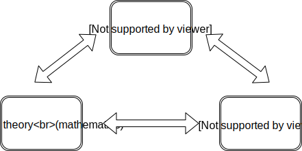

# Computational Quadrinitarianism

## Curry-Howard-Lambek Correspondence

There are deep connections, (known as Curry-Howard-Lambek correspondence) between 3 fields of study:
* `category theory` - branch of mathematics
* `type theory` - branch of computer science 
* `proof theory` - branch of philosophy

## Logic for computation

Frank Pfenning in his lecture Frank Pfenning lectures [Constructive Logic](https://www.cs.cmu.edu/~fp/courses/15317-f17/) presents
following correspondence between different flavours of logic and computation:

| judgement      | logic       | interpretation in computing |
|----------------|-------------|---|
| A true | [Intuitionistic Logic](https://plato.stanford.edu/entries/logic-intuitionistic/) | functional programming |
| K knows A | [Epistemic Logic](https://plato.stanford.edu/entries/logic-epistemic/) | distributed computing |
| A is true a time t | [Temporal Logic](https://plato.stanford.edu/entries/logic-temporal/) | model checking, partial eval |
| A is a resource | [Linear Logic](https://plato.stanford.edu/entries/logic-linear/) | concurrency, pi-calculus |
| A is possible | [Lax logic](http://twelf.org/wiki/Lax_logic) | generic effects, monad |
| A is valid | [Modal Logic](https://plato.stanford.edu/entries/logic-modal/) | runtime code generation |

Article on nLab summarize [relation between type theory and category theory](https://ncatlab.org/nlab/show/relation+between+type+theory+and+category+theory):

| flavor of type theory | flavor of category theory
|---|---|
| Simply Typed Lambda Calculus | [cartesian closed category](https://ncatlab.org/nlab/show/cartesian+closed+category) |
| Homotopy Type Theory | [elementary (∞,1)-topos](https://ncatlab.org/nlab/show/elementary+%28infinity%2C1%29-topos) |

## Computational trinitarianism and quadrinitarianism

An article on nLab [computational trinitarianism](https://ncatlab.org/nlab/show/computational+trinitarianism) list connected concepts from category theory, proof theory and type theory.

Blog post at Comonad.Reader by Gershom Bazerman [Computational Quadrinitarianism (Curious Correspondences go Cubical)](http://comonad.com/reader/2018/computational-quadrinitarianism-curious-correspondences-go-cubical/) includes
one Homotopy Theory. In ICFP talk [A Functional Programmer's Guide to Homotopy Type Theory](https://www.youtube.com/watch?v=caSOTjr1z18) Dan Licata connects: `higher category theory`, `dependent type theory`, `homotopy theory`.

Article by Maxim Sokhatsky in Cubical Tutorial at [groupoid.space](https://groupoid.space/) includes all four.

List of corresponding concepts:

| Type Theory   | Proof Theory         | Category Theory       | Homotopy Theory   |
|---------------|----------------------|-----------------------|-------------------|
| A type        | class                | object                | space             |
| isProp A      | proposition          | subterminal object    | space             |
| a:A program   | proof                | generalized element   | point             |
| B(x)          | predicate            | indexed object        | fibration         |
| b(x): B(x)    | conditional proof    | indexed elements      | section           |
| Void          | false                | initial object        | empty space       |
| Unit          | true                 | terminal object       | singleton         |
| Eiter[A,B]    | A v B disjunction    | coproduct             | coproduct space   |
| (A,B)         | A ∧ B conjunction    | product               | product space     |
| A => B        | A => B implication   | internal hom          | singleton         |
| A => Void     | negation             | internal hom into initial object |       |
| Σx: A,B(x)    | ∃x:A such that B(x)  | dependent sum         | total space       |
| Πx: A,B(x)    | ∀x:A B(x)            | dependent product     | space of sections |
| PathA | equivalence =A | path space object | path space    |
| quotient       | equivalence class    | quotient              | quotient      |
| W-type/M-type | induction            | colimit               | complex       |
| higher inductive type | higher induction | higher colimit    |  |
| type of types | universe             | object classifier     | universe      |
| substitution  | cut rule | composition of classifying morphisms / pullback of display maps |  |
| beta reduction | cut elimination for => | counit for hom-tensor adjunction |  |
| eta conversion | intro rule for =>      | unit for hom-tensor adjunction    |  |

I personally find mind blowing the fact that one can 
encode mathematical `proofs`, for example about `category theory` and `type theory`, 
using programming language (`computation`) like:
* `Coq` (library [UniMath](https://github.com/UniMath/UniMath/tree/master/UniMath))  
* `Agda` (library [agda/agda-categories](https://github.com/agda/agda-categories/tree/master/Categories))  

with `type system` based on `homotopy type theory`.

Especially that `HoTT` has models in `higher category theory` and `topos theory`, 
or even more so as `type theory` is free from paradoxes of `set theory` 
hence provide base theory for mathematics  -`univalent foundations` (`UF`).
All of those developed recently and is active field of study.

What a time to be alive!

## Resources
 * [Computational Quadrinitarianism (Curious Correspondences go Cubical) - Gershom Bazerman](http://comonad.com/reader/2018/computational-quadrinitarianism-curious-correspondences-go-cubical/)
 * [nLab computational trinitarianism](https://ncatlab.org/nlab/show/computational+trinitarianism)
 * ICFP talk by Dan Licata: [A Functional Programmer's Guide to Homotopy Type Theory](https://www.youtube.com/watch?v=caSOTjr1z18)
 * Frank Pfenning lectures [Constructive Logic](https://www.cs.cmu.edu/~fp/courses/15317-f17/)
 * Computational Type Theory - OPLSS 2018 - Robert Harper [(course)](https://www.cs.uoregon.edu/research/summerschool/summer18/topics.php#Harper), lecture notes, high quality videos, [(video playlist)](https://www.youtube.com/watch?v=LE0SSLizYUI&list=PL0DsGHMPLUWXXA8RHzVZ2B5E5hP8CD15Z) - lower quality videos
 * Introduction to Univalent Foundations of Mathematics with Agda - MGS 2019 - Martín Hötzel Escardó [(lecture notes)](https://www.cs.bham.ac.uk/~mhe/HoTT-UF-in-Agda-Lecture-Notes/index.html) [(github)](https://github.com/martinescardo/HoTT-UF-Agda-Lecture-Notes)
 * Introduction to Homotopy Type Theory - [EUTypes Summer School 2017](https://sites.google.com/view/summerschool2017-eutypes/home) - Thorsten Altenkirch [(lecture notes)](http://www.cs.nott.ac.uk/~psztxa/ss-types-17/notes-summer17.pdf), [(video with similar scope - Naïve Type Theory by Thorsten)](https://www.youtube.com/watch?v=bNG53SA4n48), [(slides 2017)](http://www.cs.nott.ac.uk/~psztxa/talks/s-repls-17.pdf), [(slides 2018)](http://www.cs.nott.ac.uk/~psztxa/talks/fmv18.pdf)