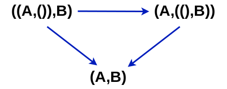
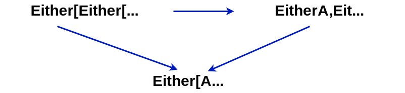
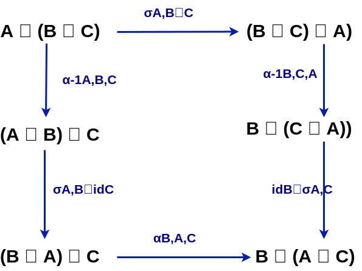
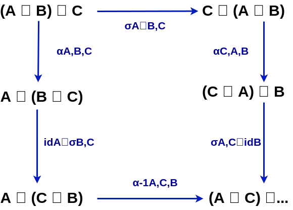

# Notes on Monoidal Categories in context of Scala

`Basic category theory` (C.T.) nicely models composition of operations (morphisms) between objects.  
`Monoidal category theory` (M.C.T.) add additional way to compose (tensor product). Thanks to additional orthogonal way to compose objects, we can conveniently model processes `composed sequenctially and in parallel`.

Categorical definitions often use conditions presented as equations.
In Scala, we provide interface with functions expressing them and test them using random input (property tests).
If those fail we have an counterexample, and we need to re-think our implementation.
Haskell provides more precise types (no ad-hoc polymorphism) so usually it is enough to write formal proof (e.g. using Coq or Agda) and express in comment how those works.

## Discovering the abstraction

Lets try to look at some examples of ADT to spot common pattern.

# Algebraic Data Types form commutative semiring

It is common knowledge in FP that there exists pattern that was rediscovered in many different branches of mathematics (Curry-Howard-Lambek isomorphism, propositions as types).
With few extra constructions (pi type, sigma type, identity type) it is powerful enough to express everything (univalent foundations of mathematics).

| Scala      | Haskell     | Logic              | Arithmetic | Set theory      | Category Theory    |
|------------|-------------|--------------------|------------|-----------------|--------------------|
| Void       | Data.Void   | false              | 0          | empty set       | initial object     | 
| Unit       | ()          | true               | 1          | one element set | terminal object    | 
| Eiter[A,B] | Data.Either | A v B disjunction  | a + b      | disjoint union  | icoproduct         |
| (A,B)      | Data.Tuple  | A ∧ B conjunction  | a * b      | intersection    | product            |

It is easy to see that `Tuple` with `Unit` it almost form a `commutative monoid`:

```scala
(Unit,a)  ~ a         ~ (a, Unit)
(a,(b,c)) ~ ((a,b),c) 
(a,b)     ~ (a, b)
``` 

similar `Either` and `Nothing`:

```scala
Either(Void,a)        ~ a                     ~ Either(a, Void)
Either(a,Either(b,c)) ~ Either(Either(a,b),c) 
Either(a,b)           ~ Either(a, b)
```

Combined they almost form `commutative semiring`:

```scala
(a,Either(b,c)) ~ Either((a,b),(a,c)) 
(Either(a,b),c) ~ Either((a,c),(b,c))
(Void,a)        ~ 0   ~ (a,Void)
``` 

Problem lies in the word almost - `Either (Either a b) c)` and `Either a (Either b c)` are isomorphic but not equal. Same for tuple.

There is more things in common with interactions between those pairs of operation and special type.

### Collapsiong triangle

Tuple with () can be collapsed:



similarly with either and empty type:

 

### Association pentagon

Tuple can be associated however we like:

 

similar Either.

## Monoidal categories

We combine those observations and solve problem with equality up to isomorphism if we intorduce operations allowing us to transform between different way of using either/tuple (associator) and unite e.g. `Either(Void,a)` with `a`.

### Definition of [Monoidal category](https://ncatlab.org/nlab/show/monoidal+category) in category theory

`Monoidal category` `(C,I,α,λ,ρ)` is a category `C` with:
* a bifunctor (`tensor product`) `⊗: (C,C) -> C`
* object (`unit object` or `tensor unit`)  `I: C`
* natural isomorphisms  
  * (`associator`) `α: (A⊗B)⊗C ~ A⊗(B⊗C)`
  * (`left unitor`) `λ: I ⊗ A ~ A`
  * (`right unitor`) `ρ: A ⊗ I ~ A`
* that satisfy `triangle equations`


* and `pentagon equations`


It turns out this two diagrams are enough to ensure all kind of combinations of association and uniting behaves nicely.


## Wiring diagrams

Nice thing about modeling things about monoidal categories is that you can draw them and reason about them visually. There is theorem that state that both formal reasoning and drawing diagrams is the same [coherence theorem for monoidal+categories](https://ncatlab.org/nlab/show/coherence+theorem+for+monoidal+categories).

Moreover simple intuitions about diagrams allow us to reason about them easyly.

As an example lets illustrate this for simple monoidal category with objects as numbers, (sequential) composition is <= and parallel composition is addition:

TODO diagrams


## Monoidal Category in Scala

### Category of Scala types and functions in Scala

If we represent category signature in following way:
```scala
trait Category[Morphism[_,_]] {
  def id[Object]: Morphism[Object,Object]
  def compose[A,B,C](f: Morphism[B,C])(g: Morphism[A,B]): Morphism[A,C]
}
```

then standard category of where objects are proper types
and morphisms are pure functions with one argument (curried) would be:

```scala
trait Function1Cat extends Category[Function1] {
  def id[A]: A => A = identity[A]
  def compose[A, B, C](f: B => C)(g: A => B): A => C = g andThen f
}
```

### Monoidal categories in Scala

```scala
trait MonoidalCategory[:=>[_,_],⊗[_, _], I]
  extends Category[:=>] {

  def tensor: Bifunctor[⊗]
  def ρ[A]    (fa: A⊗I): A
  def ρ_inv[A](a:  A):   A⊗I

  def λ[A]      (fa: I⊗A): A
  def λ_inv[A,B](a:  A):   I⊗A

  def α[A,B,C](    fa: (A⊗B)⊗C): A⊗(B⊗C)
  def α_inv[A,B,C](fa: A⊗(B⊗C)): (A⊗B)⊗C
}
```

laws based on triangle and pentagon equations:

```scala
trait MonoidalCategoryLaws[:=>[_,_],⊗[_, _], I]
  extends MonoidalCategory[:=>,⊗, I] {

  def triangleEquations[A, B](fa: (A⊗I)⊗B): Boolean = {
    //               ρ[A] ⊗ id[B]
    // (A ⊗ I) ⊗ B ----------------> A ⊗ B
    val v1: A⊗B = tensor.bimap(ρ[A],identity[B])(fa)

    //              α[A,I,B]
    // (A ⊗ I) ⊗ B ---------->  A ⊗ (I ⊗ B)
    val w1: A⊗(I⊗B) = α[A,I,B](fa)

    //               id[A] ⊗ λ[B]
    // A ⊗ (I ⊗ B) ---------------> A ⊗ B
    val w2: A⊗B = tensor.bimap(identity[A],λ[B])(w1)

    v1 == w2
  }

  def pentagonEquations[A,B,C,D](fa: ((A⊗B)⊗C)⊗D): Boolean = {
    //                    α[A,B,C] ⊗ 1D
    // ((A ⊗ B) ⊗ C) ⊗ D ---------------> (A ⊗ (B ⊗ C)) ⊗ D
    val v1: (A⊗(B⊗C))⊗D = tensor.bimap(α[A,B,C],identity[D])(fa)

    //                    α[A,B⊗C,D]
    // (A ⊗ (B ⊗ C)) ⊗ D ------------> A ⊗ ((B ⊗ C) ⊗ D)
    val v2: A⊗((B⊗C)⊗D) = α[A,B⊗C,D](v1)

    //                    1A ⊗ α[B,C,D]
    // A ⊗ ((B ⊗ C) ⊗ D) ---------------> A ⊗ (B ⊗ (C ⊗ D))
    val v3: A⊗(B⊗(C⊗D)) = tensor.bimap(identity[A],α[B,C,D])(v2)

    //                     α[A⊗B,C,D]
    // ((A ⊗ B) ⊗ C) ⊗ D -------------> (A ⊗ B) ⊗ (C ⊗ D)
    val w1: (A⊗B)⊗(C⊗D) = α[A⊗B,C,D](fa)

    //                      α[A,B,C⊗D]
    // (A ⊗ B) ⊗ (C ⊗ D) -------------> A ⊗ (B ⊗ (C ⊗ D))
    val w2: A⊗(B⊗(C⊗D)) = α[A,B,C⊗D](w1)

    v3 == w2
  }
}
```

If a given category has limits then it is easy to show that it is monoidal in at least two ways.

## [Cartesian monoidal category](https://ncatlab.org/nlab/show/cartesian+monoidal+category)

A cartesian monoidal category is a monoidal category whose tensor product is a `cartesian product` and tensor unit is a `terminal object`.

Category of Scala types and pure, functions with:  
tensor product: Tuple2  
tensor unit: ()  

```scala
trait TupleMc
  extends MonoidalCategory[Function1,Tuple2,Unit]
  with Function1Cat {

  val tensor: Bifunctor[Tuple2] = tupleBifunctor
  def ρ[A](fa: (A, Unit)): A = fa._1
  def ρ_inv[A](a: A): (A, Unit) = (a, ())
  def λ[A](fa: (Unit, A)): A = fa._2
  def λ_inv[A, B](a: A): (Unit, A) = ((), a)
  def α[A, B, C](fa: ((A, B), C)): (A, (B, C)) = fa match {case ((a,b),c) => (a, (b, c)) }
  def α_inv[A, B, C](fa: (A, (B, C))): ((A, B), C) = fa match {case (a,(b,c)) => ((a, b), c) }
}
```

## [Cocartesian monoidal category]((https://ncatlab.org/nlab/show/cocartesian+monoidal+category))

A `cocartesian monoidal category` is a monoidal category whose tensor product is a `coproduct` and tensor unit is an `initial object`.
It is dual to cartesian monoidal category.

Category of Scala types and pure, functions with:  
tensor product: Either  
tensor unit: Nothing  

```scala
type Void <: Nothing

val eitherBifunctor: Bifunctor[Either] = new Bifunctor[Either] {
  override def bimap[A, B, C, D](f: A => B, g: C => D): Either[A, C] => Either[B, D] = {
    case Left(a) => Left(f(a))
    case Right(c) => Right(g(c))
  }
}

trait Function1EitherMc
  extends MonoidalCategory[Function1,Either,Void]
    with Function1Cat {

  val tensor: Bifunctor[Either] = eitherBifunctor
  def ρ[A](fa: Either[A, Void]): A = fa match { case Left(a) => a }
  def ρ_inv[A](a: A): Either[A, Void] = Left(a)
  def λ[A](fa: Either[Void, A]): A = fa match { case Right(a) => a }
  def λ_inv[A, B](a: A): Either[Void, A] = Right(a)
  def α[A, B, C](fa: Either[Either[A, B], C]): Either[A, Either[B, C]] =
    fa match {
      case Left(Left(a)) => Left(a)
      case Left(Right(b)) => Right(Left(b))
      case Right(c) => Right(Right(c))
    }
  def α_inv[A, B, C](fa: Either[A, Either[B, C]]): Either[Either[A, B], C] = fa match {
    case Left(a) => Left(Left(a))
    case Right(Left(b)) => Left(Right(b))
    case Right(Right(c)) => Right(c)
  }
}
```

Our definition of category do not allow us express situation when objects are values like numbers (unless we use peano encoding TODO do it).
In such case we could use as tensor product min (TODO draw diagrams).


TODO explore:  
category:    
*  objects: functors: List, Vector, Option, Eiter[Throwable, *], Function1[A, *], monix.Task, ZIO[A,E,*], ZIO[A,*,R]  
*  morphisms: natural transformations (list.headOption, list.lastOption, list.reverse, option.toList, etc)
tensor product: functor composition  
tensor unit: Identity functor  

TODO explore:
category:  
  objects: ZIO[A,R,E]  
  morphisms: ZIO[A,R,E] => ZIO[B,R,E]  
tensor product: andThen  
tensor unit: ZIO[A,A,Nothing](identity)  

TODO explore
Monix Task and Parallel execution

TODO explore Kleisli categories (Id[*], Option[*], Either[*,E], Thunk[*], Task[*], ZIO[A,E,*], ZIO[A,*,R]  
Reader[*], Const[*], Cont[*], List[*]) what about tensor product and unit?

## Strict monoidal category

A monoidal category is strict if associator, left unitor and right unitors are all identity morphisms.

## Interchange law

Any morphisms `f: A -> B`, `g: B -> C`, `h: D -> E`, `j: E -> F`  
in a monoidal category, satisfy:  
`(g compose f) ⊗ (j compose h) = (g ⊗ j) compose (f ⊗ h)`  

## Properties of Monoidal categories

### [Coherence for Monoidal categories](https://ncatlab.org/nlab/show/coherence+theorem+for+monoidal+categories)

TODO definition of coherence.
Application in programming: what if we express laws as helper functions operaing of Either or Tuple?

### [Closure for Monoidal categories](https://ncatlab.org/nlab/show/monoidal+category#closure)

## Additional structure generated by objects of monoidal category

Every small monoidal category `C` embeds as a full subcategory `C -> D` into a closed monoidal category,
where the embedding functor is a strong monoidal functor.

TODO
  Supplying bells and whistles in symmetric monoidal categories - Brendan Fong, David I Spivak  
    [arxiv.org/abs/1908.02633](https://arxiv.org/pdf/1908.02633.pdf),  
    [(video part 1)](https://www.youtube.com/watch?v=5p_tB_MXFrk), [(video part 2)](https://www.youtube.com/watch?v=ecfl4DCXFPQ)  


# Braided monoidal category

Using monoidal category we solved identity and associativity properties but we did not modelled symmetry.
Symmetry is very strong condition, intermediate step is having isomorphism `(x,y) ~ (y,x)` with nice properties.

A `braided monoidal category` is a monoidal category C equipped with a natural isomorphism
`x ⊗ y ~ y ⊗ x` called `braiding`, such that following diagrams (called `hexagon identitties`) commute:



and



Implementation in Scala

```scala
trait BraidedMonoidalCategory[:=>[_,_],⊗[_, _], I]
  extends MonoidalCategory[:=>,⊗, I] {

  def braiding[A,B](a: A⊗B): B⊗A
}

trait BraidedMonoidalCategoryLaws[:=>[_,_],⊗[_, _], I]
  extends BraidedMonoidalCategory[:=>,⊗, I]
    with MonoidalCategoryLaws[:=>,⊗, I] {

  def hexagonEquations[A,B,C,D](fa: ((A⊗B)⊗C)⊗D): Boolean = {
    //                      α[A,B,C] ⊗ 1D
    // ((A ⊗ B) ⊗ C) ⊗ D -----------------> (A ⊗ (B ⊗ C)) ⊗ D
    val v1: (A⊗(B⊗C))⊗D = tensor.bimap(α[A,B,C],identity[D])(fa)
    //                     α[A,B⊗C,D]
    // (A ⊗ (B ⊗ C)) ⊗ D ------------> A ⊗ ((B ⊗ C) ⊗ D)
    val v2: A⊗((B⊗C)⊗D) = α[A,B⊗C,D](v1)
    //                    1A ⊗ α[B,C,D]
    // A ⊗ ((B ⊗ C) ⊗ D) ------------------> A ⊗ (B ⊗ (C ⊗ D))
    val v3: A⊗(B⊗(C⊗D)) = tensor.bimap(identity[A],α[B,C,D])(v2)

    //                     α[A⊗B,C,D]
    // ((A ⊗ B) ⊗ C) ⊗ D -------------> (A ⊗ B) ⊗ (C ⊗ D)
    val w1: ((A⊗B)⊗(C⊗D)) = α[A⊗B,C,D](fa)
    //                     α[A,B,C⊗D]
    // (A ⊗ B) ⊗ (C ⊗ D) ------------> A ⊗ (B ⊗ (C ⊗ D))
    val w2: A⊗(B⊗(C⊗D)) = α[A,B,C⊗D](w1)

    v3 == w2
  }
}
```

Monoidal category of types, pure functions with Either as tensor product and Void as unit is braided
and he braiding is swap 

```scala
new BraidedMonoidalCategory[Function1,Either,Void]
  with Function1EitherMc {

  def braiding[A,B](a: Either[A,B]): Either[B,A] = a.swap
}
```

similar for tuple and unit:

```scala
new BraidedMonoidalCategory[Function1,Tuple2,Unit]
  with TupleMc {

  def braiding[A,B](a: (A,B)): (B,A) = a.swap
}
```


# [Symmetric monoidal category](https://ncatlab.org/nlab/show/symmetric+monoidal+category)

A symmetric monoidal category is a braided monoidal category for which the braiding  
`B(x,y): x ⊗ y -> y ⊗ x`   
satisfies condition  
`B(y,x) . B(x,y) = 1`  

Additional condition can be implemented as:

```scala
trait SymmetricMonoidalCategoryLaws[:=>[_,_],⊗[_, _], I]
  extends BraidedMonoidalCategory[:=>,⊗, I]
    with BraidedMonoidalCategoryLaws[:=>,⊗, I] {

  def hexagonEquations[A,B](fa: A⊗B): Boolean = {
    braiding(braiding(fa)) == fa
  }
}
```

Since swap on tuple and either applied twice are identity, both monoidal categories are symmetric.

# Monoids in monoidal categories

TODO

# References
  * Some Definitions Everyone Should Know - John C. Baez [(pdf)](http://math.ucr.edu/home/baez/qg-fall2004/definitions.pdf)
  * Monoidal Categories, Higher Categories - Jamie Vicary [(pdf)](http://events.cs.bham.ac.uk/mgs2019/vicary.pdf)
  * Notions of Computation as Monoids - Exequiel Rivas, Mauro Jaskelioff [(arxiv.org/abs/1406.4823)](https://arxiv.org/pdf/1406.4823.pdf)
  * Discrimination is Wrong: Improving Productivity - Edward Kmett [(video from YOW! Conferences)](https://www.youtube.com/watch?v=eXDJ5Jcbgk8), [(video from ZuriHac 2015)](https://www.youtube.com/watch?v=cB8DapKQz-I), [(slides)](http://yowconference.com.au/slides/yowlambdajam2015/Kmett-DiscriminationIsWrong.pdf)
  * Braided Monoidal Categories - Andre Joyal, Ross Street [(pdf)](http://maths.mq.edu.au/~street/JS1.pdf)
  * A practical type theory for symmetric monoidal categories - Michael Shulman [(arxiv.org/abs/1911.00818)](https://arxiv.org/pdf/1911.00818.pdf)
  * Supplying bells and whistles in symmetric monoidal categories - Brendan Fong, David I Spivak [arxiv.org/abs/1908.02633](https://arxiv.org/pdf/1908.02633.pdf), [(video part 1)](https://www.youtube.com/watch?v=5p_tB_MXFrk), [(video part 2)](https://www.youtube.com/watch?v=ecfl4DCXFPQ)
  * A survey of graphical languages for monoidal categories - Peter Selinger [arxiv.org/abs/0908.3347](https://arxiv.org/pdf/0908.3347.pdf)
  * nLab:
    * [nLab monoidal category](https://ncatlab.org/nlab/show/monoidal+category)
    * [nLab Closure for Monoidal categories](https://ncatlab.org/nlab/show/monoidal+category#closure)
    * [nLab Coherence for Monoidal categories](https://ncatlab.org/nlab/show/coherence+theorem+for+monoidal+categories)
    * [nLab cartesian monoidal category](https://ncatlab.org/nlab/show/cartesian+monoidal+category)
    * [nLab cocartesian monoidal category](https://ncatlab.org/nlab/show/cocartesian+monoidal+category)
    * [nLab symmetric monoidal category](https://ncatlab.org/nlab/show/symmetric+monoidal+category)
